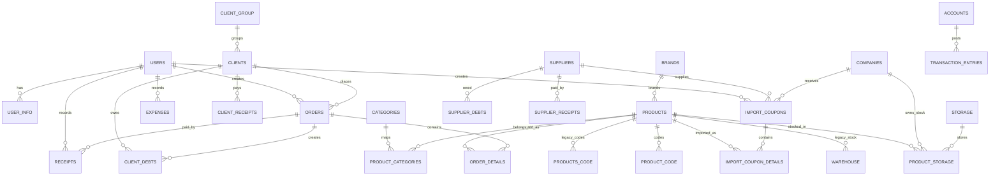

# 1. THÔNG TIN CHUNG

| Nội dung | Thông tin |
| --- | --- |
| Tên dự án | iphone |
| Người thực hiện | Nguyễn Đức Việt |
| Người phụ trách/bàn giao | [CẦN BỔ SUNG] - Chưa xác định được từ mã nguồn hiện tại. |
| Thời gian nghiên cứu | [CẦN BỔ SUNG] |
| Loại hệ thống | Hệ thống web quản lý bán hàng, kho, khách hàng, nhà cung cấp, thu chi/công nợ và vận hành nội bộ. |
| Công nghệ backend | PHP, Laravel Framework, Laravel Sanctum, Eloquent ORM, hệ thống route/controller/service/model theo cấu trúc Laravel. |
| Công nghệ frontend | Laravel Blade, Vite, JavaScript, CSS, Bootstrap; giao diện quản trị sử dụng asset theme Kaiadmin và các thư viện JavaScript hỗ trợ. |
| Phiên bản PHP | ^8.1 |
| Phiên bản Laravel | v10.49.0 theo `composer.lock`; constraint trong `composer.json` là ^10.10. |
| Cơ sở dữ liệu | MySQL là kết nối mặc định trong `.env.example` và `config/database.php`. |
| Thư viện giao diện chính | Bootstrap, Kaiadmin assets, Font Awesome, SweetAlert/SweetAlert2, CKEditor/CKFinder, Bootstrap Notify, Toastr. |
| Môi trường triển khai hiện tại | [CẦN BỔ SUNG] - Chưa xác định được môi trường triển khai thực tế từ mã nguồn hiện tại. Ghi nhận `.env.example` cấu hình môi trường `local`; `README.dev.md` có hướng dẫn chạy queue worker local/server bằng `php artisan queue:work`, screen hoặc Supervisor. |
| Quản lý mã nguồn | Git; branch hiện tại `viet_dev`, remote `origin` trỏ tới GitHub. |
| Repository hoặc tài liệu liên quan | Repository GitHub: `https://github.com/sgodev2024/iphone.git`; tài liệu trong repo gồm `README.md`, `README.dev.md`, `CHANGELOG.md` và `bao-cao-phan-tich-laravel.md`. |
| Tình trạng tài liệu bàn giao | Có một số tài liệu/hướng dẫn nội bộ nhưng chưa thấy tài liệu bàn giao đầy đủ về nghiệp vụ, kiến trúc, triển khai và vận hành. Các phần chưa có cần được bổ sung. |

# 2. MỤC TIÊU VÀ PHẠM VI NGHIÊN CỨU

## 2.1. Mục tiêu nghiên cứu

Việc nghiên cứu dự án nhằm hỗ trợ quá trình tiếp nhận một hệ thống Laravel đã được phát triển trước đó, phục vụ bảo trì, sửa lỗi và phát triển chức năng mới. Phạm vi nghiên cứu tập trung vào việc hiểu nghiệp vụ chính, cấu trúc mã nguồn, mô hình dữ liệu, cách tổ chức giao diện, cơ chế phân quyền, phụ thuộc kỹ thuật và các điều kiện vận hành cần thiết. Kết quả phần này chỉ dùng để xác định phạm vi đã kiểm tra và các giới hạn hiện có, chưa đưa ra kết luận cuối cùng về chất lượng dự án.

2. Nắm cấu trúc tổng thể của mã nguồn Laravel, bao gồm route, controller, model, service, request, middleware, view, config và helper.
3. Xác định cách tổ chức các module Admin, Staff/POS, SuperAdmin và các thành phần dùng chung trong hệ thống.
4. Đối chiếu cấu trúc cơ sở dữ liệu qua migration, seeder, factory, model và tài liệu audit có sẵn trong repository.
5. Nhận diện các chức năng đã có route, controller, view, model hoặc service để làm cơ sở kiểm tra tiếp ở các phần sau.
7. Xác định các điều kiện còn thiếu để kiểm thử vận hành thực tế, gồm tài khoản, dữ liệu, môi trường, quyền truy cập và dịch vụ sandbox/live.
8. Làm cơ sở lập kế hoạch tiếp nhận, kiểm thử bổ sung, chuẩn hóa triển khai và phát triển dự án trong giai đoạn tiếp theo.

## 2.2. Phạm vi nghiên cứu

Phạm vi nghiên cứu hiện tại được thực hiện bằng cách đọc mã nguồn, cấu hình, tài liệu có trong repository và cấu trúc Git. Không chạy migration, seeder, lệnh xóa dữ liệu hoặc thao tác có khả năng làm thay đổi dữ liệu. Các thành phần được ghi nhận theo ba mức: đã xem được cấu trúc và mã nguồn nhưng chưa chạy thử, chưa đủ điều kiện xác minh vận hành, hoặc chưa có nguồn xác minh phù hợp tại thời điểm nghiên cứu.

| Nhóm nghiên cứu | Nội dung đã kiểm tra | Mức độ kiểm tra | Nguồn xác minh | Ghi chú |
| --- | --- | --- | --- | --- |
| Backend Laravel | Routes web/API, controllers Admin/Staff/SuperAdmin, models, services, Form Requests, middleware, jobs, events/listeners, mail, exports, helpers, exception handler, config. | Một phần | `routes`, `app`, `composer.json`, `config` | Đã kiểm tra tĩnh mã nguồn; chưa chạy thử toàn bộ luồng nghiệp vụ. |
| Giao diện quản trị | Blade layout, sidebar/header/footer, các màn sản phẩm, kho, nhập hàng, khách hàng, đơn hàng, báo cáo, thu chi, công nợ, kế toán, nhân viên, cấu hình. | Một phần | `resources/views/admin`, `resources/views/Themes/admin`, `public/assets` | Chưa kiểm tra hiển thị thực tế trên trình duyệt và thiết bị. |
| Giao diện người dùng | Màn Staff/POS, bán hàng, đơn hàng, kiểm kê, warehome; giao diện đăng nhập; một số view cũ trong `Themes`, `sa`, `emails/admin`. | Một phần | `resources/views/Themes/pages`, `resources/views/auth`, `resources/views/sa`, `resources/views/emails` | Chưa thao tác end-to-end với tài khoản thật. |
| Cơ sở dữ liệu | 111 migration, 16 seeder, 13 factory, 52 model, quan hệ Eloquent, tài liệu `database-table-usage-audit.md`. | Một phần | `database`, `app/Models`, `docs/database-table-usage-audit.md` | Không truy cập hoặc thay đổi database production trong lần nghiên cứu này. |
| Phân quyền | Login/logout, middleware `auth`, `role`, `CheckLogin`, `CheckLoginSuperAdmin`, `AuthServiceProvider`, route group theo role. | Một phần | `routes/web.php`, `app/Http/Kernel.php`, `app/Http/Middleware`, `app/Providers/AuthServiceProvider.php` | Chưa có Policy/Gate nghiệp vụ; chưa kiểm thử quyền bằng tài khoản thực tế. |
| API nội bộ | `routes/api.php` với route `/api/user` dùng `auth:sanctum`; helper response và một số endpoint Ajax trong web routes. | Một phần | `routes/api.php`, `routes/web.php`, `app/Http/Responses`, `app/Helpers` | Chưa thấy API nghiệp vụ riêng ngoài route Sanctum mặc định. |
| Triển khai hệ thống | README, README.dev, Composer, NPM/Vite, queue worker, `.styleci.yml`, cấu hình Laravel cache/session/logging/filesystem. | Một phần | `README.md`, `README.dev.md`, `composer.json`, `package.json`, `vite.config.js`, `.env.example`, `config`, `.styleci.yml` | Không tìm thấy Dockerfile, docker-compose, cấu hình web server hoặc CI/CD đầy đủ. |
| Kiểm thử | `phpunit.xml`, 5 file test, cấu hình test suite Unit/Feature, test redirect login và test helper đường dẫn ảnh upload. | Một phần | `tests`, `phpunit.xml` | Chưa chạy test để tránh phát sinh thay đổi phụ; chưa có coverage cho phần lớn nghiệp vụ. |

## 2.3. Nội dung chưa kiểm tra

Các nội dung dưới đây được ghi nhận là `[CHƯA ĐỦ ĐIỀU KIỆN XÁC MINH]` tại thời điểm nghiên cứu. Lý do chủ yếu là chưa có quyền truy cập môi trường vận hành, tài khoản kiểm thử, dữ liệu thực tế đủ đại diện, thông tin dịch vụ bên thứ ba hoặc chưa thực hiện thao tác chạy thử có kiểm soát. Những nội dung này không được xem là kết luận lỗi, mà là giới hạn cần bổ sung trước khi đánh giá ở mức vận hành thực tế.

| STT | Nội dung chưa kiểm tra | Nguyên nhân | Ảnh hưởng đến kết quả đánh giá | Điều kiện cần bổ sung |
| --: | --- | --- | --- | --- |
| 1 | Môi trường production, staging và server triển khai thực tế | [CHƯA ĐỦ ĐIỀU KIỆN XÁC MINH] Chưa có quyền truy cập server hoặc tài liệu triển khai đầy đủ | Chưa thể xác minh cấu hình web server, domain, SSL, queue worker, scheduler, logging và runtime thật | Tài khoản server, sơ đồ triển khai, cấu hình web server và hướng dẫn vận hành |
| 2 | Database production hoặc database vận hành hiện tại | [CHƯA ĐỦ ĐIỀU KIỆN XÁC MINH] Trong lần nghiên cứu này không truy cập database thật và không chạy lệnh thay đổi dữ liệu | Chưa thể xác nhận dữ liệu thực tế, migration status hiện hành, orphan data hoặc hiệu năng truy vấn | Quyền đọc database phù hợp, bản dump ẩn danh hoặc môi trường staging |
| 3 | Đăng nhập và phân quyền bằng tài khoản thực tế | [CHƯA ĐỦ ĐIỀU KIỆN XÁC MINH] Chưa có tài khoản Admin, Staff và SuperAdmin đầy đủ | Chưa thể xác minh luồng quyền theo vai trò, khả năng truy cập từng module và dữ liệu theo người dùng | Bộ tài khoản kiểm thử cho từng vai trò và ma trận quyền mong muốn |
| 4 | Luồng nghiệp vụ end-to-end | [CHƯA ĐỦ ĐIỀU KIỆN XÁC MINH] Chưa thao tác trên UI từ đăng nhập, nhập hàng, bán hàng, trừ tồn, báo cáo đến công nợ | Chưa thể kết luận chức năng hoạt động ổn định khi vận hành liên tục | Môi trường test, dữ liệu mẫu, kịch bản kiểm thử và tiêu chí nghiệm thu |
| 6 | Thanh toán trực tuyến | [CHƯA ĐỦ ĐIỀU KIỆN XÁC MINH] Route thanh toán MoMo trong `routes/web.php` đang ở dạng comment và chưa có điều kiện kiểm thử gateway | Chưa thể xác nhận trạng thái tích hợp thanh toán, callback/IPN hoặc đối soát giao dịch | Tài khoản sandbox, thông số gateway và route/view được bật trong môi trường kiểm thử |
| 8 | CI/CD, Docker, backup và khôi phục | [CHƯA ĐỦ ĐIỀU KIỆN XÁC MINH] Chỉ thấy `.styleci.yml`; chưa thấy Dockerfile, docker-compose, pipeline hoặc tài liệu backup đầy đủ | Chưa thể đánh giá quy trình build, deploy tự động, rollback và phục hồi dữ liệu | File pipeline, tài liệu deploy, chính sách backup/restore và quyền kiểm tra môi trường |
| 9 | Kiểm thử tải, bảo mật chuyên sâu và tương thích trình duyệt/thiết bị | [CHƯA ĐỦ ĐIỀU KIỆN XÁC MINH] Chưa có dữ liệu lớn, công cụ test, phạm vi bảo mật hoặc danh sách thiết bị mục tiêu | Chưa thể đưa ra kết luận về hiệu năng, bảo mật ứng dụng hoặc trải nghiệm đa thiết bị | Kế hoạch performance/security test, dữ liệu đại diện và danh sách trình duyệt/thiết bị |
| 10 | Tài liệu nghiệp vụ và tiêu chí nghiệm thu đầy đủ | [CHƯA ĐỦ ĐIỀU KIỆN XÁC MINH] Repository có tài liệu phân tích, nhưng chưa thấy tài liệu yêu cầu nghiệp vụ chính thức cho từng chức năng | Chưa thể đối chiếu đầy đủ tính đúng đắn của luồng nghiệp vụ với yêu cầu ban đầu | Tài liệu BRD/SRS, checklist nghiệm thu và xác nhận từ người phụ trách nghiệp vụ |

Phạm vi đánh giá hiện tại được xây dựng dựa trên mã nguồn, tài liệu nội bộ trong repository, cấu hình mẫu và quyền truy cập đang có tại thời điểm nghiên cứu. Với các nội dung chưa có tài khoản, dữ liệu vận hành, môi trường server hoặc dịch vụ bên thứ ba tương ứng, báo cáo chỉ ghi nhận được dấu hiệu triển khai trong mã nguồn và tài liệu, chưa thể xác minh đầy đủ khi chạy thực tế. Khi có thêm môi trường kiểm thử, dữ liệu đại diện, tài khoản phù hợp và tiêu chí nghiệm thu, các nhận định liên quan có thể được cập nhật để phản ánh chính xác hơn trạng thái vận hành của hệ thống.

## Nguồn xác minh

| Nhận định | File, thư mục hoặc nguồn xác minh |
| --- | --- |
| Phạm vi backend | `app`, `app/Http/Controllers`, `app/Services`, `app/Models`, `app/Http/Requests`, `app/Http/Middleware`, `app/Jobs`, `app/Events`, `app/Listeners`, `app/Mail`, `app/Exports`, `app/Helpers`, `app/Exceptions`, `routes`, `config` |
| Phạm vi frontend | `resources/views`, `resources/js`, `resources/css`, `public/assets`, `public/js`, `public/validator`, `package.json`, `package-lock.json`, `vite.config.js` |
| Phạm vi database | `database/migrations`, `database/seeders`, `database/factories`, `app/Models`, `docs/database-table-usage-audit.md` |
| Phân quyền | `routes/web.php`, `routes/api.php`, `app/Http/Kernel.php`, `app/Http/Middleware/RoleMiddleware.php`, `app/Http/Middleware/CheckLogin.php`, `app/Http/Middleware/CheckLoginSuperAdmin.php`, `app/Providers/AuthServiceProvider.php` |
| Triển khai | `README.md`, `README.dev.md`, `composer.json`, `composer.lock`, `package.json`, `vite.config.js`, `.env.example`, `.styleci.yml`, `config`, Git branch/remote/log |
| Kiểm thử | `tests`, `phpunit.xml`; chưa chạy test trong lần cập nhật này |
| Tài liệu chức năng | `docs/feature-completion-clean.md`, `docs/feature-completion-audit.md`, `bao-cao-phan-tich-laravel.md`, `CHANGELOG.md` |

# 3. TỔNG QUAN HỆ THỐNG HIỆN TẠI

## 3.1. Mục đích của hệ thống

Hệ thống giải quyết bài toán vận hành cửa hàng bằng cách cho phép người dùng nội bộ cấu hình thông tin chung, tạo sản phẩm, danh mục, thương hiệu, nhà cung cấp, kho hàng, nhập hàng, kiểm kê, bán hàng tại quầy, ghi nhận đơn hàng và theo dõi dữ liệu kế toán. Khách hàng và nhà cung cấp không được xác minh là nhóm đăng nhập trực tiếp trong hệ thống hiện tại, nhưng là đối tượng dữ liệu chính trong các luồng bán hàng, công nợ, thu chi và báo cáo.

## 3.2. Các nhóm người dùng

Các nhóm dưới đây được xác định từ route, middleware, controller, model, migration, view sidebar và tài liệu audit trong repository. Hệ thống có bảng `roles` và `role_permission`, tuy nhiên luồng phân quyền đang được xác minh chủ yếu qua `users.role_id`, route middleware `role:*`, `CheckLogin` và session riêng của SuperAdmin.

| STT | Nhóm người dùng | Vai trò trong hệ thống | Khu vực truy cập | Chức năng chính | Cơ chế xác định quyền | Nguồn xác minh |
| --: | --- | --- | --- | --- | --- | --- |
| 1 | Quản trị viên/chủ cửa hàng | Tài khoản quản trị cấp cao trong bảng `users`, được điều hướng vào khu vực admin sau đăng nhập | `/admin`, dashboard, menu admin, các route được bảo vệ bởi `auth` và `role:*` | Quản lý sản phẩm, danh mục, thương hiệu, công ty/nhà cung cấp, khách hàng, kho, nhập hàng, đơn hàng, báo cáo, kế toán, cấu hình và tài khoản quản trị cấp dưới | `AuthController@authenticate` điều hướng `role_id` 1 về `/admin`; `RoleMiddleware` cho `role_id` 1 đi qua các nhóm route role; sidebar có menu tạo chi nhánh chỉ hiển thị với `role_id === 1` | `routes/web.php`, `app/Http/Controllers/AuthController.php`, `app/Http/Middleware/RoleMiddleware.php`, `resources/views/admin/layout/sidebar.blade.php`, `app/Models/User.php` |
| 2 | Quản trị cửa hàng/chi nhánh | Tài khoản quản trị cấp dưới do admin tạo, gắn `manager_id` và `role_id` 2 | `/admin` và các route admin được middleware cho phép | Quản lý dữ liệu vận hành theo phạm vi tài khoản, gồm sản phẩm, nhân viên, khách hàng, đơn hàng, kho, báo cáo và cấu hình quan sát được trong route/controller | `Admin\UserController@store` tạo user với `role_id = 2`; `RoleMiddleware` cho `role_id` 2 đi qua các nhóm route role; dữ liệu thường lọc theo `manager_id` hoặc `user_id` trong controller/service | `app/Http/Controllers/Admin/UserController.php`, `app/Services/StoreService.php`, `app/Services/AdminService.php`, `routes/web.php`, `app/Http/Middleware/RoleMiddleware.php` |
| 3 | Nhân viên bán hàng | Tài khoản nhân viên trong bảng `users`, do admin tạo với `role_id` 3 | `/ban-hang`; một số route `/admin` nhóm kế toán đang gắn `role:3` | Tìm sản phẩm, tìm hoặc thêm khách hàng, lập đơn bán hàng, xem lịch sử đơn, tạo phiếu kiểm kho từ khu vực staff; theo route còn có quyền vào nhóm công nợ, tài khoản kế toán, tiền mặt/ngân hàng | `Admin\EmployeeController@store` tạo user `role_id = 3`; `AuthController@authenticate` điều hướng `role_id` 3 về `/ban-hang`; `CheckLogin` cho role 1, 2, 3 vào staff; route `/ban-hang` dùng `role:3` | `app/Http/Controllers/Admin/EmployeeController.php`, `app/Http/Controllers/AuthController.php`, `app/Http/Middleware/CheckLogin.php`, `routes/web.php`, `resources/views/Themes/layout_staff/header.blade.php` |
| 4 | Nhân viên kho | Có nhóm route kho gắn `role:4`, nhưng chưa xác minh được luồng tạo tài khoản hoặc đăng nhập đầy đủ cho role này | `/admin/checkInventory`, `/admin/inventory`, `/admin/importproduct`, `/admin/storage` theo khai báo route | Xem phiếu kiểm kho, báo cáo tồn kho, nhập hàng, quản lý kho hàng nếu truy cập được qua middleware | `routes/web.php` khai báo `Route::middleware(['role:4'])`; chưa thấy seeder/controller tạo `role_id` 4 và `AuthController@authenticate` chưa có nhánh điều hướng role 4 | `routes/web.php`, `app/Http/Middleware/RoleMiddleware.php`, `database/migrations/*roles*`, `app/Http/Controllers/AuthController.php` |
| 6 | Người dùng chưa đăng nhập | Người truy cập chưa có phiên đăng nhập | `/`, `/login`, `/super-dang-nhap`, `/check-account`; API `/api/user` yêu cầu Sanctum nên không mở tự do | Truy cập form đăng nhập hoặc kiểm tra tài khoản qua endpoint `check-account`; chưa xác minh luồng đăng ký public vì các route đăng ký/OTP trong `routes/web.php` đang comment | Middleware `guest` bảo vệ route login; route `/` redirect về `auth.login`; `CheckLoginSuperAdmin` redirect về form login SuperAdmin nếu thiếu session | `routes/web.php`, `routes/api.php`, `resources/views/auth/login.blade.php`, `resources/views/superadmin/formlogin/index.blade.php` |

## 3.3. Các chức năng chính

### Bảng chức năng chi tiết

| STT | Nhóm chức năng | Chức năng | Người sử dụng | Mô tả hoạt động | Trạng thái hiện tại | Thành phần liên quan | Nguồn xác minh |
| --: | --- | --- | --- | --- | --- | --- | --- |
| 1 | Quản trị hệ thống | Đăng nhập, đăng xuất và điều hướng theo vai trò | Quản trị viên, quản trị cửa hàng, nhân viên bán hàng | Người dùng nhập email/mật khẩu, hệ thống kiểm tra tài khoản, trạng thái và `role_id`, sau đó trả đường dẫn `/admin` hoặc `/ban-hang`; đăng xuất làm mới session và quay về login | Đã có luồng xử lý | `AuthController`, `LoginRequest`, middleware `auth`, `role`, `CheckLogin`, view `auth.login` | `routes/web.php`, `app/Http/Controllers/AuthController.php`, `app/Http/Requests/Auth/LoginRequest.php`, `app/Http/Middleware` |
| 2 | Quản trị hệ thống | Đăng nhập và quản lý phiên SuperAdmin | SuperAdmin | SuperAdmin đăng nhập tại trang riêng, hệ thống xác thực qua service và lưu session `authSuper`; các route `/super-admin` kiểm tra session trước khi cho truy cập | Đã có luồng xử lý | `SuperAdminController`, `SupperAdminService`, `CheckLoginSuperAdmin`, `SuperAdmin` model, view `superadmin.formlogin.index` | `routes/web.php`, `app/Http/Controllers/SuperAdmin/SuperAdminController.php`, `app/Services/SupperAdminService.php`, `app/Http/Middleware/CheckLoginSuperAdmin.php` |
| 3 | Quản trị hệ thống | Quản lý tài khoản quản trị cửa hàng/chi nhánh | Quản trị viên/chủ cửa hàng | Quản trị viên tạo, xem, tìm kiếm và cập nhật tài khoản `role_id` 2; dữ liệu tài khoản gắn `manager_id`, có trạng thái và có thể gửi email thông tin tài khoản | Đã có luồng xử lý | `Admin\UserController`, `users`, `roles`, `storages`, view `admin.employee.*`, mail `SendMailInfo` | `routes/web.php`, `app/Http/Controllers/Admin/UserController.php`, `app/Models/User.php`, `resources/views/admin/employee` |
| 4 | Quản trị hệ thống | Quản lý nhân viên bán hàng | Quản trị viên, quản trị cửa hàng | Người quản trị tạo và cập nhật nhân viên `role_id` 3, gắn `manager_id`, kho, trạng thái và thông tin đăng nhập; nhân viên dùng tài khoản này để vào khu vực bán hàng | Đã có luồng xử lý | `Admin\EmployeeController`, `users`, `storages`, view `admin.employee.*`, mail `SendMailInfo` | `routes/web.php`, `app/Http/Controllers/Admin/EmployeeController.php`, `resources/views/admin/employee` |
| 5 | Quản trị hệ thống | Cấu hình thông tin chung | Quản trị viên | Người quản trị mở form cấu hình và lưu thông tin cửa hàng, logo, ngân hàng hoặc dữ liệu cấu hình đang được view/header/sidebar sử dụng | Đã có luồng xử lý | `ConfigController`, `Config`, `Bank`, view `admin.configuration.config`, helper upload ảnh | `routes/web.php`, `app/Http/Controllers/Admin/ConfigController.php`, `app/Models/Config.php`, `resources/views/admin/configuration/config.blade.php` |
| 6 | Quản lý nghiệp vụ | Quản lý sản phẩm | Quản trị viên, quản trị cửa hàng | Người quản trị tạo, cập nhật, tìm kiếm, phân loại, tải ảnh thumbnail và xuất danh sách sản phẩm; dữ liệu sản phẩm gắn danh mục, thương hiệu, giá, số lượng, đơn vị và trạng thái | Có một phần | `ProductController`, `ProductRequest`, `Product`, `Categories`, `Brand`, view `admin.product.*`, export Excel; route import sản phẩm có khai báo nhưng method xử lý chưa có nội dung | `routes/web.php`, `app/Http/Controllers/Admin/ProductController.php`, `app/Http/Requests/Product/ProductRequest.php`, `app/Models/Product.php`, `resources/views/admin/product` |
| 7 | Quản lý nghiệp vụ | Quản lý danh mục và thương hiệu | Quản trị viên, quản trị cửa hàng | Người quản trị tạo, cập nhật, tìm kiếm danh mục và thương hiệu, tải logo thương hiệu, dùng các dữ liệu này để phân nhóm sản phẩm | Đã có luồng xử lý | `CategorieController`, `BrandController`, `Categories`, `Brand`, view `admin.category.*`, `admin.brand.*` | `routes/web.php`, `app/Http/Controllers/Admin/CategorieController.php`, `app/Http/Controllers/Admin/BrandController.php`, `resources/views/admin/category`, `resources/views/admin/brand` |
| 8 | Quản lý nghiệp vụ | Quản lý công ty và nhà cung cấp | Quản trị viên, quản trị cửa hàng, nhóm kho | Người dùng quản lý danh sách công ty/nhà cung cấp, tìm theo số điện thoại, thêm/sửa/xóa người đại diện hoặc nhà cung cấp theo công ty; dữ liệu này được dùng khi nhập hàng và công nợ | Đã có luồng xử lý | `CompanyController`, `SupplierController`, `Company`, `Supplier`, `supplier_debts`, view `admin.company.*`, `admin.supplier.*` | `routes/web.php`, `app/Http/Controllers/Admin/CompanyController.php`, `app/Http/Controllers/Admin/SupplierController.php`, `app/Models/Company.php`, `app/Models/Supplier.php` |
| 9 | Quản lý nghiệp vụ | Quản lý kho hàng và tồn theo kho | Quản trị viên, quản trị cửa hàng, nhóm kho | Người dùng tạo, cập nhật, tìm kiếm kho và xem sản phẩm thuộc kho; tồn kho theo sản phẩm/kho được lưu qua bảng trung gian `product_storage` | Đã có luồng xử lý | `StorageController`, `StorageService`, `ProductStorageService`, `Storage`, `ProductStorage`, view `admin.storage.*` | `routes/web.php`, `app/Http/Controllers/Admin/StorageController.php`, `app/Services/ProductStorageService.php`, `app/Models/Storage.php`, `app/Models/ProductStorage.php` |
| 10 | Quản lý nghiệp vụ | Nhập hàng và tạo phiếu nhập | Quản trị viên, nhóm kho | Người dùng chọn sản phẩm, danh mục, nhà cung cấp/công ty và kho; hệ thống ghi dữ liệu tạm vào bảng `import`, tạo phiếu `import_coupon`, chi tiết `import_detail`, cập nhật `products.quantity`, `product_storage`, quan hệ `company_product` và bút toán kế toán liên quan | Đã có luồng xử lý | `ImportProductController`, `importCouponController`, `Import`, `ImportCoupon`, `ImportDetail`, `ProductStorageService`, `CompanyProductService`, view `admin.Importproduct.*` | `routes/web.php`, `app/Http/Controllers/Admin/ImportProductController.php`, `app/Http/Controllers/Admin/importCouponController.php`, `app/Models/ImportCoupon.php`, `database/migrations/*import*` |
| 11 | Quản lý nghiệp vụ | Kiểm kê kho | Nhân viên bán hàng, nhóm kho, quản trị viên | Nhân viên chọn sản phẩm kiểm kê vào bảng tạm `warehouse`, nhập số lượng thực tế, hệ thống tính chênh lệch và khi gửi sẽ tạo phiếu `check_inventory` cùng chi tiết `check_detail`; admin có màn xem, lọc và xem chi tiết phiếu | Đã có luồng xử lý | `Staff\WareHomeController`, `Staff\CheckInventoryController`, `Admin\CheckInventoryController`, `warehome`, `CheckInventory`, `CheckDetail`, view `Themes.pages.Inventory.*`, `admin.check.*` | `routes/web.php`, `app/Http/Controllers/Staff/WareHomeController.php`, `app/Http/Controllers/Staff/CheckInventoryController.php`, `app/Http/Controllers/Admin/CheckInventoryController.php`, `database/migrations/*check*`, `database/migrations/*warehouse*` |
| 12 | Phía người dùng nội bộ | Bán hàng tại quầy/POS | Nhân viên bán hàng | Nhân viên vào `/ban-hang`, tìm sản phẩm và khách hàng bằng Ajax, thêm khách hàng nếu cần, lập giỏ hàng trên giao diện, gửi đơn đến server; hệ thống kiểm tra sản phẩm, tồn tổng, tổng tiền, giảm giá, tạo đơn, chi tiết đơn và bút toán theo phương thức thanh toán | Đã có luồng xử lý | `Staff\ProductController`, `Staff\ClientController`, `Staff\OrderController`, `Product`, `Client`, `Order`, `OrderDetail`, `Transaction`, `TransactionEntry`, view `Themes.pages.layout_staff.index` | `routes/web.php`, `app/Http/Controllers/Staff/ProductController.php`, `app/Http/Controllers/Staff/ClientController.php`, `app/Http/Controllers/Staff/OrderController.php`, `resources/views/Themes/pages/layout_staff/index.blade.php` |
| 13 | Quản lý nghiệp vụ | Quản lý đơn hàng | Quản trị viên, nhân viên bán hàng | Admin xem danh sách và chi tiết đơn; nhân viên xem lịch sử đơn, lọc theo ngày hoặc mã/khách hàng; dữ liệu đơn lấy từ `orders` và `order_details` | Đã có luồng xử lý | `Admin\OrderController`, `Staff\OrderController`, `Order`, `OrderDetail`, view `admin.order.*`, `Themes.pages.order.*` | `routes/web.php`, `app/Http/Controllers/Admin/OrderController.php`, `app/Http/Controllers/Staff/OrderController.php`, `app/Models/Order.php`, `app/Models/OrderDetail.php` |
| 14 | Quản lý nghiệp vụ | Quản lý khách hàng và nhóm khách hàng | Quản trị viên, nhân viên bán hàng | Admin tìm kiếm, xem, sửa, xóa và xuất danh sách khách hàng; nhân viên tìm khách hàng hoặc thêm khách mới trong luồng bán hàng; nhóm khách hàng được hiển thị trong khu vực quản trị | Đã có luồng xử lý | `Admin\ClientController`, `Staff\ClientController`, `ClientService`, `ClientGroupService`, `Client`, `ClientGroup`, export `ClientsExport`, view `admin.client.*` | `routes/web.php`, `app/Http/Controllers/Admin/ClientController.php`, `app/Http/Controllers/Staff/ClientController.php`, `app/Services/ClientService.php`, `app/Models/Client.php` |
| 15 | Quản lý nghiệp vụ | Phiếu thu và phiếu chi | Quản trị viên, kế toán theo route | Người dùng lập phiếu thu cho khách hoặc phiếu chi cho nhà cung cấp, ghi chi tiết phiếu và cập nhật dữ liệu công nợ liên quan trong các bảng thu/chi và debt detail | Đã có luồng xử lý | `ReceiptController`, `ExpenseController`, `Receipts`, `ReceiptDetail`, `Expense`, `ExpenseDetail`, `ClientDebtsDetail`, `SupplierDebtsDetail`, view `admin.quanlythuchi.*` | `routes/web.php`, `app/Http/Controllers/Admin/ReceiptController.php`, `app/Http/Controllers/Admin/ExpenseController.php`, `database/migrations/*receipt*`, `database/migrations/*expense*` |
| 16 | Quản lý nghiệp vụ | Công nợ khách hàng, công nợ nhà cung cấp và công nợ đầu kỳ | Quản trị viên, kế toán theo route | Người dùng xem công nợ khách hàng/nhà cung cấp theo kỳ, lọc theo đối tượng và tạo công nợ đầu kỳ; hệ thống tổng hợp phát sinh từ `transactions` và `transaction_entries` gắn với `clients` hoặc `suppliers` | Đã có luồng xử lý | `DebtController`, `Transaction`, `TransactionEntry`, `Client`, `Supplier`, view `admin.debt.*` | `routes/web.php`, `app/Http/Controllers/Admin/DebtController.php`, `app/Models/Transaction.php`, `app/Models/TransactionEntry.php`, `resources/views/admin/debt` |
| 17 | Quản lý nghiệp vụ | Tài khoản kế toán | Quản trị viên, kế toán theo route | Người dùng tạo, cập nhật, xóa có kiểm soát, tìm kiếm tài khoản kế toán và xem bảng tổng hợp số dư theo cây tài khoản | Đã có luồng xử lý | `AccountController`, `Account`, view `admin.account.*`, `transactions`, `transaction_entries` | `routes/web.php`, `app/Http/Controllers/Admin/AccountController.php`, `app/Models/Account.php`, `resources/views/admin/account` |
| 18 | Quản lý nghiệp vụ | Giao dịch tiền mặt, ngân hàng và bút toán | Quản trị viên, kế toán theo route | Người dùng lập phiếu tiền mặt/ngân hàng, chọn đối tượng khách hàng hoặc nhà cung cấp, chọn tài khoản tiền, nhập số tiền, đính kèm chứng từ và hệ thống tạo các dòng bút toán nợ/có; màn bút toán hiển thị danh sách giao dịch kế toán | Đã có luồng xử lý | `CashTransactionController`, `BankTransactionController`, `JournalEntryController`, `Transaction`, `TransactionEntry`, `Account`, view `admin.cash-bank.*`, `admin.journal-entries.*` | `routes/web.php`, `app/Http/Controllers/Admin/CashTransactionController.php`, `app/Http/Controllers/Admin/BankTransactionController.php`, `app/Http/Controllers/Admin/JournalEntryController.php` |
| 19 | Báo cáo và thống kê | Dashboard quản trị | Quản trị viên, quản trị cửa hàng | Dashboard tổng hợp số liệu bán hàng, đơn hàng, doanh thu, tồn kho, sản phẩm bán chạy, sản phẩm sắp hết hàng, đơn mới và khách mới; có các route Ajax theo ngày/tháng/năm được khai báo | Có một phần | `DashboardController`, `DashboardService`, `OrderService`, `Order`, `OrderDetail`, `Product`, `Client`, view `welcome.blade.php` | `routes/web.php`, `app/Http/Controllers/Admin/DashboardController.php`, `app/Services/DashboardService.php`, `resources/views/welcome.blade.php` |
| 20 | Báo cáo và thống kê | Báo cáo tồn kho, lợi nhuận, đơn hàng/ngày nhập hàng/ngày và công nợ | Quản trị viên, nhóm kho, kế toán theo route | Người dùng xem báo cáo tồn kho theo kho, lợi nhuận theo bộ lọc, báo cáo đơn hàng/nhập hàng theo ngày, báo cáo công nợ và in/xuất một số biểu mẫu PDF | Đã có luồng xử lý | `ReportController`, `ReportdebtController`, `DailyReportController`, `ProfitService`, `DailyReportService`, `ProductStorageService`, view `admin.inventory.*`, `admin.profit.*`, `admin.report.*` | `routes/web.php`, `app/Http/Controllers/Admin/ReportController.php`, `app/Http/Controllers/Admin/DailyReportController.php`, `app/Http/Controllers/Admin/ReportdebtController.php`, `app/Services/ProfitService.php` |
| 21 | Quản trị hệ thống | Quản lý store ở SuperAdmin | SuperAdmin | SuperAdmin xem danh sách store/tài khoản chủ, tìm theo số điện thoại, xem chi tiết và xóa store theo route hiện có | Đã có luồng xử lý | `StoreController`, `StoreService`, `SignUpService`, `User`, view `superadmin.store.*` | `routes/web.php`, `app/Http/Controllers/SuperAdmin/StoreController.php`, `app/Services/StoreService.php`, `resources/views/superadmin/store` |
| 24 | Chức năng tích hợp | Email, file, Excel, PDF và QR | Quản trị viên, nhân viên, SuperAdmin | Hệ thống gửi email thông tin tài khoản, xử lý upload ảnh/file, xuất Excel khách hàng/sản phẩm, xuất PDF một số báo cáo/chứng từ và tạo QR trong luồng giao dịch | Có một phần | `app/Mail`, `app/Exports`, helper upload ảnh, `ProductController@export`, `ClientController@export`, `TransactionController@generateQrCode`, DomPDF, Maatwebsite Excel, PhpSpreadsheet | `composer.json`, `app/Mail`, `app/Exports`, `app/Helpers/helper.php`, `app/Http/Controllers/Admin/ProductController.php`, `app/Http/Controllers/Admin/ClientController.php`, `app/Http/Controllers/Admin/TransactionController.php` |
| 25 | Chức năng tích hợp | API/Ajax nội bộ | Người dùng đã đăng nhập, giao diện admin/staff/superadmin | `routes/api.php` có route `/api/user` qua `auth:sanctum`; nhiều màn web dùng Ajax để tìm kiếm, render bảng, lấy sản phẩm/khách hàng, tạo đơn, lọc báo cáo và cập nhật trạng thái | Có một phần | `routes/api.php`, Laravel Sanctum, các route web trả JSON, `ApiResponse`, helper response | `routes/api.php`, `routes/web.php`, `app/Http/Responses/ApiResponse.php`, `app/Http/Controllers/Staff/ProductController.php`, `app/Http/Controllers/Staff/OrderController.php`, `app/Http/Controllers/Admin/ReportController.php` |

### Bảng tổng hợp module

| Module | Số chức năng được xác định | Vai trò sử dụng chính | Mục đích của module |
| --- | --: | --- | --- |
| Quản trị hệ thống | 6 | Quản trị viên, quản trị cửa hàng, SuperAdmin | Quản lý phiên đăng nhập, tài khoản vận hành, cấu hình và store cấp hệ thống |
| Sản phẩm, đối tác và dữ liệu nền | 4 | Quản trị viên, quản trị cửa hàng | Tạo dữ liệu nền cho bán hàng, nhập hàng, khách hàng và nhà cung cấp |
| Kho, nhập hàng và kiểm kê | 3 | Quản trị viên, nhóm kho, nhân viên bán hàng | Ghi nhận hàng nhập, tồn theo kho và kết quả kiểm kê |
| Bán hàng và chăm sóc khách hàng tại quầy | 3 | Nhân viên bán hàng, quản trị viên | Tìm sản phẩm/khách hàng, tạo đơn hàng và theo dõi lịch sử bán |
| Thu chi, công nợ và kế toán | 4 | Quản trị viên, kế toán theo route | Ghi nhận phiếu thu/chi, công nợ, tài khoản kế toán, giao dịch và bút toán |
| Báo cáo và thống kê | 2 | Quản trị viên, nhóm kho, kế toán theo route | Tổng hợp số liệu dashboard, tồn kho, lợi nhuận, ngày bán/nhập và công nợ |

## 3.4. Quy trình nghiệp vụ chính

### Quy trình 1: Thiết lập người dùng vận hành và truy cập theo vai trò

**Mục đích:**
Thiết lập tài khoản nội bộ và đưa người dùng vào đúng khu vực thao tác theo vai trò đang được lưu trong hệ thống.

**Vai trò tham gia:**
Quản trị viên/chủ cửa hàng, quản trị cửa hàng/chi nhánh, nhân viên bán hàng, SuperAdmin.

**Điều kiện bắt đầu:**
Người dùng có tài khoản trong `users` hoặc `super_admins`; với tài khoản admin/staff, route login public đang hoạt động.

**Luồng thực hiện:**

1. Quản trị viên vào khu vực tài khoản quản trị hoặc nhân viên để tạo user mới, nhập tên, email, số điện thoại, mật khẩu, trạng thái và kho nếu có.
2. Hệ thống lưu tài khoản vào bảng `users`, gắn `role_id`, `manager_id` và gửi email thông tin tài khoản qua mail class tương ứng.
3. Người dùng đăng nhập tại `/login`; `AuthController@authenticate` kiểm tra thông tin đăng nhập, trạng thái tài khoản và `role_id`.
4. Nếu `role_id` là 1 hoặc 2, hệ thống trả đường dẫn `/admin`; nếu `role_id` là 3, hệ thống trả đường dẫn `/ban-hang`.
5. Các route sau đăng nhập tiếp tục được kiểm soát bằng middleware `auth`, `role`, `CheckLogin` hoặc session `authSuper` với SuperAdmin.

**Thay đổi trạng thái dữ liệu:**

`Chưa có tài khoản -> Tài khoản users/super_admins được tạo -> Phiên đăng nhập hợp lệ -> Truy cập khu vực theo vai trò`

**Kết quả:**
Người dùng nội bộ có thể thao tác trong khu vực được xác định bởi route và middleware; SuperAdmin có phiên riêng trong khu vực `/super-admin`.

**Dữ liệu và thành phần liên quan:**

* Bảng database: `users`, `roles`, `super_admins`, `user_info`, `storages`
* Route: `/login`, `/admin/users`, `/admin/employees`, `/admin/logout`, `/super-dang-nhap`, `/super-admin/logout`
* Controller: `AuthController`, `Admin\UserController`, `Admin\EmployeeController`, `SuperAdmin\SuperAdminController`
* Service hoặc Repository: `SupperAdminService`, `AdminService`, `UserService`
* View hoặc API: `auth.login`, `admin.employee.*`, `superadmin.formlogin.index`
* Notification hoặc Job: `SendMailInfo` mail; chưa thấy job nền riêng cho tạo tài khoản

**Nguồn xác minh:**
`routes/web.php`, `app/Http/Controllers/AuthController.php`, `app/Http/Controllers/Admin/UserController.php`, `app/Http/Controllers/Admin/EmployeeController.php`, `app/Http/Controllers/SuperAdmin/SuperAdminController.php`, `app/Http/Middleware`, `app/Mail/SendMailInfo.php`, `app/Models/User.php`, `app/Models/SuperAdmin.php`.

### Quy trình 2: Nhập hàng và cập nhật tồn kho

**Mục đích:**
Ghi nhận hàng nhập từ công ty/nhà cung cấp, tạo phiếu nhập, cập nhật tồn kho theo sản phẩm/kho và tạo dữ liệu kế toán liên quan.

**Vai trò tham gia:**
Quản trị viên, quản trị cửa hàng, nhóm kho theo route.

**Điều kiện bắt đầu:**
Người dùng đã đăng nhập, có sản phẩm, công ty/nhà cung cấp và kho để chọn trên form nhập hàng.

**Luồng thực hiện:**

1. Người dùng mở màn nhập hàng tại `/admin/importproduct/add`.
2. Hệ thống tải danh sách sản phẩm, danh mục, công ty/nhà cung cấp và kho để hiển thị trên form.
3. Người dùng thêm từng sản phẩm hoặc thêm theo danh mục; hệ thống ghi các dòng tạm vào bảng `import`, cập nhật số lượng, giá và tổng tiền qua các route Ajax.
4. Khi tạo phiếu, controller nhận nhà cung cấp/công ty, tổng tiền, số tiền đã thanh toán và kho nhập.
5. Hệ thống tạo hoặc cập nhật công nợ/phiếu chi liên quan nếu có phần chưa thanh toán hoặc đã thanh toán.
6. Hệ thống tạo `import_coupon`, tạo các dòng `import_detail`, tăng `products.quantity`, tăng `product_storage.quantity` theo kho và cập nhật liên kết `company_product`.
7. Sau khi lưu phiếu, dữ liệu tạm trong bảng `import` được xóa và hệ thống tạo bút toán nhập hàng nếu tìm được tài khoản kế toán liên quan.

**Thay đổi trạng thái dữ liệu:**

`Dòng nhập tạm -> Phiếu nhập đã tạo -> Chi tiết nhập đã tạo -> Tồn sản phẩm/kho tăng -> Bút toán nhập hàng được ghi nhận`

**Kết quả:**
Phiếu nhập có thể xem lại ở danh sách/chi tiết nhập hàng; tồn kho và các bảng kế toán/công nợ liên quan có dữ liệu phát sinh theo phiếu.

**Dữ liệu và thành phần liên quan:**

* Bảng database: `import`, `import_coupon`, `import_detail`, `products`, `product_storage`, `company_product`, `companies`, `supplier_debts`, `expense`, `transactions`, `transaction_entries`
* Route: `/admin/importproduct`, `/admin/importproduct/add`, `/admin/importproduct/import/*`, `/admin/importproduct/importCoupon`
* Controller: `Admin\ImportProductController`, `Admin\importCouponController`
* Service hoặc Repository: `ImportProductService`, `ProductStorageService`, `CompanyProductService`, `DebtNccService`, `ExpenseService`
* View hoặc API: `admin.Importproduct.index`, `admin.Importproduct.add`, `admin.Importproduct.detail`, Ajax import routes
* Notification hoặc Job: Chưa xác minh job/notification cho luồng nhập hàng

**Nguồn xác minh:**
`routes/web.php`, `app/Http/Controllers/Admin/ImportProductController.php`, `app/Http/Controllers/Admin/importCouponController.php`, `app/Services/ProductStorageService.php`, `app/Models/Import.php`, `app/Models/ImportCoupon.php`, `app/Models/ImportDetail.php`, `resources/views/admin/Importproduct`.

### Quy trình 3: Bán hàng tại quầy và ghi nhận đơn hàng

**Mục đích:**
Cho phép nhân viên bán hàng tìm sản phẩm, chọn hoặc thêm khách hàng, tạo đơn, ghi nhận phương thức thanh toán và tạo dữ liệu kế toán phát sinh.

**Vai trò tham gia:**
Nhân viên bán hàng, quản trị viên/quản trị cửa hàng khi truy cập được khu vực bán hàng.

**Điều kiện bắt đầu:**
Người dùng đã đăng nhập, có sản phẩm đang hoạt động, có khách hàng hoặc thông tin khách hàng mới để nhập trên giao diện.

**Luồng thực hiện:**

1. Nhân viên vào `/ban-hang`; hệ thống tải cấu hình, nhóm khách hàng và màn POS.
2. Nhân viên tìm sản phẩm qua endpoint Ajax, chọn sản phẩm, số lượng và giá trị giảm giá trên giao diện.
3. Nhân viên tìm khách hàng hiện có hoặc thêm khách hàng mới bằng modal.
4. Khi thanh toán, giao diện gửi danh sách sản phẩm, tổng tiền, giảm giá, thông tin khách hàng và phương thức thanh toán đến `POST /ban-hang/order`.
5. Server kiểm tra sản phẩm tồn tại, trạng thái sản phẩm, tồn tổng, dữ liệu khách hàng và tự tính lại tổng tiền.
6. Hệ thống tạo bản ghi `orders`, tạo nhiều dòng `order_details`, giảm `products.quantity` và tạo `transactions` cùng `transaction_entries` theo `cash`, `bank_transfer` hoặc `debt`.
7. Nhân viên xem lại lịch sử đơn ở `/ban-hang/order`; admin xem danh sách/chi tiết ở `/admin/order`.

**Thay đổi trạng thái dữ liệu:**

`Giỏ hàng trên giao diện -> Đơn hàng đã tạo -> Chi tiết đơn hàng đã tạo -> Tồn tổng sản phẩm giảm -> Bút toán thanh toán/công nợ được ghi nhận`

**Kết quả:**
Đơn hàng được lưu, có chi tiết sản phẩm, thông tin khách hàng, tổng tiền, phương thức thanh toán và dữ liệu kế toán liên quan.

**Dữ liệu và thành phần liên quan:**

* Bảng database: `products`, `clients`, `orders`, `order_details`, `transactions`, `transaction_entries`, `accounts`
* Route: `/ban-hang`, `/ban-hang/product`, `/ban-hang/get-clients`, `/ban-hang/clients/add`, `/ban-hang/order`, `/admin/order`
* Controller: `Staff\ProductController`, `Staff\ClientController`, `Staff\OrderController`, `Admin\OrderController`
* Service hoặc Repository: `ProductService`, `ClientService`, `ClientGroupService`
* View hoặc API: `Themes.pages.layout_staff.index`, `Themes.pages.order.index`, `admin.order.*`, Ajax staff routes
* Notification hoặc Job: Chưa xác minh notification/job trong luồng bán hàng

**Nguồn xác minh:**
`routes/web.php`, `app/Http/Controllers/Staff/ProductController.php`, `app/Http/Controllers/Staff/ClientController.php`, `app/Http/Controllers/Staff/OrderController.php`, `app/Http/Controllers/Admin/OrderController.php`, `app/Models/Order.php`, `app/Models/OrderDetail.php`, `resources/views/Themes/pages/layout_staff/index.blade.php`.

### Quy trình 4: Kiểm kê kho

**Mục đích:**
Ghi nhận kết quả kiểm kê thực tế, so sánh với số lượng hệ thống và lưu phiếu kiểm kho để admin hoặc nhóm kho theo dõi.

**Vai trò tham gia:**
Nhân viên bán hàng, nhóm kho theo route, quản trị viên.

**Điều kiện bắt đầu:**
Người dùng đăng nhập và có danh sách sản phẩm để chọn vào màn kiểm kê.

**Luồng thực hiện:**

1. Người dùng mở danh sách kiểm kho hoặc form thêm kiểm kho trong khu vực staff.
2. Người dùng thêm sản phẩm vào bảng tạm `warehouse` theo từng sản phẩm hoặc theo danh mục.
3. Người dùng nhập số lượng thực tế; hệ thống tính chênh lệch số lượng và giá trị chênh lệch dựa trên số lượng đang lưu ở sản phẩm.
4. Trước khi gửi phiếu, hệ thống kiểm tra bảng tạm có dữ liệu và có ít nhất một dòng thực tế.
5. Khi gửi, hệ thống tạo bản ghi `check_inventory` với người tạo, ghi chú và mã kho; sau đó tạo các dòng `check_detail` cho những sản phẩm có số lượng thực tế.
6. Bảng tạm `warehouse` được xóa sau khi tạo phiếu; admin có thể xem danh sách, lọc và xem chi tiết phiếu kiểm kho.

**Thay đổi trạng thái dữ liệu:**

`Dòng kiểm kê tạm -> Số lượng thực tế được nhập -> Phiếu kiểm kho được tạo -> Chi tiết kiểm kho được lưu`

**Kết quả:**
Hệ thống có phiếu kiểm kê và chi tiết chênh lệch để phục vụ theo dõi tồn kho.

**Dữ liệu và thành phần liên quan:**

* Bảng database: `warehouse`, `check_inventory`, `check_detail`, `products`, `users`
* Route: `/ban-hang/checkInventory`, `/ban-hang/checkInventory/add`, `/ban-hang/warehome/*`, `/admin/checkInventory/*`
* Controller: `Staff\WareHomeController`, `Staff\CheckInventoryController`, `Admin\CheckInventoryController`
* Service hoặc Repository: `CheckInventoryService`, `ProductService`, `CategoryService`
* View hoặc API: `Themes.pages.Inventory.*`, `admin.check.*`, Ajax warehome routes
* Notification hoặc Job: Chưa xác minh notification/job cho kiểm kê

**Nguồn xác minh:**
`routes/web.php`, `app/Http/Controllers/Staff/WareHomeController.php`, `app/Http/Controllers/Staff/CheckInventoryController.php`, `app/Http/Controllers/Admin/CheckInventoryController.php`, `app/Services/CheckInventoryService.php`, `app/Models/warehome.php`, `app/Models/CheckInventory.php`, `app/Models/CheckDetail.php`.

### Quy trình 5: Công nợ, thu chi và kế toán

**Mục đích:**
Ghi nhận phát sinh tiền mặt/ngân hàng, công nợ khách hàng/nhà cung cấp, số dư tài khoản và dữ liệu bút toán phục vụ báo cáo kế toán nội bộ.

**Vai trò tham gia:**
Quản trị viên, kế toán theo route, nhân viên có `role_id` 3 nếu truy cập nhóm route kế toán.

**Điều kiện bắt đầu:**
Có tài khoản kế toán, khách hàng hoặc nhà cung cấp, và người dùng đã đăng nhập vào khu vực route tương ứng.

**Luồng thực hiện:**

1. Người dùng xem hoặc tạo tài khoản kế toán trong màn `admin/accounts`, dữ liệu được tổ chức theo cây tài khoản.
2. Người dùng tạo giao dịch tiền mặt hoặc ngân hàng, chọn đối tượng là khách hàng hoặc nhà cung cấp, chọn tài khoản tiền, loại giao dịch, số tiền, ngày giao dịch và chứng từ đính kèm nếu có.
3. Hệ thống tạo bản ghi `transactions` và các dòng `transaction_entries` nợ/có tương ứng với tài khoản tiền và tài khoản công nợ.
4. Người dùng có thể tạo công nợ đầu kỳ, hệ thống ghi giao dịch loại `other` và entry gắn đối tượng `Client` hoặc `Supplier`.
5. Màn công nợ khách hàng/nhà cung cấp tổng hợp số dư đầu kỳ, phát sinh trong kỳ và số dư cuối kỳ từ `transactions` và `transaction_entries`.
6. Các màn phiếu thu/phiếu chi riêng ghi dữ liệu vào `receipts`, `receipt_details`, `expense`, `expense_detail` và cập nhật bảng công nợ legacy tương ứng.

**Thay đổi trạng thái dữ liệu:**

`Thông tin giao dịch/phiếu -> Transaction được tạo -> Transaction entries nợ/có được tạo -> Số dư/công nợ được tổng hợp theo kỳ`

**Kết quả:**
Hệ thống có dữ liệu kế toán phục vụ báo cáo công nợ, bảng cân đối tài khoản, giao dịch tiền mặt/ngân hàng và lịch sử phiếu thu/chi.

**Dữ liệu và thành phần liên quan:**

* Bảng database: `accounts`, `transactions`, `transaction_entries`, `clients`, `suppliers`, `receipts`, `receipts_detail`, `expense`, `expense_detail`, `customer_debts`, `supplier_debts`
* Route: `/admin/accounts`, `/admin/accounts/balance`, `/admin/transactions/cash`, `/admin/transactions/bank`, `/admin/journal-entries`, `/admin/debts/*`, `/admin/quanlythuchi/*`
* Controller: `AccountController`, `CashTransactionController`, `BankTransactionController`, `JournalEntryController`, `DebtController`, `ReceiptController`, `ExpenseController`
* Service hoặc Repository: `ReceiptsService`, `ExpenseService`, `DebtKHService`, `DebtNccService`
* View hoặc API: `admin.account.*`, `admin.cash-bank.*`, `admin.journal-entries.*`, `admin.debt.*`, `admin.quanlythuchi.*`
* Notification hoặc Job: Chưa xác minh notification/job cho kế toán và công nợ

**Nguồn xác minh:**
`routes/web.php`, `app/Http/Controllers/Admin/AccountController.php`, `app/Http/Controllers/Admin/CashTransactionController.php`, `app/Http/Controllers/Admin/BankTransactionController.php`, `app/Http/Controllers/Admin/DebtController.php`, `app/Http/Controllers/Admin/ReceiptController.php`, `app/Http/Controllers/Admin/ExpenseController.php`, `app/Models/Transaction.php`, `app/Models/TransactionEntry.php`, `app/Models/Account.php`.

### Bảng tổng hợp quy trình

| STT | Quy trình | Người bắt đầu | Vai trò tham gia | Dữ liệu chính | Kết quả cuối cùng |
| --: | --- | --- | --- | --- | --- |
| 1 | Thiết lập người dùng vận hành và truy cập theo vai trò | Quản trị viên hoặc SuperAdmin | Quản trị viên, quản trị cửa hàng, nhân viên bán hàng, SuperAdmin | `users`, `roles`, `super_admins`, session đăng nhập | Người dùng được tạo tài khoản và truy cập đúng khu vực theo vai trò |
| 2 | Nhập hàng và cập nhật tồn kho | Quản trị viên hoặc nhóm kho | Quản trị viên, nhóm kho | `import`, `import_coupon`, `import_detail`, `products`, `product_storage`, `transactions` | Phiếu nhập, chi tiết nhập, tồn kho và bút toán nhập hàng được ghi nhận |
| 3 | Bán hàng tại quầy và ghi nhận đơn hàng | Nhân viên bán hàng | Nhân viên bán hàng, quản trị viên theo quyền truy cập | `products`, `clients`, `orders`, `order_details`, `transactions`, `transaction_entries` | Đơn hàng, chi tiết đơn, thanh toán/công nợ và bút toán được lưu |
| 4 | Kiểm kê kho | Nhân viên bán hàng hoặc nhóm kho | Nhân viên bán hàng, nhóm kho, quản trị viên | `warehouse`, `check_inventory`, `check_detail`, `products` | Phiếu kiểm kho và chi tiết chênh lệch được lưu |
| 5 | Công nợ, thu chi và kế toán | Quản trị viên hoặc kế toán theo route | Quản trị viên, kế toán theo route | `accounts`, `transactions`, `transaction_entries`, `receipts`, `expense`, `customer_debts`, `supplier_debts` | Dữ liệu công nợ, thu chi, giao dịch và số dư tài khoản được tổng hợp |

## 3.5. Sơ đồ tương tác tổng quát

```mermaid
flowchart LR
    Guest["Người chưa đăng nhập"] --> Login["Đăng nhập hệ thống"]
    Login --> Admin["Khu vá»±c Admin"]
    Login --> POS["Khu vực bán hàng"]
    SuperLogin["Đăng nhập SuperAdmin"] --> SuperPortal["Khu vực SuperAdmin"]

    Owner["Quản trị viên/chủ cửa hàng"] --> Admin
    BranchAdmin["Quản trị cửa hàng/chi nhánh"] --> Admin
    Staff["Nhân viên bán hàng"] --> POS
    Warehouse["Nhóm kho theo route"] --> Admin
    SuperAdmin["SuperAdmin"] --> SuperPortal

    Admin --> ProductFlow["Sản phẩm, kho, nhập hàng, khách hàng, kế toán, báo cáo"]
    POS --> SaleFlow["Tìm sản phẩm, chọn khách hàng, tạo đơn, ghi nhận thanh toán"]

    ProductFlow --> DB["Cơ sở dữ liệu Laravel/MySQL"]
    SaleFlow --> DB
```

## 3.6. Nguồn xác minh

| Nội dung | File, thư mục hoặc nguồn xác minh |
| --- | --- |
| Mục đích hệ thống | `routes/web.php`, `resources/views/admin/layout/sidebar.blade.php`, `resources/views/Themes/layout_staff/header.blade.php`, `resources/views/superadmin/layout/sidebar.blade.php`, `docs/feature-completion-clean.md`, `bao-cao-phan-tich-laravel.md` |
| Nhóm người dùng | `app/Models/User.php`, `app/Models/Roles.php`, `app/Models/SuperAdmin.php`, `database/migrations/*users*`, `database/migrations/*roles*`, `database/migrations/*super_admins*`, `app/Http/Middleware/RoleMiddleware.php`, `app/Http/Middleware/CheckLogin.php`, `app/Http/Middleware/CheckLoginSuperAdmin.php`, `app/Http/Controllers/AuthController.php` |
| Chức năng hệ thống | `routes/web.php`, `routes/api.php`, `app/Http/Controllers/Admin`, `app/Http/Controllers/Staff`, `app/Http/Controllers/SuperAdmin`, `app/Services`, `app/Models`, `resources/views` |
| Quy trình nghiệp vụ | `app/Http/Controllers/Staff/OrderController.php`, `app/Http/Controllers/Admin/importCouponController.php`, `app/Http/Controllers/Admin/ImportProductController.php`, `app/Http/Controllers/Staff/CheckInventoryController.php`, `app/Http/Controllers/Staff/WareHomeController.php`, `app/Http/Controllers/Admin/DebtController.php`, `app/Http/Controllers/Admin/CashTransactionController.php`, `app/Http/Controllers/Admin/BankTransactionController.php` |
| Giao diện theo vai trò | `resources/views/admin`, `resources/views/Themes/layout_staff`, `resources/views/Themes/pages`, `resources/views/superadmin`, `resources/views/auth` |
| Cơ sở dữ liệu và quan hệ Eloquent | `database/migrations`, `database/seeders`, `app/Models/Product.php`, `app/Models/Order.php`, `app/Models/OrderDetail.php`, `app/Models/Client.php`, `app/Models/ImportCoupon.php`, `app/Models/Transaction.php`, `docs/database-table-usage-audit.md` |
| Kiểm thử liên quan | `tests`, `phpunit.xml`, đặc biệt `tests/Unit/UploadedImageUrlTest.php`; chưa chạy test trong lần cập nhật section 3 |

# 4. KIẾN TRÚC VÀ CÔNG NGHỆ CỦA DỰ ÁN

## 4.1. Công nghệ sử dụng

### 4.1.1. Backend

Dự án sử dụng PHP với framework Laravel. Yêu cầu PHP được khai báo là `^8.1` trong `composer.json`; phiên bản Laravel xác minh từ `composer.lock` là `v10.49.0`. Ứng dụng khởi tạo theo cấu trúc Laravel truyền thống thông qua `artisan`, `bootstrap/app.php`, `App\Http\Kernel`, `App\Console\Kernel` và `App\Exceptions\Handler`.

Cơ chế ORM chính là Eloquent. Các Model trong `app/Models` khai báo `$fillable`, `$casts`, accessor thông qua `$appends`, quan hệ `belongsTo`, `hasOne`, `hasMany`, `belongsToMany`, `hasManyThrough` và một số hook `boot()` để sinh mã hoặc gán dữ liệu khi tạo bản ghi.

Route backend tập trung chủ yếu ở `routes/web.php`; `routes/api.php` hiện chỉ có route `/api/user` dùng middleware `auth:sanctum`. Web request đi qua middleware group `web`, sau đó vào các group route theo khu vực `admin`, `ban-hang` và `super-admin`. Các request được xử lý bởi Controller trong `app/Http/Controllers`, một phần gọi Service trong `app/Services`, một phần truy vấn Model hoặc Query Builder trực tiếp.

Validation được thực hiện bằng cả Form Request (`LoginRequest`, `CategoryRequest`, `CompanyRequest`, `ProductRequest`) và validate trực tiếp trong Controller bằng `$request->validate()` hoặc `Validator::make()`. Phân quyền chủ yếu dựa trên session guard `web`, cột `role_id`, middleware `role`, `CheckLogin` và `CheckLoginSuperAdmin`. Chưa phát hiện `app/Policies` hoặc đăng ký Gate nghiệp vụ riêng trong mã nguồn hiện tại.

Mail được cấu hình qua `config/mail.php`; mã nguồn có các lớp Mail trong `app/Mail`, view email trong `resources/views/emails`, và các điểm gọi `Mail::to()`/`Mail::send()` trong Controller hoặc Listener.

### 4.1.2. Frontend

Giao diện sử dụng Laravel Blade. Các view được tổ chức trong `resources/views` theo khu vực `admin`, `superadmin`, `sa`, `Themes`, `auth`, `emails`, `components` và `vendor/pagination`. Layout chính được xác minh ở `resources/views/admin/layout/index.blade.php`, `resources/views/superadmin/layout/index.blade.php`, `resources/views/sa/layout/index.blade.php` và `resources/views/Themes/layout_staff/app.blade.php`.

Frontend có cấu hình Vite trong `vite.config.js` với input `resources/css/app.css` và `resources/js/app.js`; `package.json` khai báo `vite`, `laravel-vite-plugin`, `axios`, `ckeditor5`, `sweetalert2`. Tuy nhiên, trong phạm vi kiểm tra hiện tại chưa phát hiện `@vite` trong Blade, nên Vite được ghi nhận là có cấu hình build nhưng chưa xác minh là luồng nạp giao diện chính.

Các layout Blade đang nạp trực tiếp nhiều asset từ `public/assets`, `public/global`, `public/css`, `public/js`, `public/validator` và một số CDN. Các thư viện giao diện xác minh đang được nạp hoặc gọi gồm Bootstrap, jQuery, Font Awesome, Kaiadmin theme, DataTables, Chart.js, jquery sparkline, jsVectorMap, Bootstrap Notify, SweetAlert/SweetAlert2, Toastr nội bộ `datgin`, CKEditor CDN trong một số form và daterangepicker trong view dashboard/welcome.

Vue, React và Alpine.js không được phát hiện trong `package.json` hoặc luồng view đã kiểm tra. JavaScript chủ yếu là jQuery, JavaScript thuần trong Blade và Axios được khai báo trong `resources/js/bootstrap.js`.

### 4.1.3. Cơ sở dữ liệu

Cơ sở dữ liệu mặc định là MySQL theo `config/database.php` và `.env.example` (`DB_CONNECTION=mysql`). Laravel vẫn giữ cấu hình chuẩn cho `sqlite`, `pgsql`, `sqlsrv` và Redis, nhưng chưa phát hiện luồng nghiệp vụ dùng nhiều database connection trong mã nguồn đã kiểm tra.

### 4.1.4. Xác thực và phân quyền

Xác thực web sử dụng guard `web` với driver `session` và provider Eloquent `App\Models\User` theo `config/auth.php`. Model `User` dùng `HasApiTokens`, `HasFactory`, `Notifiable`; cột `role_id` được dùng để phân biệt vai trò. `AuthController` xử lý đăng nhập qua `LoginRequest`, gọi `Auth::attempt()`, kiểm tra trạng thái tài khoản và chuyển hướng theo `role_id`: nhóm `1, 2` vào `/admin`, nhóm `3` vào `/ban-hang`.

Laravel Sanctum được cài đặt và cấu hình trong `config/sanctum.php`; route `/api/user` trong `routes/api.php` dùng `auth:sanctum`. Chưa xác minh được API nghiệp vụ hoàn chỉnh sử dụng token Sanctum ngoài route mẫu này.

Khu vực Admin sử dụng `Route::middleware(['auth'])->prefix('admin')`, sau đó chia tiếp theo middleware `role:1`, `role:4`, `role:3`. Khu vực bán hàng dùng `CheckLogin::class` kết hợp `role:3`. Khu vực Super Admin dùng đăng nhập riêng qua `SuperAdminController`, lưu session `authSuper` và kiểm tra bằng `CheckLoginSuperAdmin`. Chưa phát hiện guard riêng trong `config/auth.php`; cơ chế Super Admin dùng session tùy chỉnh bên cạnh `Auth::login()`.

### 4.1.5. Lưu trữ và xử lý file

Cấu hình filesystem mặc định là `local`; disk `public` trỏ tới `storage/app/public` và URL `/storage` theo `config/filesystems.php`. Trong thư mục `public` hiện có `public/storage` dạng Junction trỏ đến `D:\iphone\storage\app\public`, tương ứng cơ chế `storage:link`.

Upload và xử lý ảnh được xác minh qua helper `uploadImages()` trong `app/Helpers/helper.php`: nhận file từ request, dùng Intervention Image, lưu ảnh WebP qua `Storage::disk('public')`. Helper `showImage()` và `deleteImage()` cũng dùng disk `public`. Các luồng upload gồm thumbnail sản phẩm (`ProductController`), logo cấu hình cửa hàng (`ConfigController`), logo thương hiệu (`BrandController`), avatar (`AdminController`) và attachment giao dịch tiền mặt/ngân hàng (`CashTransactionController`, `BankTransactionController`) bằng `storeAs(..., 'public')`.

CKFinder được cài đặt, có `config/ckfinder.php`, asset trong `public/js/ckfinder` và backend local mặc định trỏ tới `storage/app/public`. Cấu hình S3 tồn tại trong `config/filesystems.php`, nhưng chưa xác minh được luồng sử dụng S3 trong mã nguồn hiện tại.

### 4.1.6. Dịch vụ và thư viện bên thứ ba

QR/VietQR được xử lý trong `TransactionController::generateQrCode()` bằng URL ảnh VietQR; package `endroid/qr-code` có khai báo trong Composer nhưng chưa xác minh nơi gọi package trực tiếp. `kavenegar/laravel` có trong Composer và có `use Kavenegar` trong `Staff\ClientController`, nhưng chưa phát hiện lời gọi SMS rõ ràng. `PaymentController` có mã xử lý MoMo test bằng cURL/HTTP, nhưng route payment trong `routes/web.php` đang comment nên trạng thái là có mã nhưng chưa xác minh luồng đang sử dụng.

### 4.1.7. Công cụ phát triển và triển khai

Dự án sử dụng Composer cho backend và NPM cho frontend, có `composer.json`, `composer.lock`, `package.json`, `package-lock.json`. Vite được cấu hình nhưng chưa xác minh được view nạp `@vite`. PHPUnit được cấu hình trong `phpunit.xml`; tests hiện có `Feature\ExampleTest`, `Unit\ExampleTest` và `Unit\UploadedImageUrlTest`.

README.dev.md ghi nhận các lệnh cài package, hướng dẫn `php artisan queue:work`, chạy worker bằng `screen`/`tmux` và ví dụ cấu hình Supervisor. Chưa phát hiện Dockerfile, `docker-compose.yml`, file CI/CD, file Supervisor riêng, cấu hình Nginx/Apache hoặc script deploy độc lập trong thư mục gốc hiện tại. Git đang tồn tại vì repo có thư mục `.git`.

#### Bảng tổng hợp công nghệ

| Nhóm | Công nghệ hoặc công cụ | Phiên bản | Mục đích sử dụng | Trạng thái xác minh | Nguồn xác minh |
| --- | --- | --- | --- | --- | --- |
| Backend | PHP | `^8.1` | Ngôn ngữ server | Đang sử dụng | `composer.json` |
| Backend | Laravel Framework | `v10.49.0` | Framework chính | Đang sử dụng | `composer.json`, `composer.lock`, `artisan`, `bootstrap/app.php` |
| Backend | Eloquent ORM | Theo Laravel `v10.49.0` | Model, quan hệ, truy vấn dữ liệu | Đang sử dụng | `app/Models`, `composer.lock` |
| Backend | Laravel Sanctum | `v3.3.3` | API token/cookie auth, route mẫu `/api/user` | Có cấu hình nhưng chưa xác minh được luồng API nghiệp vụ | `composer.lock`, `config/sanctum.php`, `routes/api.php`, `app/Models/User.php` |
| Backend | Laravel Mail | Theo Laravel | Gửi email tài khoản, hỗ trợ, OTP | Đang sử dụng | `config/mail.php`, `app/Mail`, `app/Listeners/SendMailOtpCustomerLogin.php`, `app/Http/Controllers/Admin/UserController.php` |
| Backend | Monolog/Laravel Logging | Theo Laravel | Ghi log lỗi và nghiệp vụ | Đang sử dụng | `config/logging.php`, `app/Exceptions/Handler.php`, `app/Services` |
| Frontend | Laravel Blade | Theo Laravel | Render giao diện web | Đang sử dụng | `resources/views`, `routes/web.php` |
| Frontend | Vite | `4.5.3` | Build frontend theo cấu hình Laravel Vite | Có cấu hình nhưng chưa xác minh view nạp `@vite` | `package-lock.json`, `vite.config.js`, `resources/js/app.js` |
| Frontend | Axios | `1.7.2` | HTTP client trong bundle Vite | Có khai báo và import, chưa thấy view nạp bundle Vite | `package-lock.json`, `resources/js/bootstrap.js` |
| Frontend | jQuery | Không xác định được phiên bản cụ thể từ package; asset/CDN có nạp | AJAX, xử lý DOM trong Blade | Đang sử dụng | `resources/views/admin/layout/script.blade.php`, `public/assets/js/core/jquery-3.7.1.min.js` |
| Frontend | Bootstrap | Không xác định được phiên bản cụ thể từ mã nguồn hiện tại | CSS/JS giao diện | Đang sử dụng | `resources/views/*/layout`, `public/assets/css/bootstrap.min.css`, CDN trong view auth |
| Frontend | Kaiadmin theme | Không xác định được phiên bản cụ thể từ mã nguồn hiện tại | Theme quản trị | Đang sử dụng | `public/assets/css/kaiadmin.css`, `public/assets/js/kaiadmin.js`, layout Blade |
| Frontend | Font Awesome | CDN/asset; không xác định đồng nhất một phiên bản | Icon giao diện | Đang sử dụng | `resources/views/*/layout`, `public/assets/fonts/fontawesome` |
| Frontend | SweetAlert/SweetAlert2 | `sweetalert2` NPM `11.12.1`; CDN/asset có nạp | Xác nhận thao tác, thông báo | Đang sử dụng | `package-lock.json`, `resources/views/admin/layout/script.blade.php`, `resources/views/superadmin/*` |
| Frontend | Toastr nội bộ `datgin` | Không xác định được phiên bản cụ thể từ mã nguồn hiện tại | Thông báo phiên/response | Đang sử dụng | `public/global/js/toastr.js`, `resources/views/admin/layout/script.blade.php` |
| Frontend | DataTables | Không xác định được phiên bản cụ thể từ mã nguồn hiện tại | Bảng dữ liệu | Đang sử dụng | `public/assets/js/plugin/datatables/datatables.min.js`, layout Blade |
| Frontend | Chart.js | Không xác định được phiên bản cụ thể từ mã nguồn hiện tại | Biểu đồ/dashboard | Đang sử dụng | `public/assets/js/plugin/chart.js/chart.min.js`, `resources/views/welcome.blade.php` |
| Frontend | CKEditor/ckeditor5 | NPM `ckeditor5` `42.0.1`; CDN CKEditor 4 trong view | Soạn thảo nội dung | Đang sử dụng qua CDN trong một số view; package NPM chưa xác minh luồng nạp | `package-lock.json`, `resources/views/admin/branch/*.blade.php`, `resources/views/admin/client/edit.blade.php` |
| Cơ sở dữ liệu | MySQL | Không xác định phiên bản server từ mã nguồn | Database mặc định | Đang sử dụng theo cấu hình | `config/database.php`, `.env.example` |
| Cơ sở dữ liệu | Migrations | 111 file | Quản lý schema | Đang sử dụng | `database/migrations` |
| Cơ sở dữ liệu | Seeders/Factories | 16 seeders, 13 factories | Dữ liệu mẫu/test | Có trong mã nguồn | `database/seeders`, `database/factories` |
| Xác thực | Laravel session guard `web` | Theo Laravel | Đăng nhập web | Đang sử dụng | `config/auth.php`, `AuthController`, `routes/web.php` |
| Xác thực | Middleware role/session tùy chỉnh | Không áp dụng | Kiểm tra vai trò và khu vực truy cập | Đang sử dụng | `app/Http/Middleware/RoleMiddleware.php`, `CheckLogin.php`, `CheckLoginSuperAdmin.php` |
| Lưu trữ | Laravel Storage local/public | Theo Laravel | Lưu ảnh, logo, attachment | Đang sử dụng | `config/filesystems.php`, `app/Helpers/helper.php`, `public/storage` |
| Lưu trữ | S3 disk | Không xác định phiên bản cụ thể từ mã nguồn hiện tại | Cloud storage theo cấu hình Laravel | Có cấu hình nhưng chưa xác minh luồng sử dụng | `config/filesystems.php` |
| Thư viện bên thứ ba | DomPDF | `v2.2.0` | Xuất PDF | Đang sử dụng | `composer.lock`, `app/Http/Controllers/Staff/ClientController.php`, `Admin/ReportController.php`, `Admin/TransactionController.php` |
| Thư viện bên thứ ba | Intervention Image | `2.7.0` | Resize/encode ảnh upload | Đang sử dụng | `composer.lock`, `app/Helpers/helper.php` |
| Thư viện bên thứ ba | CKFinder | `v5.0.1` | Quản lý file qua CKFinder | Có cấu hình và asset | `composer.lock`, `config/ckfinder.php`, `public/js/ckfinder` |
| Thư viện bên thứ ba | Endroid QR Code | `5.1.0` | QR code theo package | Có khai báo nhưng chưa xác minh nơi dùng trực tiếp | `composer.lock`, `composer.json` |
| Thư viện bên thứ ba | Kavenegar Laravel | `v1.3.8` | SMS theo package | Có khai báo nhưng chưa xác minh lời gọi SMS rõ ràng | `composer.lock`, `app/Http/Controllers/Staff/ClientController.php` |
| Thư viện bên thứ ba | MoMo payment code | Không xác định phiên bản package; dùng cURL/HTTP | Thanh toán thử nghiệm | Có Controller nhưng route đang comment, chưa xác minh đang sử dụng | `app/Http/Controllers/PaymentController.php`, `routes/web.php` |
| Triển khai | Composer | Không xác định phiên bản Composer từ mã nguồn | Quản lý package PHP | Đang sử dụng | `composer.json`, `composer.lock` |
| Triển khai | NPM | Không xác định phiên bản NPM từ mã nguồn | Quản lý package frontend | Đang sử dụng | `package.json`, `package-lock.json` |
| Triển khai | PHPUnit | `10.5.53` | Kiểm thử | Có cấu hình và test mẫu | `composer.lock`, `phpunit.xml`, `tests` |
| Triển khai | Laravel Pint | `v1.24.0` | Định dạng code | Có khai báo dev dependency, chưa xác minh luồng chạy | `composer.lock`, `composer.json` |
| Triển khai | Supervisor/screen | Không xác định phiên bản cụ thể từ mã nguồn hiện tại | Gợi ý chạy queue worker | Có hướng dẫn, chưa phát hiện file cấu hình riêng | `README.dev.md` |

## 4.2. Cấu trúc mã nguồn

### 4.2.1. Tổng quan cấu trúc thư mục

| Thư mục hoặc thành phần | Vai trò trong dự án | Nội dung chính được phát hiện |
| --- | --- | --- |
| `app/Http/Controllers` | Tiếp nhận request và điều phối nghiệp vụ | Controller gốc, nhóm `Admin`, `Staff`, `SuperAdmin`, `Client`, `AuthController`, `BulkController`, `MultipleController`, `PaymentController` |
| `app/Http/Requests` | Form Request validation | Login, Category, Company, Product |
| `app/Http/Middleware` | Middleware xác thực và phân quyền | Middleware chuẩn Laravel và middleware tùy chỉnh `RoleMiddleware`, `CheckLogin`, `CheckLoginSuperAdmin`, `CheckRole`, `AuthMiddleware` |
| `app/Events` | Sự kiện tùy chỉnh | `CustomerLogin` |
| `app/Listeners` | Listener xử lý sự kiện | `SendMailOtpCustomerLogin` gửi OTP email và triển khai `ShouldQueue` |
| `app/Mail` | Mailable | `CustomerEmail`, `SendMailInfo`, `SuperAdmin`, `UserRegistered` |
| `app/Exports` | Export Excel | `ClientsExport`, `DailyReportExport`, `OrdersSheet`, `ProductsSalesSheet`, `UsersExport` |
| `app/Helpers` | Hàm helper dùng chung | Upload ảnh, xóa ảnh, response JSON, transaction wrapper, sinh mã |
| `app/View/Components` | Blade component class | `Breadcrumb`, `Card` |
| `resources/views` | Giao diện Blade | Admin, SuperAdmin, Staff/POS, Auth, Email, Components, Pagination, Theme copy |
| `resources/js` | JS nguồn cho Vite | `app.js`, `bootstrap.js` nạp Axios |
| `resources/css` | CSS nguồn cho Vite | `app.css` |
| `public/assets` | Asset theme quản trị | CSS/JS Kaiadmin, Bootstrap, plugins, fonts, ảnh |
| `public/global` | Asset ná»™i bá»™ | `toastr.js`, `helpers.js`, `data-tables.js`, CSS toastr/table |
| `public/js/ckfinder` | Asset CKFinder | JS và sample CKFinder |
| `routes` | Định nghĩa route | `web.php`, `api.php`, `channels.php`, `console.php` |
| `database` | Migration, seeder, factory | 111 migrations, 16 seeders, 13 factories |
| `tests` | Kiểm thử | Unit, Feature, test helper hiển thị ảnh upload |

Chưa phát hiện thư mục Repository riêng trong cấu trúc mã nguồn hiện tại. Chưa phát hiện `app/Policies`, `app/Notifications`, `app/Http/Resources`, `app/Actions`, `app/DTO` hoặc `app/Console/Commands`.

### 4.2.2. Routes

Route tập trung chủ yếu trong `routes/web.php`. File này khai báo các route đăng nhập, redirect `/`, khu vực `admin`, khu vực bán hàng `ban-hang`, khu vực `super-admin`, và route kiểm tra tài khoản đăng ký. Các route dùng nhiều `prefix`, `name`, `middleware group` và controller group; chưa phát hiện route resource dạng `Route::resource()` trong phạm vi kiểm tra hiện tại.

`routes/api.php` chỉ có route `/user` được bảo vệ bởi `auth:sanctum`, trả về user hiện tại. Chưa xác minh được API nghiệp vụ riêng.

| File route | Khu vực hoặc đối tượng | Middleware chính | Controller hoặc module liên quan |
| --- | --- | --- | --- |
| `routes/web.php` | Guest/Auth | `guest` | `AuthController`, `SignUpController` |
| `routes/web.php` | Admin `/admin` | `auth`, `role:1`, `role:4`, `role:3` | Dashboard, sản phẩm, người dùng, công ty, danh mục, nhân viên, chi nhánh, thương hiệu, khách hàng, nhà cung cấp, đơn hàng, cấu hình, hỗ trợ, nhập hàng, kho, báo cáo, kế toán |
| `routes/web.php` | Bán hàng `/ban-hang` | `CheckLogin`, `role:3` | `Staff\ProductController`, `Staff\ClientController`, `Staff\OrderController`, `Staff\CheckInventoryController`, `Staff\WareHomeController` |
| `routes/api.php` | API user hiện tại | `auth:sanctum` | Closure trả `$request->user()` |
| `routes/console.php` | Console command mẫu | Không áp dụng | Closure command `inspire` |
| `routes/channels.php` | Broadcast channels | Không phát hiện channel tùy chỉnh đáng kể trong phạm vi kiểm tra | Laravel broadcasting scaffold |

### 4.2.3. Controllers

Controller được chia theo vai trò và khu vực:

* `Admin`: quản trị cửa hàng, sản phẩm, kho, nhập hàng, khách hàng, nhà cung cấp, báo cáo, thu chi, tài khoản kế toán, giao dịch.
* `Staff`: bán hàng/POS, giỏ hàng, đơn hàng, kiểm kê, kho nhân viên.
* `Client`: đăng ký/kiểm tra tài khoản.
* Controller ngoài namespace vai trò: `AuthController`, `BulkController`, `MultipleController`, `PaymentController`.

Controller có trả về Blade View, redirect, JSON response, file download PDF/Excel, và HTML partial render cho AJAX.

### 4.2.4. Models

Model Eloquent đại diện cho các nhóm dữ liệu chính:

* Sản phẩm và kho: `Product`, `ProductImages`, `Categories`, `Brand`, `Storage`, `ProductStorage`, `warehome`, `CheckInventory`, `CheckDetail`.
* Đơn hàng và bán hàng: `Order`, `OrderDetail`, `Cart`.
* Khách hàng: `Client`, `ClientGroup`, `Customer`, `ClientDebt`, `ClientDebtsDetail`.
* Nhà cung cấp và nhập hàng: `Supplier`, `Company`, `CompanyProduct`, `Import`, `ImportCoupon`, `ImportDetail`.
* Thu chi, công nợ và kế toán: `Account`, `Transaction`, `TransactionEntry`, `Receipts`, `ReceiptDetail`, `Expense`, `ExpenseDetail`, `SupplierDebt`, `SupplierDebtsDetail`.
* Tài khoản và phân quyền: `User`, `UserInfo`, `Roles`, `RolePermission`, `SuperAdmin`, `Wallet`, `UserWallet`.
* Dữ liệu địa lý/cấu hình: `City`, `Districts`, `Ward`, `Field`, `Bank`, `Config`.

Quan hệ Eloquent đã xác minh gồm `belongsTo`, `hasOne`, `hasMany`, `belongsToMany`, `hasManyThrough`, `morphTo`. Một số Model dùng `$appends` và accessor để lấy dữ liệu liên quan, ví dụ `User::user_info`, `Product::images`, `Order::orderdetail`, `ImportCoupon::detail/user/supplier/company`. Chưa phát hiện sử dụng `SoftDeletes` trong các Model đã kiểm tra bằng tìm kiếm.

### 4.2.5. Services

Thư mục `app/Services` tồn tại và đang được Controller inject qua namespace `App\Services`. Các Service tiêu biểu:

| Nhóm Service | Service tiêu biểu | Vai trò đã xác minh |
| --- | --- | --- |
| Người dùng/quản trị | `UserService`, `AdminService`, `SupperAdminService`, `StoreService`, `SignUpService` | Đăng nhập/tạo tài khoản, quản trị staff/store, đăng ký |
| Sản phẩm/kho | `ProductService`, `ProductStorageService`, `CategoryService`, `BrandService`, `StorageService`, `CheckInventoryService` | CRUD sản phẩm/danh mục/thương hiệu/kho, tồn kho, kiểm kê |
| Khách hàng/nhà cung cấp | `ClientService`, `ClientGroupService`, `SupplierService`, `CompanyService`, `CompanyProductService` | Quản lý khách hàng, nhóm khách, nhà cung cấp, công ty |
| Bán hàng/đơn hàng | `CartService`, `OrderService` | Giỏ hàng, đơn hàng, thông báo đơn |
| Nhập hàng/công nợ/thu chi | `ImportProductService`, `ReceiptsService`, `ExpenseService`, `DebtKHService`, `DebtNccService`, `TransactionService` | Phiếu nhập, thu/chi, công nợ, giao dịch |
| Báo cáo | `DashboardService`, `DailyReportService`, `ProfitService` | Dashboard, báo cáo ngày, tồn kho/lợi nhuận |

Ngoài `app/Services`, thư mục `app/Models/Services` cũng tồn tại và chứa nhiều file service có namespace `App\Services`. Luồng Controller đã kiểm tra đang `use App\Services\...`, vì vậy phần báo cáo ghi nhận `app/Services` là nơi service đang được tham chiếu chính; `app/Models/Services` là thành phần tồn tại trong mã nguồn nhưng chưa cần tách thành Repository.

Một số nghiệp vụ vẫn xử lý trực tiếp tại Controller thông qua Model, Query Builder hoặc helper, ví dụ tạo đơn bán hàng trong `Staff\OrderController`, tạo phiếu tiền mặt/ngân hàng trong `CashTransactionController`/`BankTransactionController`, upload attachment và xuất file.

### 4.2.6. Repositories

[KHÔNG PHÁT HIỆN TRONG MÃ NGUỒN HIỆN TẠI] Chưa phát hiện lớp Repository riêng, interface Repository hoặc binding Repository trong Service Provider. Các truy vấn hiện được thực hiện thông qua Model Eloquent, Query Builder, raw SQL trong Controller, hoặc thông qua Service.

### 4.2.7. Form Requests và validation

Form Request đang có trong:

* `app/Http/Requests/Auth/LoginRequest.php`: validate đăng nhập.
* `app/Http/Requests/CategoryRequest.php`: validate danh mục.
* `app/Http/Requests/Company/CompanyRequest.php`: validate công ty/nhà cung cấp theo form.
* `app/Http/Requests/Product/ProductRequest.php`: validate sản phẩm.
* `app/Http/Requests/ProductRequest.php`: Form Request cũ/khác namespace, chưa xác minh route dùng trực tiếp.

Validation trực tiếp trong Controller cũng xuất hiện nhiều, bằng `$request->validate()`, `Validator::make()`, `$this->validate()`. Các module dùng validate trực tiếp gồm tài khoản kế toán, chi nhánh, thương hiệu, nhân viên, cấu hình, khách hàng staff, đơn hàng staff, cash/bank transaction, chiến dịch, công nợ và bulk action.

Chưa phát hiện rule tùy chỉnh tách thành class riêng trong phạm vi mã nguồn đã kiểm tra.

### 4.2.8. Middleware, Policies và Gates

Middleware tùy chỉnh đã xác minh:

| Middleware | Cách sử dụng hiện tại | Nguồn xác minh |
| --- | --- | --- |
| `RoleMiddleware` | Alias `role`, kiểm tra `auth()->check()` và `role_id`; role `1` hoặc `2` đi qua, các role khác phải nằm trong danh sách route | `app/Http/Kernel.php`, `app/Http/Middleware/RoleMiddleware.php`, `routes/web.php` |
| `CheckLogin` | Kiểm tra đăng nhập và `role_id` thuộc `[1,2,3]` cho khu bán hàng | `app/Http/Middleware/CheckLogin.php`, `routes/web.php` |
| `CheckLoginSuperAdmin` | Kiểm tra session `authSuper` cho khu `super-admin` | `app/Http/Middleware/CheckLoginSuperAdmin.php`, `routes/web.php` |
| `CheckRole` | Tồn tại trong mã nguồn, kiểm tra `Auth::check()` và role truyền vào | `app/Http/Middleware/CheckRole.php` |
| Middleware Laravel chuẩn | Auth, guest, CSRF, session, throttle, bindings | `app/Http/Kernel.php` |

Chưa phát hiện thư mục `app/Policies`. Chưa phát hiện đăng ký Gate nghiệp vụ trong `AuthServiceProvider`. Trong view có kiểm tra điều kiện theo `Auth::user()->role_id` và session ở một số layout, nhưng chưa phát hiện directive Blade `@can` cho nghiệp vụ chính trong phạm vi tìm kiếm.

### 4.2.9. Jobs và Queues

Dự án có các Job:

| Job | Mục đích | Nguồn xác minh |
| --- | --- | --- |

Queue connection mặc định là `sync` theo `.env.example` và `config/queue.php`. Dự án có migration `2024_08_28_142348_create_jobs_table.php` và README.dev.md hướng dẫn `php artisan queue:work`, chạy nền bằng `screen`/`tmux` hoặc Supervisor. Chưa phát hiện file cấu hình Supervisor riêng trong repo. Chưa phát hiện retry/timeout tùy chỉnh trong Job ngoài cơ chế mặc định của Laravel.

### 4.2.10. Events và Listeners

Event tùy chỉnh đã phát hiện là `App\Events\CustomerLogin`. Listener tương ứng `App\Listeners\SendMailOtpCustomerLogin` được đăng ký trong `EventServiceProvider` và triển khai `ShouldQueue`; listener gửi email OTP qua `Mail::send('emails.otp_email', ...)`.

`EventServiceProvider` cũng giữ mapping mặc định `Registered => SendEmailVerificationNotification`. Chưa phát hiện nhiều event nghiệp vụ khác cho đơn hàng, thanh toán, kho hoặc báo cáo trong phạm vi mã nguồn đã kiểm tra.

### 4.2.11. Views và API Resources

Blade view được chia theo khu vực:

* `resources/views/admin`: giao diện quản trị sản phẩm, kho, nhập hàng, khách hàng, công ty, báo cáo, kế toán, cấu hình, layout.
* `resources/views/sa`: một nhóm layout/store/profile khác cho super admin hoặc admin store.
* `resources/views/Themes`: layout staff, màn bán hàng, đơn hàng, kiểm kê, các bản view theme/admin copy.
* `resources/views/auth`: đăng nhập, quên mật khẩu, xác minh OTP.
* `resources/views/emails`: email OTP, thông tin tài khoản, thông báo đăng ký.
* `resources/views/components` và `app/View/Components`: component `breadcrumb`, `card`.
* `resources/views/vendor/pagination`: template phân trang.

Chưa phát hiện `app/Http/Resources` hoặc `JsonResource`. API/JSON response hiện chủ yếu trả trực tiếp bằng `response()->json()`, helper `successResponse()`/`errorResponse()`, hoặc render HTML partial trong response AJAX.

### 4.2.12. Tests

Thư mục `tests` tồn tại với Unit và Feature test. `phpunit.xml` khai báo test suite `Unit` và `Feature`, bootstrap `vendor/autoload.php`, môi trường `APP_ENV=testing`, cache/session array, mail array và queue sync. Cấu hình SQLite in-memory đang comment.

Các test hiện có:

* `tests/Feature/ExampleTest.php`: kiểm tra `/` redirect tới route login.
* `tests/Unit/ExampleTest.php`: test mẫu `true`.
* `tests/Unit/UploadedImageUrlTest.php`: kiểm tra một số view không render ảnh upload bằng các mẫu asset cũ.

#### Bảng tổng hợp thành phần kiến trúc

| Thành phần | Có trong dự án | Cách sử dụng hiện tại | Module tiêu biểu | Nguồn xác minh |
| --- | --- | --- | --- | --- |
| Routes | Có | Tập trung trong `web.php`, có `api.php` route mẫu | Admin, Staff/POS, SuperAdmin, API `/user` | `routes/web.php`, `routes/api.php` |
| Controllers | Có | Chia theo namespace vai trò, trả Blade/JSON/file | `Admin`, `Staff`, `SuperAdmin` | `app/Http/Controllers` |
| Repositories | Không | Chưa phát hiện Repository Pattern riêng | Không áp dụng | Tìm kiếm `app/Repositories`, `Repository` |
| Form Requests | Có | Dùng cho đăng nhập, danh mục, công ty, sản phẩm; nhiều Controller validate trực tiếp | Auth, Category, Product, Company | `app/Http/Requests`, `app/Http/Controllers` |
| Middleware | Có | Auth, guest, role, CheckLogin, CheckLoginSuperAdmin | Admin, Staff, SuperAdmin | `app/Http/Kernel.php`, `app/Http/Middleware`, `routes/web.php` |
| Policies/Gates | Không phát hiện | Chưa thấy policy/gate nghiệp vụ riêng | Không áp dụng | `app/Policies` không tồn tại, `AuthServiceProvider` |
| Events/Listeners | Có | `CustomerLogin` -> gửi OTP email; event Registered mặc định | Auth/OTP | `app/Events`, `app/Listeners`, `app/Providers/EventServiceProvider.php` |
| Views/API Resources | Có view, không phát hiện API Resource | Blade theo module; JSON response trực tiếp | Admin, POS, SuperAdmin, Email | `resources/views`, `app/Http/Resources` không tồn tại |
| Tests | Có | Unit/Feature test cơ bản và test view upload | Redirect login, uploaded image URL | `tests`, `phpunit.xml` |

## 4.3. Luồng xử lý dữ liệu

### 4.3.1. Luồng web request thông thường

Luồng web đã xác minh:

`Trình duyệt -> routes/web.php -> middleware web/auth/role hoặc middleware tùy chỉnh -> Controller -> Form Request hoặc validate trực tiếp -> Service hoặc Model/Query Builder -> Eloquent/DB transaction -> Blade View, redirect, JSON response hoặc file download`

Ví dụ sản phẩm Admin:

1. Người dùng đã đăng nhập truy cập `/admin/products`.
2. Route thuộc group `admin`, qua middleware `auth` và `role:1`.
3. `Admin\ProductController` nhận request.
4. `ProductRequest` validate khi tạo/cập nhật sản phẩm.
5. Controller dùng `uploadImages()` nếu có thumbnail, gán `user_id`, sinh mã bằng `generateCode()`.
6. Dữ liệu lưu vào bảng `products` bằng Eloquent `Product::create()` hoặc `update()`.
7. Hệ thống trả JSON qua `successResponse()` hoặc Blade view/partial table cho AJAX.

### 4.3.2. Luồng xử lý API

`routes/api.php` hiện chỉ có:

`Client -> /api/user -> middleware auth:sanctum -> Closure -> trả về $request->user()`

Dự án có cấu hình Sanctum và Model `User` dùng `HasApiTokens`, nhưng chưa xác minh được đầy đủ một luồng API nghiệp vụ hoàn chỉnh có Controller API, Form Request API, Resource và response schema riêng. Các JSON response nghiệp vụ trong hệ thống hiện xuất hiện nhiều ở web route/AJAX, không phải nhóm API tách riêng.

### 4.3.3. Luồng xác thực và phân quyền

Luồng đăng nhập web chính:

1. Người dùng truy cập `/login`, route `guest` trả view `auth.login`.
2. Form gá»­i POST `/login` tá»›i `AuthController::authenticate`.
3. `LoginRequest` validate email/password.
4. `Auth::attempt()` kiểm tra tài khoản qua provider `users`.
5. Controller kiểm tra `status` của user.
6. Nếu hợp lệ, session guard `web` được tạo; hệ thống trả JSON thành công kèm đường dẫn redirect.
7. `role_id` quyết định khu vực chuyển đến: role `1,2` vào `/admin`, role `3` vào `/ban-hang`.
8. Các request tiếp theo đi qua middleware `auth`, `role`, `CheckLogin` hoặc `CheckLoginSuperAdmin`.
9. Khi không có quyền, middleware redirect login hoặc `abort(403)`.

Luồng Super Admin riêng:

`GET/POST super-dang-nhap -> SuperAdminController -> SupperAdminService -> Auth::login($supper) và session authSuper -> CheckLoginSuperAdmin -> /super-admin/*`

### 4.3.4. Luồng nghiệp vụ qua Service

**Luồng báo cáo tồn kho/lợi nhuận**

`Route admin/inventory hoặc admin/profit -> auth + role -> ReportController -> ProductStorageService/ProfitService -> ProductStorage, ImportCoupon, ImportDetail, OrderDetail -> Blade/JSON/PDF`

Service tổng hợp dữ liệu tồn kho, nhập hàng, bán hàng và lợi nhuận theo kho/kỳ, sau đó Controller trả view, JSON hoặc PDF.

### 4.3.5. Luồng xử lý trực tiếp trong Controller

Ví dụ luồng bán hàng trong `Staff\OrderController::store`:

`Route POST /ban-hang/order -> CheckLogin + role:3 -> Staff\OrderController -> Validator::make -> Product kiểm tra tồn kho -> DB::beginTransaction -> Order::create -> OrderDetail::create -> Product::decrement -> Transaction/TransactionEntry theo phương thức thanh toán -> DB::commit -> JSON response`

Luồng này dùng trực tiếp Model `Product`, `Order`, `OrderDetail`, `Transaction`, `TransactionEntry`, `Account` trong Controller. Khi thanh toán tiền mặt/chuyển khoản/công nợ, Controller tạo giao dịch kế toán tương ứng. Nếu lỗi xảy ra trong transaction, hệ thống rollback và trả JSON lỗi.

Một ví dụ khác là `CashTransactionController` và `BankTransactionController`: Controller validate request, xử lý attachment, tạo `Transaction`, tạo các dòng `TransactionEntry`, dùng raw SQL/Query Builder để tổng hợp số dư và trả JSON/partial table.

### 4.3.6. Luồng upload và lưu trữ file

Các luồng upload chính:

* Sản phẩm: `ProductController::store/update` nhận `thumbnail`, validate bằng `ProductRequest`, gọi `uploadImages('thumbnail', 'products')`, lưu đường dẫn vào cột `thumbnail`.
* Cấu hình cửa hàng: `ConfigController::save` nhận `logo`, gọi `uploadImages('logo', 'logo')`, lưu vào bảng `config`, xóa logo cũ nếu có upload mới.
* Giao dịch tiền mặt/ngân hàng: `CashTransactionController` và `BankTransactionController` nhận `attachment`, validate file `jpg/jpeg/png/pdf/webp`, sinh tên bằng `Str::uuid()`, lưu vào `attachments/cash_transactions` trên disk `public`, lưu đường dẫn vào `transactions.attachment`.
* Helper ảnh: `uploadImages()` dùng Intervention Image để encode WebP và `Storage::disk('public')->put()`. `deleteImage()` xóa file qua disk `public`; `showImage()` trả URL public hoặc ảnh mặc định.

Disk public trỏ tới `storage/app/public`; `public/storage` hiện là Junction tới thư mục storage public. CKFinder cũng cấu hình backend local vào `storage/app/public`.

### 4.3.7. Luồng queue hoặc tác vụ nền

#### Sơ đồ Mermaid luồng xử lý dữ liệu tổng quát

```mermaid
flowchart LR
    User["Người dùng hoặc trình duyệt"] --> WebRoute["routes/web.php"]
    ApiClient["API client"] --> ApiRoute["routes/api.php /user"]
    WebRoute --> Middleware["Middleware auth, role, CheckLogin, CheckLoginSuperAdmin"]
    ApiRoute --> Sanctum["auth:sanctum"]
    Middleware --> Controller["Controller theo khu vá»±c"]
    Sanctum --> JsonUser["JSON user hiện tại"]
    Controller --> FormRequest["Form Request hoặc validate trực tiếp"]
    FormRequest --> Service["Service Layer"]
    FormRequest --> DirectModel["Model hoặc Query Builder trực tiếp"]
    Service --> Model["Eloquent Model"]
    DirectModel --> Model
    Model --> DB[("MySQL")]
    Service --> Queue["Job hoặc Listener queue"]
    Service --> Mail["Mail"]
    Controller --> Blade["Blade View"]
    Controller --> Json["JSON/AJAX Response"]
    Controller --> File["PDF/Excel/File download"]
    Controller --> Storage["Storage public/local"]
    Storage --> PublicStorage["public/storage -> storage/app/public"]
```

#### Bảng tổng hợp luồng xử lý

| Loại luồng | Điểm bắt đầu | Thành phần xử lý chính | Nơi lưu dữ liệu | Kết quả trả về | Nguồn xác minh |
| --- | --- | --- | --- | --- | --- |
| Web request | Browser gửi request tới `routes/web.php` | Middleware, Controller, Form Request/Validator, Service hoặc Model | MySQL qua Eloquent/DB | Blade, redirect, JSON, file | `routes/web.php`, `app/Http/Controllers`, `app/Services` |
| API request | `/api/user` | `auth:sanctum`, Closure | Không ghi dữ liệu trong route hiện tại | JSON user hiện tại | `routes/api.php`, `config/sanctum.php` |
| Xác thực | POST `/login`, POST `super-dang-nhap` | `LoginRequest`, `AuthController`, `SuperAdminController`, Service, middleware | Session file theo cấu hình | Redirect/JSON, session đăng nhập | `config/auth.php`, `config/session.php`, `AuthController`, `CheckLoginSuperAdmin` |
| Upload file | Form sản phẩm/cấu hình/giao dịch | Form Request/validate, helper `uploadImages`, `Storage::disk('public')`, `storeAs` | `storage/app/public`, DB lưu đường dẫn | URL/file hiển thị hoặc attachment | `app/Helpers/helper.php`, `ProductController`, `ConfigController`, `CashTransactionController`, `BankTransactionController` |
| Bán hàng | `/ban-hang`, POST `/ban-hang/order` | `Staff\ProductController`, `Staff\OrderController`, Validator, DB transaction | `orders`, `order_details`, `products`, `transactions`, `transaction_entries` | JSON hoặc Blade | `routes/web.php`, `app/Http/Controllers/Staff/OrderController.php` |
| Báo cáo/PDF/Excel | Admin report/export route | Controller, Service, DomPDF, Excel/PhpSpreadsheet | Đọc MySQL, file tạm/output stream | PDF/Excel download, JSON, Blade | `ReportController`, `DailyReportController`, `ProductController`, `ClientController`, `app/Exports` |

## 4.4. Mô hình kiến trúc tổng quát

## Nguồn xác minh

| Nội dung | File, thư mục hoặc nguồn xác minh |
| --- | --- |
| Backend và package PHP | `composer.json`, `composer.lock`, `artisan`, `bootstrap/app.php`, `app`, `config` |
| Frontend và thư viện giao diện | `package.json`, `package-lock.json`, `vite.config.js`, `resources/js`, `resources/css`, `resources/views`, `public/assets`, `public/global`, `public/js/ckfinder` |
| Cơ sở dữ liệu | `config/database.php`, `database/migrations`, `database/seeders`, `database/factories`, `app/Models` |
| Routes và middleware | `routes/web.php`, `routes/api.php`, `routes/console.php`, `app/Http/Kernel.php`, `app/Http/Middleware` |
| Controllers và nghiệp vụ | `app/Http/Controllers`, `app/Services`, `app/Helpers/helper.php` |
| Xác thực và phân quyền | `config/auth.php`, `config/session.php`, `config/sanctum.php`, `app/Http/Controllers/AuthController.php`, `app/Http/Controllers/SuperAdmin/SuperAdminController.php`, `app/Http/Middleware/RoleMiddleware.php`, `CheckLogin.php`, `CheckLoginSuperAdmin.php`, `app/Models/User.php`, `app/Models/SuperAdmin.php` |
| Queue và tác vụ nền | `app/Jobs`, `app/Listeners`, `app/Events`, `app/Providers/EventServiceProvider.php`, `config/queue.php`, `database/migrations/2024_08_28_142348_create_jobs_table.php`, `README.dev.md` |
| Views và API | `resources/views`, `routes/api.php`, `app/Http/Responses`, `app/Http/Resources` không tồn tại trong phạm vi kiểm tra |
| File storage/upload | `config/filesystems.php`, `config/ckfinder.php`, `app/Helpers/helper.php`, `public/storage`, `app/Http/Controllers/Admin/ProductController.php`, `ConfigController.php`, `CashTransactionController.php`, `BankTransactionController.php` |
| Kiểm thử | `tests`, `phpunit.xml` |
| Triển khai | `README.md`, `README.dev.md`, `.git`, `composer.json`, `package.json`; chưa phát hiện Dockerfile, docker-compose, CI/CD, Nginx/Apache hoặc file Supervisor riêng |

# 5. ĐÁNH GIÁ CHỨC NĂNG HIỆN TẠI

## 5.1. Phương pháp đánh giá

Phần đánh giá này được thực hiện theo hướng kiểm tra tĩnh kết hợp chạy các lệnh đọc trạng thái an toàn của Laravel, không sửa mã nguồn, không thay đổi cấu trúc cơ sở dữ liệu và không thao tác dữ liệu thật. Mỗi chức năng được đối chiếu từ route, middleware, controller, request validation, service, model, migration, view Blade, queue/job, cấu hình package và test hiện có. Các chức năng cần tài khoản thật, dữ liệu nghiệp vụ thật hoặc khóa API bên thứ ba chỉ được xác minh ở mức mã nguồn và được đánh dấu riêng. Khi một luồng có route và giao diện nhưng controller rỗng, thiếu migration, lệch model-schema hoặc có nguy cơ làm sai dữ liệu, trạng thái không được xem là ổn định. Kết quả kiểm thử tự động chỉ phản ánh bộ test hiện tại, không được dùng thay thế cho kiểm thử nghiệp vụ đầy đủ.

| Tiêu chí kiểm tra | Cách đối chiếu |
| --- | --- |
| Route và middleware | Kiểm tra `routes/web.php`, `routes/api.php`, `app/Http/Middleware` và kết quả `php artisan route:list` |
| Controller và service | Đối chiếu method route gọi tới controller/service tương ứng, transaction, validate, catch lỗi và phản hồi |
| Model và database | So sánh fillable, quan hệ Eloquent, migration đã chạy/chưa chạy và tên cột được sử dụng |
| View và thao tác người dùng | Kiểm tra Blade, AJAX endpoint, form, nút thao tác và dữ liệu gửi lên |
| Tích hợp và queue | Kiểm tra package, job, scheduler, queue config, log và điều kiện credential |
| Kiểm thử | Đối chiếu `tests`, `phpunit.xml`, kết quả `php artisan test` và khoảng trống coverage |

## 5.2. Quy tắc xác định trạng thái

| Trạng thái | Quy tắc áp dụng |
| --- | --- |
| Hoạt động ổn định | Có route, UI hoặc API, controller xử lý đầy đủ, validation hợp lý, schema khớp, có kiểm thử hoặc có thể xác minh end-to-end an toàn, không thấy lỗi dữ liệu nghiêm trọng trong phạm vi kiểm tra |
| Hoạt động nhưng còn hạn chế | Luồng chính có thể chạy theo mã nguồn, nhưng còn thiếu một số nhánh, thiếu kiểm thử, phụ thuộc cấu hình, thiếu kiểm soát quyền chi tiết hoặc còn rủi ro vận hành chưa chặn luồng chính |
| Hoạt động một phần | Chỉ một phần luồng có thể xác minh; có route/view/controller nhưng thiếu bước quan trọng, lệch dữ liệu, thiếu cập nhật tồn kho/kế toán, thiếu transaction hoặc có lỗi khiến một nhánh nghiệp vụ đáng kể không tin cậy |
| Chưa hoạt động | Có dấu vết chức năng nhưng implementation rỗng, route trỏ sai method, migration/schema làm luồng khó chạy hoặc lỗi đã xác minh khiến chức năng không sử dụng được theo mục tiêu |
| Chưa có chức năng | Chưa thấy route/controller/view/service cho nghiệp vụ, hoặc route đang bị comment và không có luồng thay thế |
| Chưa đủ điều kiện kiểm tra | Chức năng phụ thuộc tài khoản thật, dữ liệu thật, khóa API, worker/scheduler hoặc môi trường ngoài chưa có trong phạm vi kiểm tra; chỉ kết luận được về mã nguồn tĩnh |

## 5.3. Thang điểm mức độ hoàn thiện

Điểm hoàn thiện được chấm theo 10 tiêu chí, mỗi tiêu chí tối đa 10 điểm: route/entrypoint, giao diện hoặc API, xử lý controller/service, validation, schema/model, phân quyền, tính đúng dữ liệu nghiệp vụ, xử lý lỗi/transaction, tích hợp hoặc file/queue nếu có, và kiểm thử. Điểm không nhằm khẳng định chất lượng sản phẩm cuối cùng; điểm chỉ phản ánh mức độ có thể xác minh trong mã nguồn hiện tại.

| Khoảng điểm | Diễn giải |
| --- | --- |
| 85-100% | Gần hoàn chỉnh, ít rủi ro rõ ràng trong phạm vi kiểm tra |
| 70-84% | Luồng chính có thể dùng nhưng còn thiếu kiểm thử, phân quyền chi tiết hoặc xử lý biên |
| 45-69% | Có nền tảng nhưng thiếu bước nghiệp vụ quan trọng hoặc có rủi ro dữ liệu cần sửa trước khi tin cậy |
| 1-44% | Có dấu vết chức năng nhưng hiện chưa đủ để vận hành đúng mục tiêu |
| 0% | Chưa có chức năng hoặc route bị comment, không có implementation |
| N/A | Chưa đủ điều kiện kiểm tra do thiếu môi trường, credential, dữ liệu hoặc worker |

## 5.4. Bảng đánh giá tổng hợp

Tổng số chức năng/nhóm chức năng đã nhận diện: **34**.

| STT | Nhóm | Chức năng | Trạng thái | Điểm | Bằng chứng chính | Ghi chú rủi ro |
| --- | --- | --- | --- | --- | --- | --- |
| 1 | Xác thực | Đăng nhập tài khoản admin/staff | Hoạt động nhưng còn hạn chế | 78% | `routes/web.php`, `AuthController::authenticate`, `LoginRequest`, `resources/views/auth/login.blade.php` | Có kiểm tra `inactive/locked`, nhưng chưa thấy throttling, role 4 không có điều hướng rõ, JS lỗi dùng `datgin.error` có thể làm thông báo lỗi không hiển thị |
| 2 | Xác thực | Đăng xuất | Hoạt động ổn định | 90% | `AuthController::logout`, route `logout` | Có `logout`, invalidate session và regenerate token |
| 3 | Xác thực | Quên mật khẩu/đặt lại mật khẩu | Chưa có chức năng | 0% | Route `forget-password` và MoMo trong `routes/web.php` đang bị comment | Chưa thấy controller/view/reset token tương ứng |
| 4 | Xác thực | Đổi mật khẩu người dùng | Hoạt động một phần | 45% | `AdminController@changePassword`, `AdminService::changePassword` | Controller phụ thuộc `session('authUser')`, trong khi login chuẩn dùng `Auth::attempt`; dễ trả 401 sau đăng nhập bình thường |
| 5 | Xác thực | Khóa/mở trạng thái tài khoản | Hoạt động nhưng còn hạn chế | 80% | `AuthController`, `UserController`, `EmployeeController` | Trạng thái `active/inactive/locked` được kiểm tra khi login, nhưng chưa có luồng audit hoặc lịch sử khóa |
| 6 | Phân quyền | Điều hướng và middleware vai trò | Hoạt động một phần | 60% | `RoleMiddleware`, `CheckLogin`, route group `role:1`, `role:3`, `role:4` | `role_id` 2 được cho qua mọi nhóm role, role 4 có route nhưng không được điều hướng sau login; chưa thấy policy/gate |
| 7 | Tài khoản | Quản lý tài khoản quản trị/chi nhánh | Hoạt động nhưng còn hạn chế | 78% | `Admin/UserController`, views admin, route `admin/users` | Có list/create/update, chưa thấy delete riêng, phụ thuộc SMTP khi gửi mail |
| 8 | Tài khoản | Quản lý nhân viên bán hàng | Hoạt động nhưng còn hạn chế | 78% | `Admin/EmployeeController`, routes `admin/employees` | Có CRUD chính và gán kho, nhưng thiếu test nghiệp vụ và chưa thấy delete/khóa riêng ngoài status |
| 9 | Hàng hóa | Quản lý sản phẩm CRUD | Hoạt động một phần | 62% | `ProductController`, `ProductRequest`, `ProductService`, `Product` model, migrations products | List/create/update có, nhưng delete không rõ, import rỗng, lệch `brand_id` và `brands_id`, trạng thái product giữa request và migration không thống nhất |
| 10 | Hàng hóa | Import Excel sản phẩm | Chưa hoạt động | 20% | Route `admin/products/import`, `ProductController::import(Request $request) {}` | Có route nhưng method rỗng |
| 11 | Hàng hóa | Quản lý danh mục | Hoạt động một phần | 55% | `CategorieController`, route category delete | Route delete trỏ `destroy` trong khi controller có `delete`, nguy cơ lỗi method không tồn tại |
| 12 | Hàng hóa | Quản lý thương hiệu | Hoạt động một phần | 58% | `BrandController`, route brand, product form | Có list/create/update, nhưng không thấy route xóa; product dùng cả `brand_id` và `brands_id` |
| 13 | Đối tác | Quản lý khách hàng | Hoạt động nhưng còn hạn chế | 78% | `Admin/ClientController`, `Staff/ClientController`, `ClientService` | POS thêm khách có validate, admin update/delete/export có, nhưng unique rule theo user chưa chặt và thiếu test |
| 14 | Đối tác | Công ty, nhà cung cấp, người đại diện | Hoạt động nhưng còn hạn chế | 75% | `CompanyController`, `SupplierController`, `RepresentativePersonController`, requests/services | Có nghiệp vụ chính, nhưng một số nhánh thiếu validate rõ và company không thấy route xóa |
| 15 | Kho | Quản lý kho hàng | Hoạt động nhưng còn hạn chế | 74% | `StorageController`, `StorageService`, `ProductStorage`, migrations storage/product_storage | Có nền tảng kho và sản phẩm theo kho; còn phụ thuộc các luồng nhập/bán để giữ số liệu đúng |
| 16 | Kho | Nhập hàng và phiếu nhập | Hoạt động một phần | 63% | `ImportProductController`, `importCouponController`, `ImportCoupon`, `ProductStorageService` | Có tạo phiếu và tăng tồn, nhưng dùng bảng tạm global `import`, `Import::truncate()`, thiếu transaction rõ và migration `storage_id` của import_coupon đang pending |
| 17 | Kho | Tồn kho theo kho | Hoạt động một phần | 55% | `ProductStorageService::inventoryReport`, `ReportController`, `Staff\OrderController` | Nhập hàng cập nhật `product_storage`, nhưng bán hàng hiện tại chỉ giảm `products.quantity`, không giảm tồn theo kho |
| 18 | Kho | Kiểm kê kho | Hoạt động một phần | 52% | `Staff/CheckInventoryController`, `warehome`, `CheckInventory`, `CheckDetail` | Có tạo phiếu kiểm kê từ bảng tạm, nhưng không cập nhật tồn thực tế và có `warehome::truncate()` global |
| 19 | Bán hàng | POS tìm sản phẩm và khách hàng | Hoạt động nhưng còn hạn chế | 76% | `resources/views/Themes/pages/layout_staff/index.blade.php`, `Staff/ProductController`, `Staff/ClientController` | Giao diện POS hoạt động theo AJAX, nhưng endpoint chính lấy product global, chưa khóa chặt theo tồn kho của nhân viên |
| 20 | Bán hàng | POS tạo đơn/thanh toán | Hoạt động một phần | 65% | `Staff/OrderController::store`, `Order`, `OrderDetail`, `Transaction`, `TransactionEntry` | Có transaction DB và kiểm tra số lượng global, nhưng không ghi `storage_id` cho order detail, không giảm `product_storage`, phụ thuộc account code kế toán có sẵn |
| 21 | Bán hàng | Quản lý đơn hàng | Hoạt động nhưng còn hạn chế | 72% | `Admin/OrderController`, `Staff/OrderController`, views order | Có list/detail/filter, nhưng chưa thấy luồng hủy/đổi trả/cập nhật trạng thái đầy đủ và thiếu test |
| 22 | Thu chi | Phiếu thu/chi legacy | Hoạt động một phần | 45% | `ReceiptController`, `ExpenseController`, routes receipt/expense | Route còn tồn tại nhưng menu có phần bị comment; có `ClientDebtsDetail::truncate()` và `SupplierDebtsDetail::truncate()` khi hết nợ, rủi ro xóa dữ liệu toàn cục |
| 23 | Công nợ | Công nợ khách hàng/NCC và đầu kỳ | Hoạt động nhưng còn hạn chế | 75% | `DebtController`, `TransactionEntry`, routes debts | Có báo cáo và ghi đầu kỳ, nhưng độ đúng phụ thuộc bút toán từ POS/nhập hàng và mapping account |
| 24 | Kế toán | Hệ thống tài khoản kế toán | Hoạt động nhưng còn hạn chế | 80% | `AccountController`, `accounts`, recursive balance query | Có CRUD, cây tài khoản, kiểm tra số dư; thiếu test và còn phụ thuộc danh sách tài khoản mặc định |
| 25 | Kế toán | Giao dịch tiền mặt/ngân hàng | Hoạt động nhưng còn hạn chế | 82% | `CashTransactionController`, `BankTransactionController`, `Transaction`, `TransactionEntry` | Có validate, attachment và DB transaction; chưa có test hồi quy cho bút toán và số dư |
| 26 | Báo cáo | Dashboard quản trị | Hoạt động nhưng còn hạn chế | 76% | `DashboardController`, views dashboard | Có số liệu doanh thu, sản phẩm, khách hàng; một số truy vấn chưa scope rõ theo user/kho |
| 27 | Báo cáo | Báo cáo tồn kho, lợi nhuận, báo cáo ngày | Hoạt động một phần | 60% | `ReportController`, `DailyReportController`, `ReportdebtController`, `ProfitService` | Báo cáo theo kho phụ thuộc `order_details.storage_id`; migration thêm cột này đang pending và POS hiện chưa ghi cột đó |
| 28 | SuperAdmin | Đăng nhập SuperAdmin và quản lý store | Hoạt động nhưng còn hạn chế | 72% | `SuperAdminController`, `CheckLoginSuperAdmin`, `StoreController` | Có session `authSuper` và store list/detail/delete, nhưng delete dùng GET và thiếu kiểm thử |
| 32 | API/AJAX | API và endpoint nội bộ | Hoạt động nhưng còn hạn chế | 78% | `routes/api.php`, AJAX routes trong `routes/web.php` | API công khai chỉ có `/api/user` qua Sanctum; nghiệp vụ chủ yếu là web/AJAX nội bộ |
| 33 | Tích hợp | Email, SMS, PDF, Excel, upload file | Chưa đủ điều kiện kiểm tra | N/A | `Mail`, `Excel`, DomPDF, CKFinder, helper upload, `.env` | Mã nguồn có package và class, nhưng cần SMTP/SMS/API/file thật để xác minh đầy đủ; test hiện chỉ kiểm tra chuỗi asset ảnh |
| 34 | Thanh toán | Thanh toán trực tuyến MoMo | Chưa có chức năng | 0% | `routes/web.php` có route payment bị comment, `PaymentController` chưa được nối route đang hoạt động | Chưa có luồng thanh toán online đang bật |

### 5.4.1. Thống kê trạng thái

| Trạng thái | Số lượng |
| --- | ---: |
| Hoạt động ổn định | 1 |
| Hoạt động nhưng còn hạn chế | 15 |
| Hoạt động một phần | 12 |
| Chưa hoạt động | 1 |
| Chưa có chức năng | 2 |
| Chưa đủ điều kiện kiểm tra | 3 |
| Tổng cộng | 34 |

## 5.5. Đánh giá chi tiết các chức năng trọng yếu

### 5.5.1. Đăng nhập, trạng thái tài khoản và phân quyền

| Mục | Đánh giá |
| --- | --- |
| Mục đích | Cho phép người dùng đăng nhập, điều hướng theo vai trò và chặn tài khoản không hợp lệ |
| Đối tượng sử dụng | Admin, quản trị chi nhánh, nhân viên bán hàng, kế toán/kho, SuperAdmin |
| Điều kiện để hoạt động | Có user hợp lệ trong bảng `users` hoặc `super_admins`, session hoạt động, middleware route đúng |
| Luồng đã đối chiếu | `GET/POST /login`, `AuthController::authenticate`, `LoginRequest`, `RoleMiddleware`, `CheckLogin`, `CheckLoginSuperAdmin` |
| Kết quả mong đợi | Đăng nhập thành công sẽ đưa user tới đúng khu vực; tài khoản khóa hoặc inactive bị từ chối; role bị giới hạn đúng chức năng |
| Kết quả thực tế | Login chính có validate và kiểm tra trạng thái. Tuy nhiên `role_id` 2 được `RoleMiddleware` cho qua mọi role group, role 4 không có điều hướng sau login, và một số view/controller vẫn dùng `session('authUser')` ngoài luồng Auth chuẩn |
| Trạng thái | Hoạt động một phần cho phân quyền tổng thể; riêng đăng nhập đạt mức hoạt động nhưng còn hạn chế |
| Mức hoàn thiện | 60-78% tùy nhánh |
| Lỗi/rủi ro | Người dùng role 2 có thể vượt phạm vi kế toán/kho nếu biết URL; đổi mật khẩu có thể không chạy sau login chuẩn; role 4 khó vào đúng luồng |
| Ảnh hưởng | Sai quyền truy cập có thể ảnh hưởng dữ liệu kho, kế toán và bán hàng |
| Đề xuất | Rà lại ma trận role, bỏ bypass role 2 nếu không có chủ đích, thêm policy/gate hoặc permission table thực thi, chuẩn hóa dùng `Auth::user()` thay cho `session('authUser')` |
| Nguồn xác minh | `routes/web.php`, `app/Http/Controllers/AuthController.php`, `app/Http/Middleware/RoleMiddleware.php`, `app/Http/Middleware/CheckLogin.php`, `app/Providers/AuthServiceProvider.php` |

### 5.5.2. Quản lý sản phẩm, danh mục và thương hiệu

| Mục | Đánh giá |
| --- | --- |
| Mục đích | Quản lý dữ liệu hàng hóa, phân loại sản phẩm, thương hiệu và ảnh sản phẩm |
| Đối tượng sử dụng | Admin và tài khoản quản trị cửa hàng |
| Điều kiện để hoạt động | Migration products/categories/brands khớp với model và form; storage public hoạt động |
| Luồng đã đối chiếu | `ProductController`, `ProductRequest`, `ProductService`, `CategorieController`, `BrandController`, form add/edit sản phẩm |
| Kết quả mong đợi | CRUD sản phẩm đầy đủ, import Excel hoạt động, danh mục/thương hiệu đồng bộ với schema |
| Kết quả thực tế | List/create/update sản phẩm có logic rõ và validate ảnh. Tuy nhiên `ProductController::import` rỗng, product request dùng `brand_id` trong khi migration/model/view dùng `brands_id`, route xóa danh mục trỏ `destroy` nhưng controller có `delete` |
| Trạng thái | Hoạt động một phần |
| Mức hoàn thiện | 55-62% |
| Lỗi/rủi ro | Import sản phẩm không chạy; danh mục có nguy cơ lỗi route; thương hiệu sản phẩm có thể lưu/đọc không nhất quán |
| Ảnh hưởng | Sai dữ liệu sản phẩm làm ảnh hưởng POS, nhập hàng, tồn kho, báo cáo lợi nhuận và xuất Excel |
| Đề xuất | Chuẩn hóa một tên cột thương hiệu, sửa route xóa danh mục, triển khai hoặc gỡ route import rỗng, bổ sung test CRUD sản phẩm và danh mục |
| Nguồn xác minh | `app/Http/Controllers/Admin/ProductController.php`, `app/Http/Requests/Product/ProductRequest.php`, `app/Models/Product.php`, `database/migrations/*products*`, `app/Http/Controllers/Admin/CategorieController.php`, `app/Http/Controllers/Admin/BrandController.php` |

### 5.5.3. Nhập hàng, tồn kho theo kho và kiểm kê

| Mục | Đánh giá |
| --- | --- |
| Mục đích | Ghi nhận nhập hàng, tăng tồn kho tổng và tồn kho theo từng kho, kiểm kê thực tế |
| Đối tượng sử dụng | Admin, bộ phận kho, nhân viên được gán kho |
| Điều kiện để hoạt động | Có kho, sản phẩm, nhà cung cấp, phiếu nhập, bảng `product_storage`, các migration storage đã chạy |
| Luồng đã đối chiếu | `ImportProductController`, `importCouponController`, `ProductStorageService`, `Staff/CheckInventoryController`, `Staff/WareHomeController` |
| Kết quả mong đợi | Nhập hàng tạo phiếu và cập nhật tồn theo kho trong transaction; kiểm kê cập nhật hoặc ghi nhận chênh lệch có kiểm soát |
| Kết quả thực tế | Nhập hàng có tạo phiếu và tăng tồn thông qua service, nhưng giỏ nhập dùng bảng tạm global `import`, sau khi lưu dùng `Import::truncate()`. Kiểm kê tạo phiếu từ bảng `warehome` rồi `warehome::truncate()`, chưa thấy bước cập nhật tồn thực tế |
| Trạng thái | Hoạt động một phần |
| Mức hoàn thiện | 52-63% |
| Lỗi/rủi ro | Bảng tạm dùng chung có thể làm lẫn dữ liệu giữa người dùng; truncate toàn bảng có thể xóa dữ liệu phiên khác; thiếu transaction rõ ở phiếu nhập lớn |
| Ảnh hưởng | Có nguy cơ sai tồn kho, sai phiếu nhập và sai báo cáo kho khi nhiều người thao tác |
| Đề xuất | Scope bảng tạm theo `user_id/session_id/storage_id`, bọc lưu phiếu nhập và kiểm kê trong `DB::transaction`, thay truncate bằng xóa có điều kiện, xác định rõ kiểm kê có cập nhật tồn hay chỉ ghi nhận chênh lệch |
| Nguồn xác minh | `app/Http/Controllers/Admin/ImportProductController.php`, `app/Http/Controllers/Admin/importCouponController.php`, `app/Services/ProductStorageService.php`, `app/Http/Controllers/Staff/CheckInventoryController.php`, `app/Http/Controllers/Staff/WareHomeController.php` |

### 5.5.4. POS bán hàng và tạo đơn

| Mục | Đánh giá |
| --- | --- |
| Mục đích | Bán hàng tại quầy, tìm sản phẩm/khách hàng, tạo đơn, ghi nhận thanh toán và giảm tồn |
| Đối tượng sử dụng | Nhân viên bán hàng, quản trị viên hỗ trợ bán hàng |
| Điều kiện để hoạt động | User có kho, sản phẩm còn hàng, khách hàng hợp lệ hoặc khách lẻ, tài khoản kế toán cấu hình đủ mã |
| Luồng đã đối chiếu | View POS `resources/views/Themes/pages/layout_staff/index.blade.php`, `Staff/ProductController`, `Staff/OrderController::store` |
| Kết quả mong đợi | Đơn hàng lưu đầy đủ, giảm tồn kho đúng kho, tạo chi tiết đơn, tạo bút toán đúng phương thức thanh toán |
| Kết quả thực tế | Luồng hiện tại có validate request, kiểm tra số lượng `products.quantity`, tạo `orders`, `order_details`, giảm `products.quantity` và tạo transaction entries. Nhưng không cập nhật `product_storage`, không gán `storage_id` cho `order_details`, endpoint product chính chưa luôn khóa theo tồn kho của nhân viên |
| Trạng thái | Hoạt động một phần |
| Mức hoàn thiện | 65% |
| Lỗi/rủi ro | Tồn tổng và tồn theo kho có thể lệch nhau; báo cáo theo kho không đủ dữ liệu; nếu thiếu mã tài khoản kế toán thì đơn có thể rollback |
| Ảnh hưởng | Ảnh hưởng trực tiếp đến bán hàng, tồn kho và báo cáo lợi nhuận |
| Đề xuất | Khi tạo đơn phải giảm `product_storage` theo kho của user, ghi `storage_id` vào `order_details`, kiểm thử các phương thức cash/bank/debt và chuẩn hóa endpoint tìm sản phẩm theo kho |
| Nguồn xác minh | `app/Http/Controllers/Staff/OrderController.php`, `app/Http/Controllers/Staff/ProductController.php`, `app/Models/OrderDetail.php`, `app/Services/ProductStorageService.php`, POS Blade |

### 5.5.5. Công nợ, thu chi và kế toán

| Mục | Đánh giá |
| --- | --- |
| Mục đích | Ghi nhận công nợ khách hàng/NCC, phiếu thu/chi, giao dịch tiền mặt/ngân hàng và tài khoản kế toán |
| Đối tượng sử dụng | Kế toán, admin, chủ cửa hàng |
| Điều kiện để hoạt động | Có hệ thống tài khoản, giao dịch, transaction entries, dữ liệu khách/NCC và quyền kế toán |
| Luồng đã đối chiếu | `DebtController`, `AccountController`, `CashTransactionController`, `BankTransactionController`, `ReceiptController`, `ExpenseController` |
| Kết quả mong đợi | Giao dịch ghi bút toán cân đối, công nợ được cập nhật có lịch sử chi tiết, không xóa dữ liệu ngoài phạm vi phiếu |
| Kết quả thực tế | Module tài khoản và giao dịch tiền mặt/ngân hàng có cấu trúc tương đối rõ, validate và DB transaction. Tuy nhiên luồng receipt/expense legacy còn route và có thao tác truncate bảng chi tiết công nợ khi hết nợ |
| Trạng thái | Hoạt động nhưng còn hạn chế cho kế toán mới; hoạt động một phần cho thu chi legacy |
| Mức hoàn thiện | 45-82% |
| Lỗi/rủi ro | `ClientDebtsDetail::truncate()` và `SupplierDebtsDetail::truncate()` là rủi ro mất dữ liệu toàn cục; bút toán từ POS/nhập hàng cần được kế toán kiểm tra lại |
| Ảnh hưởng | Có thể làm sai lịch sử công nợ và báo cáo tài chính |
| Đề xuất | Vô hiệu hóa hoặc sửa legacy receipt/expense, thay truncate bằng cập nhật/xóa theo phiếu và đối tượng, thêm test số dư tài khoản và công nợ |
| Nguồn xác minh | `app/Http/Controllers/Admin/ReceiptController.php`, `app/Http/Controllers/Admin/ExpenseController.php`, `app/Http/Controllers/Admin/DebtController.php`, `app/Http/Controllers/Admin/AccountController.php`, `app/Http/Controllers/Admin/CashTransactionController.php`, `app/Http/Controllers/Admin/BankTransactionController.php` |

### 5.5.6. Báo cáo và dashboard

| Mục | Đánh giá |
| --- | --- |
| Mục đích | Cung cấp thống kê doanh thu, tồn kho, lợi nhuận, công nợ và báo cáo ngày |
| Đối tượng sử dụng | Admin, kế toán, quản lý kho, chủ cửa hàng |
| Điều kiện để hoạt động | Dữ liệu đơn hàng, chi tiết đơn, nhập hàng, tồn kho theo kho và bút toán phải nhất quán |
| Luồng đã đối chiếu | `DashboardController`, `ReportController`, `DailyReportController`, `ReportdebtController`, `ProfitService` |
| Kết quả mong đợi | Báo cáo lọc đúng theo kho/ngày/kỳ, số liệu khớp với đơn hàng và nhập hàng |
| Kết quả thực tế | Có nhiều controller và view báo cáo. Tuy nhiên báo cáo theo kho phụ thuộc `order_details.storage_id`, trong khi luồng POS hiện tại chưa ghi cột này; một số báo cáo cũ dùng `quantity` trong khi model hiện dùng `p_quantity` |
| Trạng thái | Hoạt động một phần |
| Mức hoàn thiện | 60-76% |
| Lỗi/rủi ro | Báo cáo tồn kho/lợi nhuận theo kho có thể thiếu hoặc lệch doanh số bán; dashboard có truy vấn chưa scope rõ theo user/kho |
| Ảnh hưởng | Người quản lý có thể ra quyết định dựa trên số liệu chưa nhất quán |
| Đề xuất | Chuẩn hóa dữ liệu order detail, chạy migration cần thiết, sửa POS để ghi kho, thêm test báo cáo theo mẫu dữ liệu nhỏ có thể kiểm chứng thủ công |
| Nguồn xác minh | `app/Http/Controllers/Admin/ReportController.php`, `app/Http/Controllers/Admin/DailyReportController.php`, `app/Services/ProfitService.php`, `app/Models/OrderDetail.php`, `database/migrations/2024_08_23_103647_add_storage_id_to_order_details_table.php` |

| Mục | Đánh giá |
| --- | --- |
| Đối tượng sử dụng | SuperAdmin hoặc người quản trị hệ thống |
| Điều kiện để hoạt động | Có tài khoản SuperAdmin, OA active, app id/secret, access token/refresh token hợp lệ, queue/worker nếu gửi nền |
| Đề xuất | Xóa hard-code token, rotate credential, không log token, sửa key refresh token, thêm dispatch job rõ ràng, cấu hình queue/failed_jobs/scheduler trước khi gửi thật |

### 5.5.8. Queue, email, file, PDF và Excel

| Mục | Đánh giá |
| --- | --- |
| Mục đích | Xử lý tác vụ nền, gửi email, export/import file, tạo PDF/Excel và upload ảnh/attachment |
| Đối tượng sử dụng | Hệ thống, admin, nhân viên, khách hàng nhận thông báo |
| Điều kiện để hoạt động | Cấu hình queue, SMTP/SMS/API, storage public, worker, bảng jobs/failed_jobs nếu dùng database queue |
| Luồng đã đối chiếu | `config/queue.php`, `app/Jobs`, `app/Mail`, `README.dev.md`, helper upload, package DomPDF/Excel |
| Kết quả mong đợi | Queue ghi job và failed job, mail gửi được qua SMTP, file/PDF/Excel hoạt động với dữ liệu thật |
| Kết quả thực tế | Package và class có tồn tại, README có hướng dẫn queue worker. Tuy nhiên `php artisan about` cho thấy queue đang là `sync`, scheduler không có command thật, `php artisan queue:failed` lỗi do thiếu bảng `failed_jobs` |
| Trạng thái | Chưa đủ điều kiện kiểm tra đầy đủ |
| Mức hoàn thiện | N/A |
| Lỗi/rủi ro | Không ghi nhận failed job được; job chạy sync có thể làm request chậm hoặc không đúng kỳ vọng; mail/SMS cần credential ngoài |
| Đề xuất | Tạo migration `failed_jobs`, cấu hình queue worker/supervisor, thêm scheduler nếu có job định kỳ, cấu hình môi trường test cho mail/file và test export/import |
| Nguồn xác minh | `config/queue.php`, `database/migrations/2024_08_28_142348_create_jobs_table.php`, `app/Console/Kernel.php`, `README.dev.md`, kết quả `php artisan queue:failed` |

## 5.6. Chức năng chưa đủ điều kiện kiểm tra

| Chức năng | Lý do chưa đủ điều kiện | Cần bổ sung để kiểm tra |
| --- | --- | --- |
| Queue worker và failed job | Queue hiện là `sync`; `php artisan queue:failed` báo thiếu bảng `failed_jobs`; scheduler chưa có command thật | Migration `failed_jobs`, queue connection phù hợp, worker/supervisor, test job lỗi có kiểm soát |
| Email SMTP và SMS/Kavenegar | Cần credential SMTP/SMS thật hoặc sandbox; không nên gửi ra ngoài khi chưa có môi trường test | SMTP sandbox, fake mail transport, SMS sandbox và test assertion |
| Thanh toán trực tuyến | Route MoMo/payment đang bị comment, chưa có luồng hoạt động trong route hiện tại | Bật route sandbox, cấu hình payment gateway test, test callback |
| Hiệu năng và dữ liệu lớn | Chưa có dữ liệu lớn, chưa chạy benchmark hoặc profiling | Dataset test, query profiling, kiểm thử phân trang/export với dữ liệu lớn |
| Ma trận quyền người dùng thật | Cần tài khoản mẫu cho từng role và dữ liệu thuộc nhiều chi nhánh/kho | Seed tài khoản role 1/2/3/4, test truy cập từng route và dữ liệu cross-store |

## 5.7. Tổng hợp theo nhóm chức năng

| Nhóm chức năng | Tổng chức năng | Ổn định | Hạn chế | Một phần | Chưa hoạt động | Chưa có | Chưa đủ điều kiện | Điểm trung bình có thể chấm |
| --- | ---: | ---: | ---: | ---: | ---: | ---: | ---: | ---: |
| Xác thực và phân quyền | 6 | 1 | 2 | 2 | 0 | 1 | 0 | 58.8% |
| Tài khoản người dùng | 2 | 0 | 2 | 0 | 0 | 0 | 0 | 78.0% |
| Sản phẩm, danh mục, thương hiệu, đối tác | 6 | 0 | 2 | 3 | 1 | 0 | 0 | 59.7% |
| Kho, nhập hàng, tồn kho, kiểm kê | 4 | 0 | 1 | 3 | 0 | 0 | 0 | 61.0% |
| Bán hàng và đơn hàng | 3 | 0 | 2 | 1 | 0 | 0 | 0 | 71.0% |
| Thu chi, công nợ, kế toán | 4 | 0 | 3 | 1 | 0 | 0 | 0 | 70.5% |
| Dashboard và báo cáo | 2 | 0 | 1 | 1 | 0 | 0 | 0 | 68.0% |
| Toàn hệ thống | 34 | 1 | 15 | 12 | 1 | 2 | 3 | 65.5% |

## 5.8. Nhận xét tổng quan về mức độ hoàn thiện chức năng

## 5.9. Khuyến nghị xử lý theo mức độ ưu tiên

| Mức ưu tiên | Vấn đề | Hướng xử lý đề xuất |
| --- | --- | --- |
| Khẩn cấp | `ClientDebtsDetail::truncate()` và `SupplierDebtsDetail::truncate()` trong thu/chi legacy | Thay bằng cập nhật/xóa theo đối tượng, phiếu và kỳ công nợ; kiểm tra lại dữ liệu đã phát sinh |
| Khẩn cấp | Bảng tạm nhập hàng/kiểm kê dùng global và truncate toàn bảng | Scope theo `user_id`, `session_id`, `storage_id`; thay truncate bằng delete có điều kiện; bọc transaction |
| Khẩn cấp | POS không giảm `product_storage` và không ghi `order_details.storage_id` | Sửa `Staff\OrderController::store` để giảm tồn theo kho và ghi kho vào chi tiết đơn |
| Cao | Middleware role cho phép role 2 đi qua mọi nhóm | Thiết kế lại ma trận quyền, dùng policy/gate hoặc permission table đang có, thêm test truy cập route theo role |
| Cao | Product schema không nhất quán `brand_id`/`brands_id`, status boolean/enum | Chuẩn hóa migration, model, request và view; thêm migration điều chỉnh an toàn nếu cần |
| Cao | Migration pending và thiếu bảng `failed_jobs` | Rà lại migration, tách migration trùng/không hợp lệ, bổ sung migration failed jobs và chạy trên staging trước |
| Trung bình | Nhiều controller validate trực tiếp chưa đồng đều hoặc thiếu FormRequest | Chuẩn hóa FormRequest cho nhập hàng, supplier, receipt/expense, customer update và report filter |
| Trung bình | Báo cáo dùng dữ liệu chi tiết đơn chưa thống nhất | Chuẩn hóa `p_quantity`/`quantity`, `storage_id`, scope user/kho và thêm test báo cáo với dataset nhỏ |
| Trung bình | Bộ test chưa bao phủ nghiệp vụ | Bật sqlite memory hoặc database test riêng, thêm test đăng nhập, phân quyền, POS, nhập hàng, tồn kho, công nợ, báo cáo |
| Thấp | Trải nghiệm UI lỗi thông báo và một số route/comment cũ | Sửa `datgin.error`, dọn route/comment legacy, ẩn hoặc gỡ chức năng chưa triển khai |

## 5.10. Nguồn xác minh riêng cho mục 5

| Nhóm bằng chứng | Nguồn đã kiểm tra |
| --- | --- |
| Lệnh trạng thái Laravel | `php artisan about`, `php artisan route:list`, `php artisan route:list --json`, `php artisan migrate:status`, `php artisan config:show database` |
| Lệnh kiểm thử an toàn | `php artisan test` trả về PASS với 3 test, 12 assertion; `php artisan queue:failed` báo thiếu bảng `failed_jobs` |
| Dependency | `composer show --no-interaction`, `npm list --depth=0`, `composer.json`, `package.json` |
| Route và phân quyền | `routes/web.php`, `routes/api.php`, `routes/console.php`, `app/Http/Middleware/RoleMiddleware.php`, `CheckLogin.php`, `CheckLoginSuperAdmin.php`, `app/Providers/AuthServiceProvider.php` |
| Xác thực và tài khoản | `app/Http/Controllers/AuthController.php`, `app/Http/Requests/Auth/LoginRequest.php`, `Admin/UserController.php`, `Admin/EmployeeController.php`, view login |
| Sản phẩm và kho | `ProductController`, `ProductRequest`, `ProductService`, `ProductStorageService`, `ImportProductController`, `importCouponController`, `Staff/CheckInventoryController`, `Staff/WareHomeController` |
| Bán hàng và kế toán | `Staff/OrderController`, `Order`, `OrderDetail`, `Transaction`, `TransactionEntry`, `DebtController`, `AccountController`, `CashTransactionController`, `BankTransactionController`, `ReceiptController`, `ExpenseController` |
| Báo cáo | `DashboardController`, `ReportController`, `DailyReportController`, `ReportdebtController`, `ProfitService` |
| Kiểm thử hiện có | `tests/Feature/ExampleTest.php`, `tests/Unit/ExampleTest.php`, `tests/Unit/UploadedImageUrlTest.php`, `phpunit.xml` |

# 6. ĐÁNH GIÁ CHẤT LƯỢNG KỸ THUẬT

## 6.1. Phương pháp và phạm vi đánh giá

Phần này đánh giá chất lượng kỹ thuật dựa trên kiểm tra trực tiếp mã nguồn, cấu trúc thư mục, route, controller, service, model, migration, seeder, factory, view, helper, middleware, job, cấu hình, tài liệu và kết quả chạy công cụ kiểm tra an toàn. Nội dung không đánh giá lại việc chức năng chạy đúng hay sai ở mức người dùng cuối, mà tập trung vào nguyên nhân và đặc điểm kỹ thuật ảnh hưởng đến khả năng bảo trì, mở rộng, kiểm thử và vận hành tiếp.

Các thành phần đã kiểm tra gồm `app/Http/Controllers`, `app/Http/Requests`, `app/Http/Middleware`, `app/Models`, `app/Services`, `app/Providers`, `app/Jobs`, `app/Events`, `app/Listeners`, `app/Mail`, `app/Exports`, `app/Helpers`, `app/Exceptions`, `routes`, `config`, `bootstrap/app.php`, `composer.json`, `composer.lock`, `phpunit.xml`, `database/migrations`, `database/seeders`, `database/factories`, `resources/views`, `resources/js`, `resources/css`, `public`, `tests`, `README.md`, `README.dev.md`, `CHANGELOG.md`, `docs` và báo cáo phân tích hiện có.

Các lệnh kiểm tra đã chạy: `git status --short`, `git ls-files`, `php artisan about`, `php artisan route:list`, `php artisan test`, `composer validate`, `composer show --direct`, `./vendor/bin/pint --test`. Không chạy migration, không chạy seeder, không xóa cache, không format code, không cài package, không thay đổi `.env`, không commit và không push code.

## 6.2. Chất lượng mã nguồn

### 6.2.1. Quy ước đặt tên

| Nội dung kiểm tra | Hiện trạng | Ví dụ hoặc nguồn xác minh | Ảnh hưởng | Đánh giá |
| --- | --- | --- | --- | --- |
| Tên class | Phần lớn class chính dùng PascalCase, nhưng còn ngoại lệ và tên chưa nhất quán. | `app/Http/Controllers/Admin/importCouponController.php:28` dùng class bắt đầu bằng chữ thường; `app/Models/warehome.php` dùng tên model chữ thường; có `CategorieController`, `BrandSeeer`, `SupperAdminService`. | Tăng chi phí tìm kiếm, sinh nhầm tên class/file và khó theo convention Laravel/PSR. | Trung bình |
| Tên method | Nhiều method phản ánh nghiệp vụ, nhưng còn lẫn cách đặt tên cũ, viết sai chính tả hoặc chưa thống nhất. | `ImportProductController::importadd`, `importupdateprice`, `importdelete`; `WareHomeController::checkwerehouse`; `ProductService::getPRoductInStorage_Staff`. | Người tiếp quản phải đối chiếu route và code nhiều hơn, khó suy luận nhanh vai trò method. | Trung bình |
| Tên biến | Có nhiều biến nghiệp vụ tiếng Việt/viết tắt lẫn tiếng Anh. | `importCouponController.php:55-57` dùng `$total`, `$totalncc`, `$congno`; `DebtController` dùng biến như `$so_du_no_dau`, `$ghi_no`. | Không gây lỗi trực tiếp nhưng làm chuẩn đọc code thiếu đồng nhất giữa module. | Trung bình |
| Tên route | Route được đặt tên khá đầy đủ theo nhóm `admin.*`, `staff.*`, `super.*`, nhưng có một số tên nhóm còn dư hoặc chưa rõ. | `routes/web.php` có `admin.importproduct.importCoupon.add`, `staff.Inventory.*`, route POST `admin.debts.` không có tên cuối rõ ràng. | Khi refactor view/controller, route name khó đoán và dễ dùng nhầm. | Khá |

Nhận xét kỹ thuật: dự án có quy ước đặt tên ở mức có thể đọc được, nhưng chưa nhất quán giữa code mới và code legacy. Các tên sai chính tả hoặc không theo chuẩn Laravel nên được gom xử lý dần trong các lần refactor có kiểm soát, tránh đổi đồng loạt khi chưa có test.

### 6.2.2. Trách nhiệm của Controller

| Controller | Vai trò hiện tại | Xử lý chính đang đặt trong Controller | Có sử dụng Service | Nhận xét kỹ thuật |
| --- | --- | --- | --- | --- |
| `Admin\importCouponController` | Tạo phiếu nhập hàng | Tính công nợ, cập nhật phiếu chi, tạo phiếu nhập, tạo chi tiết nhập, cập nhật tồn tổng, cập nhật tồn theo kho, liên kết công ty-sản phẩm, truncate bảng tạm, tạo bút toán. | Một phần | Method `add()` khoảng 150 dòng logic nghiệp vụ, có nhiều cập nhật tiền/kho/công nợ nhưng chưa thấy transaction bao quanh toàn bộ luồng (`app/Http/Controllers/Admin/importCouponController.php:51`, `:76`, `:129`, `:147`, `:157`, `:162`). |
| `Staff\OrderController` | Tạo đơn POS và lịch sử đơn | Validate payload, tính lại tổng tiền, tạo đơn, tạo chi tiết, trừ tồn tổng, tạo bút toán theo phương thức thanh toán. | Không cho nghiệp vụ tạo đơn chính | Có transaction (`:182`, `:278`, `:284`) và tự tính lại tiền, đây là điểm tích cực. Tuy nhiên controller vẫn chứa nhiều logic đơn hàng/kế toán trực tiếp và chưa trừ tồn theo `product_storage` (`:203`, `:210`). |
| `Admin\CashTransactionController` | Phiếu tiền mặt | Validate, upload file, tạo/cập nhật/xóa transaction và entries, query danh sách bằng raw/query builder. | Không rõ service riêng | Controller dài 590 dòng, có `DB::transaction` cho store/update/destroy, nhưng chứa nhiều logic kế toán và query báo cáo trực tiếp. |
| `Admin\BankTransactionController` | Phiếu ngân hàng | Tương tự cash transaction, xử lý validate, file, bút toán, số dư, danh sách. | Không rõ service riêng | Controller dài 536 dòng; transaction được dùng nhưng trách nhiệm còn rộng. |
| `Admin\DebtController` | Công nợ khách/NCC và công nợ đầu kỳ | Query builder tính số dư đầu kỳ, phát sinh, tạo transaction đầu kỳ. | Không | Các query tổng hợp công nợ nằm trực tiếp trong controller (`DB::table` nhiều lần tại `app/Http/Controllers/Admin/DebtController.php:33-68`, `:116-151`). |

Nhận xét kỹ thuật: controller trong dự án không chỉ điều phối request/response mà nhiều nơi còn chứa nghiệp vụ cốt lõi, thao tác database, tính toán tiền/kho/công nợ, gọi API và xử lý file. Một số controller mới hơn có transaction và validate rõ hơn, nhưng trách nhiệm tổng thể chưa được phân ranh đều.

### 6.2.3. Tổ chức logic nghiệp vụ

### 6.2.4. Code lặp lại

| Mẫu code lặp | Vị trí tiêu biểu | Số vị trí phát hiện hoặc phạm vi ảnh hưởng | Ảnh hưởng | Hướng cải tiến |
| --- | --- | ---: | --- | --- |
| Service trùng thư mục | `app/Services/*`, `app/Models/Services/*` | 31 service ở `app/Services`, nhiều file tương ứng dưới `app/Models/Services` | Dễ sửa nhầm file, tăng chi phí review và gây khác biệt logic giữa hai bản. | Xác định thư mục chính thức, kiểm tra autoload, xóa/dọn bản không dùng sau khi có test. |
| Query công nợ/giao dịch bằng Query Builder | `DebtController`, `CashTransactionController`, `BankTransactionController`, `ReportController` | Nhiều controller kế toán/báo cáo | Dễ lệch công thức khi thay đổi tài khoản, kỳ lọc hoặc đối tượng. | Tách query report/debt thành service/repository đọc, thêm test dataset nhỏ. |
| Validate trực tiếp trong controller | `CashTransactionController`, `BankTransactionController`, `AdminController`, `BrandController`, `StorageController`, `Staff\OrderController` | Nhiều controller | Quy tắc validate khó tái sử dụng, message/attribute không đồng nhất. | Bổ sung Form Request theo nhóm nghiệp vụ. |
| Giao diện Blade lặp theo theme/admin/email | `resources/views/admin`, `resources/views/Themes/admin`, `resources/views/emails/admin` | Nhiều module | Dễ lệch UI và phải sửa nhiều nơi khi đổi layout/partial. | Xác định view còn dùng, tách component/partial cho bảng/form chung, dọn view legacy có kiểm soát. |
| Mã trạng thái và mã tài khoản hard-code | `role:1/3/4`, `status`, `TMCH`, `tech`, `131`, `156`, `331`, `5111` | Nhiều nghiệp vụ | Thay đổi quy tắc vai trò/kế toán phải sửa nhiều vị trí. | Dùng enum/constant/config hoặc bảng cấu hình tài khoản kế toán theo cửa hàng. |

### 6.2.5. Helper và Trait

Dự án có 3 file trong `app/Helpers`: `helper.php`, `system.php`, `NumberToWords.php`. Helper đang phục vụ cả tiện ích kỹ thuật và một phần thao tác hạ tầng/dữ liệu: `showImage`, `deleteImage`, `formatPrice`, `transaction`, `successResponse`, `errorResponse`, `generateCode`, `uploadImages`. Việc có helper không phải vấn đề tự thân; vấn đề nằm ở phạm vi dùng chung khá rộng và phụ thuộc trực tiếp vào `request()`, `session()`, `DB`, `Storage`, `response()` trong helper.

| Nhóm helper | Hiện trạng | Bằng chứng | Đánh giá |
| --- | --- | --- | --- |
| Helper kỹ thuật | Có hàm format tiền, ảnh, chuyển số thành chữ. | `formatPrice`, `NumberToWords::convert`, `showImage`. | Chấp nhận được, nhưng cần tránh trùng hàm `formatPrice` trong cùng file. |
| Helper nghiệp vụ/hạ tầng | Có `generateCode($table, $prefix)` query DB để sinh mã, `transaction($callback)` bọc DB transaction. | `app/Helpers/helper.php:50`, `:101`, `:117`. | Dùng được nhưng nên chuyển các phần liên quan DB sang service chuyên trách nếu nghiệp vụ phức tạp hơn. |
| Helper phụ thuộc request/session | `uploadImages()` đọc file từ `request()`, response helper flash session. | `app/Helpers/helper.php:77-95`, `:123-155`. | Làm helper khó test độc lập và khó tái sử dụng ngoài HTTP request. |

Chưa phát hiện thư mục `app/Traits`, `app/Actions`, `app/DTOs`.

### 6.2.6. Hard-code

| Giá trị hard-code | Vị trí | Mục đích | Ảnh hưởng khi thay đổi | Hướng quản lý phù hợp |
| --- | --- | --- | --- | --- |
| `role:1`, `role:3`, `role:4`, `role_id == 1/2/3` | `routes/web.php:102`, `:287`, `:328`, `:390`; `RoleMiddleware.php:24-30`; `CheckLogin.php:28` | Phân quyền route theo vai trò | Đổi vai trò hoặc thêm permission chi tiết phải sửa route/middleware, khó test ma trận quyền. | Enum/constant + Policy/Gate hoặc bảng permission. |
| Mã tài khoản kế toán `TMCH`, `tech`, `131`, `156`, `331`, `5111` | `Staff\OrderController.php:225`, `:242`, `:253`; `importCouponController.php:159-160` | Tạo bút toán bán hàng/nhập hàng | Thay hệ thống tài khoản hoặc dùng nhiều store có chart of accounts khác nhau sẽ cần sửa code. | Config hoặc bảng mapping tài khoản theo store/nghiệp vụ. |
| Trạng thái đơn hàng `status = 1` | `Staff\OrderController.php:198` | Đánh dấu trạng thái đơn | Không rõ ý nghĩa trạng thái khi thêm trạng thái mới. | Enum/constant `OrderStatus`. |
| `Import::truncate()` và truncate công nợ detail | `importCouponController.php:157`, `ReceiptController.php:85`, `ExpenseController.php:85` | Dọn bảng tạm hoặc chi tiết khi hoàn tất | Nếu bảng dùng chung nhiều user/đối tượng, có nguy cơ xóa dữ liệu ngoài phạm vi thao tác. | Delete theo `user_id/session_id/object_id`, transaction, khóa dữ liệu. |

### 6.2.7. Chuẩn PSR và phong cách code

Kết quả `./vendor/bin/pint --test` trả về fail: 384 file được kiểm tra, 221 style issues. Nhóm lỗi gồm `class_attributes_separation`, `no_unused_imports`, `single_quote`, `concat_space`, `trailing_comma_in_multiline`, `function_declaration`, `ordered_imports`, `blank_line_before_statement`, `braces_position`, `no_trailing_whitespace` và một số lỗi tương tự.

Mã nguồn dùng PSR-4 qua `composer.json` cho `App\\`, `Database\\Factories\\`, `Database\\Seeders\\`. Tuy nhiên phong cách trong file PHP chưa đồng đều. Có file class không theo tên chuẩn (`importCouponController`, `warehome`), nhiều import không dùng, nhiều đoạn comment/debug cũ và một lệnh `dd($e->getMessage())` còn hoạt động trong `ProductService::updateProduct` (`app/Services/ProductService.php:170`). Đây là rủi ro kỹ thuật vì nếu nhánh exception xảy ra, request có thể bị dừng bằng debug output thay vì rollback/log/response nhất quán.

### 6.2.8. Comment và tài liệu trong code

Nguồn tài liệu ngoài code có `README.dev.md`, `CHANGELOG.md`, `docs/feature-completion-clean.md`, `docs/feature-completion-audit.md`, `docs/database-table-usage-audit.md` và báo cáo phân tích trước. Đây là điểm tích cực, nhưng tài liệu vẫn thiên về audit/phân tích, chưa phải tài liệu vận hành và thiết kế kỹ thuật hoàn chỉnh.

### 6.2.9. Xử lý lỗi và logging

Dự án có `try-catch` và `Log::error/info/warning` ở nhiều service/controller, có `app/Exceptions/Handler.php` ghi log tập trung và custom response cho `ValidationException` với Ajax. Một số nghiệp vụ quan trọng dùng transaction và rollback. Tuy nhiên cách xử lý lỗi chưa đồng đều: có nơi catch `Exception` rộng rồi throw lại message chung, có nơi trả thẳng `$e->getMessage()` cho client, có nơi log token hoặc toàn bộ API response, và có nơi debug bằng `dd()`.

| Nội dung | Hiện trạng | Bằng chứng | Đánh giá |
| --- | --- | --- | --- |
| Logging tập trung | Có `Handler::report()` ghi message/file/line. | `app/Exceptions/Handler.php:59`. | Khá |
| Custom exception | Có `ProductNotFoundException`, nhưng chưa thấy pattern exception domain được dùng rộng. | `app/Exceptions/ProductNotFoundException.php`. | Một phần |

### Bảng tổng hợp chất lượng mã nguồn

| Tiêu chí | Điểm /5 | Hiện trạng chính | Bằng chứng tiêu biểu | Ảnh hưởng |
| --- | ---: | --- | --- | --- |
| Quy ước đặt tên | 2.5 | Có convention cơ bản nhưng còn tên sai/không nhất quán. | `importCouponController`, `warehome`, `SupperAdminService`, `CategorieController`. | Khó tìm kiếm và refactor. |
| Trách nhiệm Controller | 2.3 | Nhiều controller chứa nghiệp vụ, query, file, API và response. | `importCouponController`, `CashTransactionController`, `BankTransactionController`, `DebtController`. | Thay đổi nghiệp vụ có thể ảnh hưởng nhiều nơi. |
| Quản lý helper | 2.8 | Helper hữu ích nhưng phụ thuộc request/session/DB ở nhiều hàm. | `app/Helpers/helper.php`. | Khó test độc lập. |
| PSR/style | 2.0 | Pint phát hiện nhiều style issues. | `pint --test`: 384 files, 221 style issues. | Review khó hơn, chất lượng style chưa đồng nhất. |

## 6.3. Khả năng bảo trì

### 6.3.1. Khả năng xác định vị trí cần sửa

Cấu trúc module theo Laravel giúp xác định điểm vào tương đối rõ qua `routes/web.php`, controller theo nhóm `Admin`, `Staff`, `SuperAdmin`, model và service. Route list có 200 route, chủ yếu nằm trong `routes/web.php`, nên khi cần lần theo nghiệp vụ có thể bắt đầu từ route group. Tuy nhiên route file khá dài và chứa nhiều route/comment cũ, khiến việc định vị nhanh có thể mất thời gian hơn khi module tăng.

### 6.3.2. Mức độ ảnh hưởng khi thay đổi

### 6.3.3. Phân chia module

### 6.3.4. Khả năng tiếp quản

Khả năng tiếp quản ở mức trung bình. Người mới có thể đọc route/controller/model để hiểu luồng chính, nhưng cần thời gian đối chiếu giữa code mới và legacy, giữa tồn tổng và tồn theo kho, giữa bảng công nợ cũ và bút toán mới, giữa service chính và service sao chép. Các tài liệu `docs` và báo cáo trước giúp giảm rủi ro, nhưng chưa thay thế được tài liệu kiến trúc/nghiệp vụ chính thức.

### 6.3.5. Test và kiểm tra hồi quy

| Tiêu chí bảo trì | Hiện trạng | Bằng chứng | Mức rủi ro | Đánh giá |
| --- | --- | --- | --- | --- |
| Định vị module | Có nhóm Admin/Staff/SuperAdmin rõ. | `routes/web.php`, `app/Http/Controllers/*`. | Trung bình | Khá |
| Thay đổi nghiệp vụ | Logic tiền/kho/công nợ phân tán ở controller/service. | `Staff\OrderController`, `importCouponController`, `ReceiptController`, `ExpenseController`. | Cao | Trung bình |
| Tài liệu hỗ trợ | Có docs/báo cáo nhưng chưa đầy đủ vận hành/kiến trúc. | `docs`, `README.dev.md`, `CHANGELOG.md`. | Trung bình | Trung bình |
| Test hồi quy | Test rất mỏng so với phạm vi nghiệp vụ. | `php artisan test`: 3 passed, 12 assertions. | Cao | Yếu |
| Chuẩn style | Có Pint nhưng chưa đạt `--test`. | `composer.json`, `.styleci.yml`, kết quả Pint. | Trung bình | Yếu-Trung bình |

## 6.4. Khả năng mở rộng

### 6.4.1. Mở rộng module

Có thể mở rộng module mới theo pattern hiện tại: route -> controller -> service -> model -> Blade. Tuy nhiên để mở rộng an toàn, cần chuẩn hóa service/use case và giảm logic trong controller. Với module liên quan tiền/kho/công nợ, nên có service nghiệp vụ riêng và test trước khi thêm chức năng.

### 6.4.2. Mở rộng database

### 6.4.3. Hỗ trợ API

`routes/api.php` mới có route mặc định `/api/user` qua `auth:sanctum`. Phần lớn endpoint nghiệp vụ hiện là web route trả view/JSON cho Ajax. Việc mở rộng API public/mobile cần tách controller API, chuẩn hóa response, auth, throttle, versioning và test contract. `ApiResponse` đã tồn tại nhưng chưa được dùng đồng đều.

### 6.4.4. Tích hợp dịch vụ ngoài

### 6.4.5. Queue và xử lý tải lớn

### 6.4.6. Mở rộng hiệu năng

Dự án dùng pagination ở nhiều danh sách và có query filter, đây là điểm tích cực. Tuy nhiên một số báo cáo dùng nhiều query tổng hợp trong controller/service, một số accessor model tự query như `Order::getOrderdetailAttribute`, `ImportCoupon::getDetailAttribute`, `Product::getImagesAttribute`, có nguy cơ N+1 nếu dùng trên danh sách lớn. Các export/report nên được kiểm tra với dữ liệu lớn và thêm eager loading/chunking khi cần.

| Khía cạnh mở rộng | Hiện trạng | Bằng chứng | Rủi ro chính | Mức ưu tiên |
| --- | --- | --- | --- | --- |
| Module nghiệp vụ | Có pattern Laravel nhưng logic chưa tách đều. | Controllers + Services. | Module mới dễ sao chép pattern cũ. | Cao |
| API | Chủ yếu web/Ajax, API riêng còn ít. | `routes/api.php` chỉ có `/api/user`. | Khó mở mobile/public API nhanh. | Trung bình |
| Queue | Có job/migration jobs, queue runtime đang sync. | `php artisan about`, `app/Jobs`, `database/migrations/*jobs*`. | Request có thể gánh tác vụ nặng, lỗi job khó theo dõi. | Cao |
| Hiệu năng | Có pagination, nhưng report/query/accessor cần kiểm tra dữ liệu lớn. | `ReportController`, `ProfitService`, `DebtController`, model accessors. | Chậm khi dữ liệu tăng. | Trung bình |

## 6.5. Mức độ sử dụng Laravel

Dự án sử dụng nhiều thành phần Laravel cơ bản: route group, middleware, controller, service container qua constructor injection, Eloquent model/relationship, migration, seeder, factory, Form Request một phần, job queue, mail, event/listener, cache, logging, Blade, helper autoload và PHPUnit. Mức áp dụng nhìn chung là một phần đến khá, nhưng chưa đồng đều ở Policy/Gate, API Resource, typed domain service, queue failure handling, static analysis và test nghiệp vụ.

| Thành phần Laravel | Trạng thái sử dụng | Mức độ phù hợp | Vị trí tiêu biểu | Nội dung còn thiếu hoặc cần cải thiện | Mức ưu tiên |
| --- | --- | --- | --- | --- | --- |
| Middleware | Đang sử dụng | Có tác dụng phân vùng route, nhưng role hard-code | `RoleMiddleware`, `CheckLogin`, `CheckLoginSuperAdmin`, `routes/web.php` | Chuẩn hóa role/permission, thêm test phân quyền. | Cao |
| Policy/Gate | Chưa phát hiện sử dụng nghiệp vụ | [KHÔNG PHÁT HIỆN TRONG MÃ NGUỒN HIỆN TẠI] | `app/Providers/AuthServiceProvider.php` chưa đăng ký policy | Dùng Policy/Gate cho resource nhạy cảm nếu có nhu cầu phân quyền chi tiết. | Cao |
| Service Container | Đang sử dụng | Khá | Constructor injection service trong nhiều controller | Dọn `app/Models/Services`, tránh service trùng. | Trung bình |
| Events/Listeners | Sử dụng một phần | Có cấu trúc nhưng phạm vi nhỏ | `CustomerLogin`, `SendMailOtpCustomerLogin` | Chưa thấy event/listener cho nghiệp vụ chính. | Thấp-Trung bình |
| Logging | Đang sử dụng | Một phần | `Log::error/info`, `Handler.php` | Mask secret, chuẩn hóa context, hạn chế log body/token. | Cao |
| Migration/Seeder/Factory | Đang sử dụng | Có nền tảng tốt nhưng migration cần rà | `database/migrations`, `database/seeders`, `database/factories` | Sửa typo/rollback, bổ sung `failed_jobs`, seed role/account chuẩn. | Cao |
| Automated Test | Đang sử dụng rất hạn chế | Yếu | `tests`, `phpunit.xml`; `php artisan test` pass 3 test | Bổ sung test nghiệp vụ chính và test database độc lập. | Cao |

## 6.6. Danh sách phát hiện kỹ thuật

| Mã | Nhóm | Phát hiện kỹ thuật | Bằng chứng | Ảnh hưởng | Mức độ | Hướng xử lý đề xuất |
| --- | --- | --- | --- | --- | --- | --- |
| TECH-002 | Dữ liệu kho/kế toán | Luồng nhập hàng cập nhật nhiều bảng tiền/kho/công nợ/bút toán trong controller, chưa thấy transaction bao toàn bộ method. | `importCouponController.php:51-199`, đặc biệt `:76`, `:129`, `:147`, `:157`, `:162`. | Nếu một bước lỗi giữa chừng có thể lệch phiếu nhập, tồn kho, công nợ hoặc bút toán. | Nghiêm trọng | Tách `ImportPurchaseService`, dùng `DB::transaction`, delete bảng tạm theo phạm vi user/session. |
| TECH-003 | Tồn kho | POS tạo chi tiết đơn và trừ `products.quantity` nhưng chưa cập nhật `product_storage` và chưa ghi `storage_id` vào order detail trong method mới. | `Staff\OrderController.php:203`, `:210`; migration có `order_details.storage_id` tại `2024_08_23_103647...:15`. | Báo cáo/tồn theo kho có thể lệch với bán hàng. | Nghiêm trọng | Gắn kho vào line item, giảm tồn theo kho trong cùng transaction, thêm test tồn tổng/tồn kho. |
| TECH-004 | Công nợ legacy | Có truncate chi tiết công nợ toàn bảng khi hết nợ. | `ReceiptController.php:85`, `ExpenseController.php:85`. | Có nguy cơ mất lịch sử chi tiết công nợ ngoài đối tượng đang xử lý. | Nghiêm trọng | Thay truncate bằng cập nhật/xóa theo phiếu/đối tượng, audit dữ liệu phát sinh. |
| TECH-005 | Phân quyền | Role ID hard-code trong route/middleware; chưa phát hiện Policy/Gate nghiệp vụ. | `routes/web.php:102`, `:287`, `:328`, `:390`; `RoleMiddleware.php:24-30`. | Ma trận quyền khó mở rộng, khó kiểm thử và có nguy cơ cấp quyền rộng ngoài dự kiến. | Cao | Chuẩn hóa role/permission, dùng Policy/Gate hoặc permission table, thêm feature test từng role. |
| TECH-009 | Controller scope | Nhiều controller dài và chứa nhiều trách nhiệm. | `CashTransactionController` 590 dòng, `BankTransactionController` 536 dòng, `ReportController` 428 dòng, `Staff\ProductController` 309 dòng. | Khó review, khó tách lỗi và khó mở rộng module. | Trung bình | Tách service/query object/request, ưu tiên controller tiền/kho/báo cáo. |
| TECH-010 | Validation | Form Request mới dùng một phần; nhiều validate còn trực tiếp trong controller. | `app/Http/Requests` có 5 file; `rg` phát hiện nhiều `$request->validate()` trong controller. | Quy tắc validate và message dễ không đồng nhất. | Trung bình | Mở rộng Form Request theo nghiệp vụ và tái sử dụng attribute/message. |
| TECH-012 | PSR/style | Pint phát hiện nhiều style issue. | `./vendor/bin/pint --test`: fail, 384 files, 221 style issues. | Style không thống nhất, tăng chi phí review. | Thấp | Chạy Pint theo từng PR/nhóm file sau khi có branch riêng; thiết lập CI `pint --test`. |
| TECH-013 | Debug/dead code | Còn `dd()` hoạt động và nhiều debug/comment cũ. | `ProductService.php:170`; các `// dd(...)` trong controller/service. | Exception có thể dừng request bằng debug output, gây khó vận hành. | Trung bình | Gỡ `dd()`, thay bằng log/exception, dọn comment cũ khi refactor. |

Tổng số phát hiện kỹ thuật: 14. Phân loại mức độ: Nghiêm trọng 4, Cao 5, Trung bình 4, Thấp 1.

## 6.7. Bảng chấm điểm tổng hợp

| Nhóm đánh giá | Điểm /5 | Cơ sở chấm điểm | Rủi ro chính |
| --- | ---: | --- | --- |
| Chất lượng mã nguồn | 2.4 | Có cấu trúc Laravel và service layer, nhưng naming/style/debug/hard-code còn nhiều. | Khó review và dễ phát sinh lỗi khi sửa module lớn. |
| Khả năng bảo trì | 2.5 | Module rõ ở mức route/controller, tài liệu có một phần, nhưng logic phân tán và test mỏng. | Thay đổi nghiệp vụ tiền/kho/công nợ cần kiểm tra thủ công nhiều. |
| Mức độ áp dụng Laravel | 3.0 | Dùng route, middleware, Eloquent, service container, migration, Form Request một phần, job, mail, cache/log. | Policy/Gate, Form Request, queue failure và test chưa đủ. |
| Kiểm thử tự động | 1.5 | PHPUnit chạy pass nhưng chỉ có 3 test, 12 assertions. | Không bảo vệ các luồng nghiệp vụ trọng yếu. |
| Tài liệu kỹ thuật | 2.6 | Có README, README.dev, CHANGELOG, docs audit và báo cáo trước. | Thiếu tài liệu kiến trúc, vận hành, mapping trạng thái/tài khoản. |
| Xử lý lỗi và logging | 2.2 | Có try-catch/log/Handler/transaction một phần. | Log secret, `dd()`, catch rộng, thiếu failed job. |
| Quản lý cấu hình | 2.0 | Dùng config/env Laravel, nhưng có token/endpoint/TTL/mã tài khoản hard-code. | Rủi ro bảo mật và khó cấu hình theo môi trường/store. |

Điểm kỹ thuật trung bình = 18.7 / 8 = 2.34 / 5.

Điểm số phản ánh chất lượng kỹ thuật trong phạm vi mã nguồn, cấu hình, tài liệu và lệnh kiểm tra đã thực hiện. Điểm không phản ánh đầy đủ khả năng vận hành production vì chưa có quyền kiểm tra môi trường thật, dữ liệu thật và dịch vụ bên ngoài. Điểm số cần được đọc cùng danh sách `TECH-xxx` và nguồn xác minh ở cuối mục 6.

## 6.8. Nhận xét tổng quát

## 6.9. Kiến nghị cải tiến kỹ thuật

| Thứ tự ưu tiên | Hạng mục | Hiện trạng cần xử lý | Hướng cải tiến | Kết quả mong đợi |
| ---: | --- | --- | --- | --- |
| 1 | An toàn dữ liệu tiền, kho, công nợ | Nhập hàng/POS/thu chi legacy có nhiều cập nhật liên bảng, một số chỗ chưa có transaction toàn luồng hoặc dùng truncate toàn bảng. | Tách service nghiệp vụ, dùng `DB::transaction`, xóa dữ liệu tạm theo scope, thêm test dữ liệu. | Giảm rủi ro lệch tồn kho, công nợ và bút toán. |
| 3 | Phân quyền backend | Role ID hard-code, chưa có Policy/Gate nghiệp vụ. | Định nghĩa ma trận quyền, dùng enum/constant, Policy/Gate hoặc permission table, thêm feature test. | Quyền truy cập rõ ràng và kiểm thử được. |
| 4 | Logic đơn hàng, kho, thu chi, công nợ | Logic còn phân tán ở controller/service và chưa đồng nhất tồn tổng/tồn kho. | Tạo các service/use case như `CreateOrderService`, `CreateImportCouponService`, `PostAccountingEntryService`. | Dễ thay đổi quy tắc nghiệp vụ và giảm trùng logic. |
| 5 | Migration và schema | Có migration typo/rollback sai, thiếu `failed_jobs` theo cấu hình. | Rà migration trên staging, bổ sung migration sửa an toàn, thêm failed jobs. | Schema có thể dựng/rollback đáng tin hơn. |
| 7 | Chuẩn hóa trạng thái/cấu hình | Role, status, mã tài khoản, endpoint, TTL đang hard-code. | Dùng enum/constant/config/database mapping. | Thay đổi nghiệp vụ không cần sửa nhiều file. |
| 9 | Chuẩn hóa style và CI | Pint `--test` fail 221 style issues, chưa phát hiện CI đầy đủ. | Áp dụng Pint theo nhóm file, thêm CI chạy test + Pint + composer validate. | Review nhất quán, giảm lỗi style lặp lại. |

## Nguồn xác minh

| Nội dung đánh giá | File, thư mục hoặc nguồn xác minh |
| --- | --- |
| Quy ước đặt tên | `app/Http/Controllers`, `app/Models`, `app/Services`, `routes/web.php`, `database/migrations` |
| Trách nhiệm Controller | `app/Http/Controllers/Admin/importCouponController.php`, `Staff/OrderController.php`, `Admin/CashTransactionController.php`, `Admin/BankTransactionController.php`, `Admin/DebtController.php` |
| Logic nghiệp vụ | Controllers, `app/Services`, `app/Models`, `app/Helpers/helper.php` |
| Code lặp lại | `app/Services`, `app/Models/Services`, `resources/views/admin`, `resources/views/Themes/admin`, `resources/views/emails/admin` |
| Helper và Trait | `app/Helpers/helper.php`, `app/Helpers/system.php`, `app/Helpers/NumberToWords.php`; không phát hiện `app/Traits` |
| Chuẩn PSR | Kết quả `./vendor/bin/pint --test`, `composer.json`, `.styleci.yml` |
| Xử lý lỗi và logging | `app/Exceptions/Handler.php`, `app/Services`, `app/Http/Controllers`, `app/Jobs` |
| Khả năng bảo trì | Cấu trúc `app`, `routes`, `resources/views`, `docs`, `README.dev.md`, kết quả `git ls-files` |
| Khả năng mở rộng | `database/migrations`, `database/seeders`, `database/factories`, `routes/api.php`, `app/Jobs`, `config/queue.php`, `config/services.php` |
| Sử dụng Laravel | `app/Http/Requests`, `app/Http/Middleware`, `app/Providers`, `app/Models`, `app/Jobs`, `app/Mail`, `config`, `phpunit.xml` |
| Test | `tests`, `phpunit.xml`, kết quả `php artisan test` |
| Công cụ kiểm tra | `composer validate`, `composer show --direct`, `php artisan about`, `php artisan route:list`, `./vendor/bin/pint --test` |
| Tài liệu | `README.md`, `README.dev.md`, `CHANGELOG.md`, `docs/feature-completion-clean.md`, `docs/feature-completion-audit.md`, `docs/database-table-usage-audit.md`, `bao-cao-phan-tich-laravel.md` |

# 7. ĐÁNH GIÁ CƠ SỞ DỮ LIỆU

## 7.1. Phạm vi và phương pháp đánh giá

Phần này chỉ đánh giá cơ sở dữ liệu dựa trên mã nguồn, migration, model, seeder, factory, service, controller, route và các tài liệu audit sẵn có trong repository. Không thay đổi schema, không chạy migration mới, không ghi dữ liệu vào database và không sửa code nghiệp vụ.

Các lệnh kiểm tra đã chạy đều ở chế độ đọc:

| Nhóm kiểm tra | Lệnh/nguồn đã dùng | Mục đích |
| --- | --- | --- |
| Môi trường Laravel | `php artisan about` | Xác định Laravel 10.49.0, PHP 8.3.16, driver DB MySQL |
| Trạng thái migration | `php artisan migrate:status` | Đối chiếu migration đã chạy/chưa chạy trên DB local |
| Route nghiệp vụ | `php artisan route:list` | Xác định bề mặt nghiệp vụ có truy vấn DB |
| Mã nguồn | `rg`, `Get-ChildItem`, đọc migration/model/controller/service/export | Tìm schema, quan hệ, transaction, query, accessors, export |
| Tài liệu audit có sẵn | `docs/database-table-usage-audit.md` | Đối chiếu dữ liệu mồ côi và bảng legacy đã được kiểm trước đó |

Kết quả định lượng nhanh:

| Chỉ số | Kết quả |
| --- | ---: |
| File migration trong `database/migrations` | 111 |
| Khai báo `Schema::create(...)` | 54 |
| Tên bảng tạo mới riêng biệt trong migration | 51 |
| Trạng thái DB local theo `migrate:status` | 98 Ran, 16 Pending |
| Route Laravel | 200 |
| Model trong `app/Models` | 52 |
| Seeder | 16 |
| Factory | 13 |

Lưu ý: `php artisan migrate:status` có liệt kê migration vendor như `personal_access_tokens` của Sanctum, vì vậy tổng trạng thái DB local có thể lớn hơn số file migration nội bộ trong thư mục `database/migrations`.

## 7.2. Nhóm dữ liệu chính

Hệ thống hiện có dữ liệu nghiệp vụ rộng, tập trung vào bán hàng, kho, công nợ và vận hành nội bộ.

| Nhóm dữ liệu | Bảng/đối tượng tiêu biểu | Vai trò |
| --- | --- | --- |
| Tài khoản và phân quyền | `users`, `user_info`, `roles`, `permissions`, `model_has_roles`, `role_has_permissions`, `super_admins`, `personal_access_tokens` | Đăng nhập, nhân sự, quyền truy cập |
| Sản phẩm và danh mục | `products`, `categories`, `brands`, `product_categories`, `product_code`, `products_code`, `attributes`, `variations`, `images` | Catalog, mã hàng, biến thể, hình ảnh |
| Kho và tồn kho | `warehouse`, `product_storage`, `storage`, `imports`, `import_coupons`, `import_coupon_details`, `company_product` | Tồn kho, nhập hàng, tồn theo kho/công ty |
| Bán hàng và POS | `orders`, `order_details`, `carts`, `web_info`, `discount_codes`, `discount_products` | Đơn hàng, chi tiết đơn, giỏ hàng, giảm giá |
| Khách hàng | `clients`, `client_group`, `client_debts`, `client_receipts`, `customers` | Khách hàng, nhóm khách, công nợ, dữ liệu legacy |
| Nhà cung cấp/công ty | `suppliers`, `supplier_debts`, `supplier_receipts`, `companies`, `city` | Nguồn hàng, công nợ NCC, công ty |
| Kế toán và dòng tiền | `receipts`, `expenses`, `expense`, `transaction_entries`, `accounts`, `account_funds` | Thu/chi, bút toán, quỹ/tài khoản |
| Cấu hình hệ thống | `config`, `notifications`, `failed_jobs`, `jobs`, `cache`, `sessions` | Cấu hình, queue/cache/session |

## 7.3. Sơ đồ ERD tổng quan

Sơ đồ sau chỉ thể hiện các quan hệ nghiệp vụ chính và một số bảng đang được code sử dụng nhiều. Đây không phải là ERD đầy đủ của toàn bộ 51 bảng.

## 7.4. Đánh giá thiết kế schema

| Tiêu chí | Điểm | Nhận xét |
| --- | ---: | --- |
| Chuẩn đặt tên | 2/5 | Tên bảng và cột không thống nhất: `config`, `city`, `warehouse`, `expense`, `import`, `client_group`; cột có cả `brands_id`, `companies_id`, `clientgroup_id`, `gia_chenh_lech`. |
| Kiểu dữ liệu | 2/5 | Một số kiểu dữ liệu không phù hợp nghiệp vụ: `products.quantity` là `string`, giá tiền dùng lẫn `integer`, `bigInteger`, `decimal`, `super_admins.bank_account` dùng số. |
| Khóa chính/phụ | 3/5 | Nhiều bảng có foreign key, nhưng vẫn còn bảng quan trọng thiếu ràng buộc hoặc có lỗi migration, ví dụ `company_product` dùng nhầm `onDelte('cascade')`. |
| Quan hệ model-schema | 3/5 | Có nhiều model và quan hệ, nhưng một số model/controller đang gọi cột không khớp migration hiện có. |
| Xóa dữ liệu | 2/5 | Không tìm thấy `SoftDeletes`/`softDeletes()`, rủi ro mất lịch sử ở domain bán hàng, công nợ, tồn kho. |
| Khả năng audit | 2/5 | Nhiều nghiệp vụ nhạy cảm tiền/kho chưa thấy pattern audit log nhất quán. |

Điểm thiết kế schema trung bình: **2.5/5**.

## 7.5. Rủi ro toàn vẹn dữ liệu

Các rủi ro lớn nhất nằm ở tính nhất quán giữa đơn hàng, tồn kho, công nợ và dòng tiền.

| Mã | Mức độ | Vấn đề | Bằng chứng | Tác động |
| --- | --- | --- | --- | --- |
| DB-001 | Nghiêm trọng | Cập nhật tồn kho/đơn hàng/công nợ có đường chạy thiếu transaction hoặc transaction chưa bao hết nghiệp vụ | `Staff\ClientController@pay` có transaction bị comment; `Admin\importCouponController@add` cập nhật nhiều bảng nhưng không thấy transaction bao toàn hàm | Có thể lệch tồn kho, lệch công nợ, ghi thiếu receipt/expense khi lỗi giữa chừng |
| DB-002 | Nghiêm trọng | Không thấy khóa bi quan/lạc quan khi trừ tồn kho | `Staff\OrderController@store` dùng `decrement('quantity')`; không tìm thấy `lockForUpdate()` | Race condition khi nhiều nhân viên bán cùng sản phẩm, có thể bán vượt tồn |
| DB-003 | Cao | Migration/model/controller không khớp ở các bảng lõi | `products.status` enum nhưng model cast boolean; `products.brands_id` vs `brand_id`; `orders`/`order_details` có field code đang dùng khác migration gốc | Bug ẩn khi deploy DB mới hoặc rebuild môi trường |
| DB-004 | Cao | Dữ liệu mồ côi đã được audit trước đó | `docs/database-table-usage-audit.md` ghi nhận orphan ở `receipts.client_id`, `user_info.user_id`, `warehouse.product_id`, `products_code.id_product` | Báo cáo sai, lỗi truy vấn quan hệ, khó dọn dữ liệu |
| DB-005 | Cao | Bảng legacy và bảng mới cùng tồn tại | `customers` cạnh `clients`, `warehouse` cạnh `product_storage`, `product_code` cạnh `products_code`, `expense` cạnh `expenses` | Dễ ghi nhầm nguồn dữ liệu, báo cáo không đồng nhất |
| DB-006 | Cao | Tiền tệ và số lượng dùng kiểu không nhất quán | Giá, nợ, thu/chi dùng lẫn integer/bigint/decimal; `quantity` có nơi là string | Lỗi làm tròn, sort/filter sai, khó chuẩn hóa báo cáo tài chính |
| DB-007 | Cao | Thiếu constraint/unique rõ ràng cho mã nghiệp vụ | Mã đơn, mã nhập, mã giao dịch, mã sản phẩm được sinh trong code ở nhiều nơi | Trùng mã khi concurrent request hoặc import lớn |
| DB-008 | Cao | Không có soft delete cho domain cần lịch sử | Không tìm thấy `SoftDeletes` trong model/migration | Xóa nhầm làm mất dấu vết đơn hàng, công nợ, nhập kho |
| DB-009 | Trung bình | Một số migration pending trên DB local | `migrate:status` ghi nhận 16 Pending | Môi trường local có thể không phản ánh production, tăng rủi ro khi phân tích schema |
| DB-010 | Trung bình | Seeder/factory có thể chưa đủ để dựng dữ liệu kiểm thử thực tế | 16 seeder, 13 factory cho domain hơn 50 bảng | Khó test regression cho tồn kho, công nợ, báo cáo |

Tổng số phát hiện: **10**.

Phân bổ mức độ:

| Mức độ | Số lượng |
| --- | ---: |
| Nghiêm trọng | 2 |
| Cao | 6 |
| Trung bình | 2 |
| Thấp | 0 |

Điểm toàn vẹn dữ liệu: **2.33/5**.

## 7.6. Đánh giá hiệu năng truy vấn

| Nhóm rủi ro | Vị trí tiêu biểu | Nhận xét |
| --- | --- | --- |
| N+1 query qua accessor/appends | `Order::getOrderdetailAttribute`, `OrderDetail::getProductAttribute`, `Product::getImagesAttribute`, `Product::getCategoryAttribute`, `ImportCoupon::getDetailAttribute`, các accessor debt/receipt/supplier | Accessor tự query DB khiến danh sách đơn/sản phẩm/import dễ nhân số query theo số bản ghi |
| Query trong vòng lặp | `DebtController`, `ProductStorageService::inventoryReport`, `DashboardService`, `ProfitService` | Các màn hình báo cáo/tồn kho/công nợ có nguy cơ chậm khi dữ liệu tăng |
| Export tải toàn bộ dữ liệu | `DailyReportExport::collection()` dùng `Order::all()`, `UsersExport` dùng `User::all()`, `ClientsExport` dùng `get()` | Export lớn dễ tốn RAM và timeout |
| Hàm ngày trên cột indexed | Các báo cáo dùng `DB::raw('DATE(created_at)')` | Có thể làm MySQL khó dùng index trên `created_at` |
| Thiếu cache tầng ứng dụng | Không thấy pattern `Cache::remember(...)` cho dashboard/report | Dashboard và báo cáo có thể truy vấn lại dữ liệu nặng liên tục |
| Phân trang chưa nhất quán | Một số danh sách/export dùng `get()`/`all()` | Rủi ro chậm khi bảng lớn |

Module/truy vấn cần ưu tiên tối ưu:

1. `Admin\DashboardController` và `DashboardService`.
2. `Admin\DebtController` cho công nợ khách hàng/nhà cung cấp.
3. `ProductStorageService::inventoryReport`.
4. `ProfitService` và `DailyReportService`.
5. Các export `DailyReportExport`, `UsersExport`, `ClientsExport`.
6. Các model accessor có `$appends` và query phụ.
7. Luồng POS và nhập hàng vì vừa ghi nhiều bảng vừa ảnh hưởng tồn kho/tài chính.

Điểm hiệu năng truy vấn: **2.0/5**.

## 7.7. Đánh giá migration và khả năng vận hành

Migration hiện phản ánh quá trình phát triển dài, có nhiều thay đổi domain và một số dấu hiệu legacy.

Điểm tích cực:

- Có migration cho phần lớn domain chính.
- Nhiều bảng đã có `foreignId`, `constrained()` hoặc `foreign()`.
- Có seeder/factory hỗ trợ dựng dữ liệu cơ bản.
- Có route/controller/service tương đối rõ theo module admin/staff/client.

Điểm cần chú ý:

- Một số migration có lỗi hoặc typo, ví dụ `onDelte('cascade')`.
- Có nhiều bảng/cột đặt tên lệch chuẩn, làm khó bảo trì lâu dài.
- DB local đang có migration pending, cần đối chiếu với production/staging trước khi kết luận trạng thái thật.
- Các bảng `accounts` và `transaction_entries` được code dùng nhiều nhưng không thấy rõ migration tương ứng trong thư mục hiện tại; cần xác minh nguồn schema thực tế.
- Không có soft delete cho nghiệp vụ cần lịch sử.

Điểm migration/vận hành: **2.5/5**.

## 7.8. Ưu tiên xử lý đề xuất

### Ưu tiên P0 - cần xử lý trước khi mở rộng tính năng

| Việc cần làm | Lý do |
| --- | --- |
| Bao transaction đầy đủ cho POS, tạo đơn, nhập hàng, thu/chi, công nợ | Tránh ghi nửa chừng giữa nhiều bảng |
| Thêm cơ chế chống race khi trừ tồn kho | Tránh bán âm/bán vượt tồn khi concurrent request |
| Đối chiếu schema thật với migration cho `orders`, `order_details`, `products`, `accounts`, `transaction_entries` | Giảm rủi ro deploy/rebuild lỗi |
| Chuẩn hóa kiểu dữ liệu tiền và số lượng | Đảm bảo báo cáo tài chính/kho chính xác |

### Ưu tiên P1 - cần xử lý trong nhịp refactor gần

| Việc cần làm | Lý do |
| --- | --- |
| Chuẩn hóa naming convention bảng/cột mới | Giảm chi phí bảo trì |
| Thay accessor query động bằng eager loading/relation rõ ràng | Giảm N+1 query |
| Thêm/kiểm tra index cho foreign key, `created_at`, mã đơn, mã sản phẩm, mã giao dịch | Tăng tốc dashboard, báo cáo, tìm kiếm |
| Chuyển export lớn sang chunk/query streaming | Tránh timeout và hết RAM |
| Thêm soft delete/audit log cho đơn hàng, công nợ, nhập kho, thu chi | Bảo toàn lịch sử nghiệp vụ |

### Ưu tiên P2 - cải thiện dài hạn

| Việc cần làm | Lý do |
| --- | --- |
| Tách bảng legacy hoặc tạo kế hoạch deprecate | Tránh nhầm nguồn dữ liệu |
| Bổ sung test tích hợp cho bán hàng, nhập hàng, thanh toán nợ | Bắt regression dữ liệu |
| Tài liệu hóa ERD/schema dictionary | Giúp onboarding và review migration nhanh hơn |
| Thêm cache có kiểm soát cho dashboard/report | Giảm tải DB |

## 7.9. Điểm tổng hợp

| Hạng mục | Điểm |
| --- | ---: |
| Thiết kế schema | 2.5/5 |
| Toàn vẹn dữ liệu | 2.33/5 |
| Hiệu năng truy vấn | 2.0/5 |
| Migration/vận hành | 2.5/5 |
| Khả năng audit/lịch sử | 2.0/5 |
| **Trung bình** | **2.36/5** |

Kết luận: cơ sở dữ liệu đã đủ rộng để vận hành các nghiệp vụ chính, nhưng đang có rủi ro cao ở tính nhất quán dữ liệu, đồng bộ schema-code và hiệu năng báo cáo khi dữ liệu tăng. Trước khi mở rộng tính năng, nên ưu tiên khóa lại các luồng ghi nhiều bảng, chuẩn hóa kiểu dữ liệu tiền/tồn kho và xử lý N+1 ở dashboard/report/export.

## 7.10. Cam kết phạm vi thực hiện

Trong lần đánh giá này:

- Không sửa file migration.
- Không tạo migration mới.
- Không chạy migrate/rollback/seed.
- Không thay đổi dữ liệu trong database.
- Không sửa controller, model, service, route hoặc view.
- Không commit và không push.
- Chỉ cập nhật nội dung báo cáo tại file `BAO_CAO_NGHIEN_CUU_DU_AN.md`.

# 8. ĐÁNH GIÁ BẢO MẬT

## 8.1. Phương pháp và phạm vi đánh giá

Phần đánh giá bảo mật được thực hiện trong phạm vi an toàn: chỉ đọc mã nguồn, cấu hình, route, middleware, controller, model, view, helper, dependency và chạy các lệnh kiểm tra không phá hủy dữ liệu. Không thực hiện tấn công production, không dò mật khẩu, không upload file độc hại, không thay đổi database, không sửa `.env`, không commit và không push code.

| Nguồn đã kiểm tra | Cách đối chiếu | Giới hạn kiểm tra |
| --- | --- | --- |
| `routes/web.php`, `routes/api.php`, `php artisan route:list -v` | Đối chiếu route công khai, route admin, staff, super-admin, API, CKFinder với middleware thực tế | [CHỈ XÁC MINH ĐƯỢC TỪ MÃ NGUỒN], chưa kiểm thử bằng nhiều tài khoản |
| `app/Http/Middleware`, `app/Providers/AuthServiceProvider.php`, `app/Providers/RouteServiceProvider.php` | Kiểm tra xác thực, phân quyền, rate limit, CSRF, policy/gate | Chưa xác minh runtime production/reverse proxy |
| `app/Http/Controllers`, `app/Services`, `app/Http/Requests`, `app/Models` | Đối chiếu validation, query, upload, mass assignment, ID trên URL, xử lý token/password | Chưa có dữ liệu staging/production để kiểm thử IDOR thực tế |
| `resources/views`, `public/js`, `config/ckfinder.php` | Kiểm tra Blade escape, `{!! !!}`, JS ghi HTML, lưu mật khẩu phía client, CKEditor/CKFinder | Chưa chạy trình duyệt với tài khoản thật |
| `.gitignore`, `.env.example`, `config/*`, Git tracked files | Kiểm tra secret/config mẫu, session/cookie, logging, filesystem, CORS | Không đọc nội dung `.env` và không công khai secret |
| `composer audit`, `npm audit --omit=dev`, `php artisan test` | Xác minh dependency advisory và trạng thái test local | Audit phụ thuộc vào cơ sở dữ liệu advisory tại thời điểm chạy |

## 8.2. Xác thực và phân quyền

### 8.2.1. Mã hóa mật khẩu

| Nội dung | Hiện trạng | Bằng chứng | Rủi ro | Đánh giá |
| --- | --- | --- | --- | --- |
| Lưu mật khẩu User | User dùng cast `password => hashed`; nhiều nơi tạo mật khẩu dùng `Hash::make()` hoặc `bcrypt()` | `app/Models/User.php:31-39`, `app/Services/AdminService.php:184-188`, `app/Services/SignUpService.php:50-60` | Nhìn chung có cơ chế hash phù hợp cho User | Đã xác minh an toàn trong phạm vi kiểm tra |
| Kiểm tra mật khẩu | Đăng nhập thường dùng `Auth::attempt()`; super-admin/service dùng `Hash::check()` | `app/Http/Controllers/AuthController.php:22-31`, `app/Services/SupperAdminService.php:25-33` | Có cơ chế so khớp hash, không thấy so sánh chuỗi trực tiếp cho User/SuperAdmin | Đã xác minh an toàn trong phạm vi kiểm tra |
| Đặt lại/đổi mật khẩu | Có đổi mật khẩu admin kiểm tra mật khẩu hiện tại và `Hash::make()` mật khẩu mới | `app/Services/AdminService.php:114-138`, `app/Http/Controllers/Admin/AdminController.php:36-102` | Chưa thấy luồng quên mật khẩu/reset password được bật; chưa thấy yêu cầu đổi mật khẩu lần đầu | Chưa đủ điều kiện xác minh |
| Ẩn mật khẩu khỏi response | `User` và `SuperAdmin` có `$hidden` cho `password`, `remember_token` | `app/Models/User.php:31-34`, `app/Models/SuperAdmin.php:33-36` | Giảm rủi ro lộ hash khi serialize model | Đã xác minh an toàn trong phạm vi kiểm tra |
| Gửi/lưu mật khẩu rõ | View email gửi mật khẩu khởi tạo; form super-admin lưu mật khẩu vào `localStorage` và `console.log` | `resources/views/emails/send-mail-info.blade.php:15-19`, `resources/views/superadmin/formlogin/index.blade.php:176-214` | Lộ mật khẩu rõ qua email, trình duyệt, console/devtools | Phát hiện rủi ro hoặc thiếu kiểm soát |

### 8.2.2. Đăng nhập, đăng xuất và session

Luồng đăng nhập thường sử dụng `LoginRequest` để validate email/password, sau đó gọi `Auth::attempt()`. Controller kiểm tra trạng thái `inactive` và `locked`, hỗ trợ remember me, nhưng chưa thấy gọi `$request->session()->regenerate()` sau đăng nhập. Đăng xuất thường có `Auth::logout()`, `session()->invalidate()` và `regenerateToken()`.

Super-admin dùng `SuperAdminController@login()` nhận `email`, `password` bằng `$request->only()`, gọi service tự viết, đặt `session('authSuper')` và không thấy validate Form Request, không thấy regenerate session sau đăng nhập. Middleware `CheckLoginSuperAdmin` chỉ kiểm tra session tồn tại.

Session/cookie trong `config/session.php` có `http_only => true`, `same_site => lax`, lifetime mặc định 120 phút, nhưng `secure` phụ thuộc `SESSION_SECURE_COOKIE`; `php artisan about` cho biết môi trường local hiện `Debug Mode ENABLED`, chưa phải bằng chứng production.

### 8.2.3. Rate limit đăng nhập

Chưa thấy route `login` hoặc `super-dang-nhap` gắn middleware `throttle`. `RouteServiceProvider` chỉ định nghĩa `RateLimiter::for('api', Limit::perMinute(60))`, áp dụng cho nhóm API. Vì vậy có rủi ro brute-force trên form đăng nhập thường và super-admin nếu không có kiểm soát ở web server/reverse proxy.

### 8.2.4. Middleware route quản trị

| Nhóm route | Middleware xác thực | Middleware vai trò/quyền | Route đáng chú ý | Kết luận |
| --- | --- | --- | --- | --- |
| Admin | Có `auth` ở group `/admin` | Có `role:1`, `role:3`, `role:4` theo nhóm; `role_id` 1/2 được cho qua mọi role trong `RoleMiddleware` | `admin/bulk/{type}` chỉ có `auth`, route tài chính/kho được chia role | Có kiểm soát cơ bản, nhưng cần rà lại route bulk và quyền chi tiết theo bản ghi |
| Staff | Có `CheckLogin` và `role:3` | `CheckLogin` cho phép role 1,2,3; `role:3` cho phép role 1,2 do logic middleware | `ban-hang/warehome/delete` dùng GET để xóa | Có kiểm soát route, nhưng phương thức HTTP và quyền bản ghi cần cải thiện |
| API | `/api/user` dùng `auth:sanctum` | Không thấy API nghiệp vụ khác | `routes/api.php:17-19` | Phạm vi API nhỏ, chưa đủ điều kiện đánh giá API nghiệp vụ |
| CKFinder | Route do package nạp, middleware CKFinderBridge | Config access role `*` cho nhiều quyền file | `ckfinder/browser`, `ckfinder/connector`; `config/ckfinder.php` | Cần siết quyền upload/file manager trước production |

### 8.2.5. Kiểm tra quyền backend

### 8.2.6. Policy và Gate

Không thấy thư mục `app/Policies`; `AuthServiceProvider` để trống `$policies` và `boot()`. Tìm kiếm `Gate::`, `@can`, middleware `can` không ghi nhận policy/gate nghiệp vụ, ngoài các method `authorize()` mặc định của Form Request. Đây chưa phải lỗi mặc định với hệ thống phân quyền đơn giản theo vai trò, nhưng với dữ liệu theo cửa hàng/người dùng/chi nhánh như sản phẩm, kho, khách hàng, nhà cung cấp, công nợ và giao dịch tài chính, thiếu Policy/Gate làm tăng rủi ro IDOR và khó audit quyền theo bản ghi.

### 8.2.7. IDOR và quyền sở hữu dữ liệu

| Tiêu chí | Điểm /5 | Hiện trạng | Bằng chứng | Rủi ro chính |
| --- | ---: | --- | --- | --- |
| Mã hóa mật khẩu | 3.5 | Có hash/cast và hidden, nhưng còn gửi/lưu mật khẩu rõ ở một số luồng | `User.php`, `AdminService.php`, email login info | Lộ mật khẩu khởi tạo/client-side |
| Bảo vệ luồng đăng nhập | 2.5 | Có validation cho login thường, thiếu regenerate session sau login; super-admin yếu hơn | `AuthController.php`, `SuperAdminController.php` | Session fixation, login custom thiếu chuẩn |
| Chống brute-force | 2.0 | Chỉ thấy rate limit API, chưa thấy throttle login web | `RouteServiceProvider.php`, `routes/web.php` | Brute-force login |
| Middleware route quản trị | 3.0 | Có auth/role group, nhưng một số route nhạy cảm chỉ auth hoặc dùng GET xóa | `routes/web.php`, route:list -v | Bypass ở thao tác nhạy cảm nếu role chưa đủ chặt |
| Kiểm tra quyền backend | 2.5 | Có role route, chưa nhất quán theo bản ghi | Controllers/services | IDOR, truy cập dữ liệu ngoài phạm vi |
| Policy/Gate | 1.5 | Chưa thấy policy/gate nghiệp vụ | `AuthServiceProvider.php`, tìm kiếm code | Khó kiểm soát owner/branch |
| Bảo mật session | 2.5 | Cookie cơ bản ổn, secure phụ thuộc env; super-admin session custom | `config/session.php`, `CheckLoginSuperAdmin.php` | Session fixation/custom session yếu |

## 8.3. Kiểm tra dữ liệu đầu vào

### 8.3.1. Validation phía server

| Module | Thao tác | Cơ chế validation | Nội dung chính được kiểm tra | Thiếu sót |
| --- | --- | --- | --- | --- |
| Đăng nhập thường | Login | `LoginRequest` | email required/exists, password required/max | Thông báo `exists` có thể phân biệt email tồn tại |
| Sản phẩm | Thêm/Sửa | `ProductRequest` | tên, giá, tồn kho, category/brand exists, trạng thái, thumbnail image/mimes/max | Upload nhiều ảnh `images[]` trong view/service chưa thấy rule tương ứng rõ ràng |
| Danh mục | Thêm/Sửa | `CategoryRequest` | name unique, description string, status in 1/0 | Nội dung HTML/CKEditor chưa sanitize tập trung |
| Công ty | Thêm/Sửa | `CompanyRequest` | name unique, phone, address, tax, bank account, note | Chưa thấy owner scope ở mọi thao tác |
| Nhân viên/User | Thêm/Sửa | `$this->validate()` | name/email/phone/password/role/storage/img_url image | Email gửi mật khẩu rõ; dùng `$credentials` tạo User |
| Tài khoản kế toán | CRUD | `Validator::make()` | code/name/type/parent/status | Cần kiểm tra quyền kế toán theo bản ghi |
| Phiếu tiền mặt/ngân hàng | Thêm/Sửa | `$request->validate()` | account, obj_type, obj_id exists, amount, attachment mimes/max | File lưu public; update/delete dùng ID transaction cần owner scope |
| Staff order | Tạo đơn | `Validator::make()` | items, customer, payment, totals | Cần kiểm tra race condition/tồn kho, owner scope |

### 8.3.2. Tìm kiếm, lọc và sắp xếp

Các tham số tìm kiếm chủ yếu dùng Eloquent/Query Builder với binding (`where('name', 'like', "%...%")`) và không thấy `orderByRaw` nhận trực tiếp input người dùng trong phạm vi kiểm tra. Có sử dụng `DB::raw`, `selectRaw`, `DB::selectOne($query, [$accountId])` cho báo cáo/kế toán/dashboard, phần lớn query raw có binding hoặc giá trị nội bộ. Chưa phát hiện SQL Injection có bằng chứng khai thác từ input trực tiếp, nhưng cần tiếp tục rà các báo cáo có `DB::raw` phức tạp.

### 8.3.3. Upload file

Upload ảnh sản phẩm/user/config có rule `image|mimes|max`. Phiếu tiền mặt/ngân hàng validate attachment `file|max:2048|mimes:jpg,jpeg,png,pdf,webp` và lưu bằng UUID vào public disk. Helper `uploadImages()` chuyển ảnh sang `.webp`, nhưng helper `uploadFile()` dùng `getClientOriginalName()` ghép vào tên file. CKFinder cấu hình `maxSize => 0`, lưu vào `storage/app/public`, cho phép nhiều extension tài liệu/media/archive và cấp quyền view/create/rename/delete/upload cho role `*`.

### 8.3.4. Ná»™i dung HTML

Blade phần lớn dùng `{{ }}` để escape. Có một số `{!! !!}` để render badge tĩnh hoặc pagination translation; rủi ro thấp nếu dữ liệu không đến từ người dùng. Tuy nhiên các view legacy/email có render description bằng `{!! $category->description !!}` và CKEditor được bật cho description ở một số màn, trong khi request chỉ validate `nullable|string`, chưa thấy sanitize HTML tập trung.

### 8.3.5. Import dữ liệu

| Nhóm dữ liệu đầu vào | Trạng thái | Bằng chứng | Rủi ro |
| --- | --- | --- | --- |
| Form Request | Có nhưng chưa phủ toàn bộ | `app/Http/Requests` | Validation không đồng nhất |
| Controller validation | Có ở nhiều module | User/Employee/Account/Cash/Bank/StaffOrder controllers | Một số dùng `$request->all()` sang service |
| Search/filter | Chủ yếu dùng Query Builder/Eloquent | Services/controllers search | Chưa phát hiện SQLi trực tiếp |
| Upload ảnh/file | Có rule ở nhiều nơi | `ProductRequest`, `ConfigController`, `CashTransactionController`, `config/ckfinder.php` | Public disk, CKFinder rộng quyền |
| HTML/CKEditor | Có nội dung HTML | Blade `{!! !!}`, CKEditor views | Stored XSS nếu thiếu sanitize |

## 8.4. Các nguy cơ bảo mật

### 8.4.1. SQL Injection

Chưa phát hiện vị trí dùng raw SQL ghép trực tiếp input người dùng theo cách có thể kết luận SQL Injection. Các raw query đáng chú ý ở báo cáo/kế toán dùng binding hoặc giá trị nội bộ. Trạng thái: **Đã xác minh an toàn trong phạm vi kiểm tra**, nhưng cần rà tiếp khi thêm sort/filter động.

### 8.4.2. XSS

Có nguy cơ Stored XSS ở nội dung HTML/CKEditor do một số view legacy render `{!! $category->description !!}` và JS `.html(response.table)` hiển thị HTML trả về từ server. Blade chính hiện escape nhiều dữ liệu bằng `{{ }}`. Trạng thái: **Phát hiện rủi ro hoặc thiếu kiểm soát**.

### 8.4.3. CSRF

Web middleware có `VerifyCsrfToken`; form login dùng `@csrf` và AJAX gửi header CSRF. CKFinder bật `csrfProtection => true`. Trạng thái: **Đã xác minh an toàn trong phạm vi kiểm tra**, nhưng route GET thực hiện xóa/cập nhật vẫn là rủi ro thiết kế HTTP.

### 8.4.4. IDOR

### 8.4.5. Mass Assignment

Model `User` cho phép fillable `password`, `status`, `role_id`; `SuperAdmin` cho phép `password`, `bank_account`. Một số service/controller truyền `$request->all()` hoặc `$data->all()` vào update. Có validate ở nhiều điểm, nhưng luồng super-admin profile update dùng `$request->all()` vào `updateSuperAdmin()`. Trạng thái: **Phát hiện rủi ro hoặc thiếu kiểm soát**.

### 8.4.6. Upload file độc hại

Upload ảnh/controller chính có validation, nhưng CKFinder cho phép nhiều extension, không giới hạn dung lượng (`maxSize => 0`), public backend và quyền rộng. Trạng thái: **Phát hiện rủi ro hoặc thiếu kiểm soát**.

### 8.4.7. Lộ cấu hình và secret

### 8.4.8. Lộ lỗi chi tiết

`Handler::report()` log exception message/file/line; helper transaction log trace đầy đủ. Một số response trả `$e->getMessage()` hoặc token/API response vào log. `php artisan about` local đang debug enabled, nhưng chưa xác minh production. Trạng thái: **Phát hiện rủi ro hoặc thiếu kiểm soát**.

### 8.4.9. Rate limiting

API có throttle 60/min. Login web và super-admin chưa thấy throttle. Trạng thái: **Phát hiện rủi ro hoặc thiếu kiểm soát**.

### 8.4.10. Logging và audit

Có nhiều `Log::info/error` trong service/controller, nhưng chủ yếu log kỹ thuật/lỗi, chưa thấy audit log nghiệp vụ chuẩn cho thay đổi vai trò, giao dịch, công nợ, token, upload/xóa file. Có nơi log token/API response. Trạng thái: **Phát hiện rủi ro hoặc thiếu kiểm soát**.

### 8.4.11. Redirect và URL bên ngoài

### 8.4.12. Dependency

`composer audit` phát hiện 33 advisory ảnh hưởng 16 package, trong đó có advisory critical/high liên quan `phpoffice/phpspreadsheet`, `laravel/framework`, `aws/aws-sdk-php`, `symfony/*`, `guzzle*`; có 2 package abandoned. `npm audit --omit=dev` phát hiện 60 vulnerability, gồm CKEditor/lodash-es và sweetalert2. Trạng thái: **Phát hiện rủi ro hoặc thiếu kiểm soát**.

| Nguy cơ | Trạng thái | Bằng chứng | Mức độ |
| --- | --- | --- | --- |
| SQL Injection | Chưa phát hiện bằng chứng trực tiếp | Query Builder/raw có binding | Thấp/Chưa đủ điều kiện |
| XSS | Có rủi ro stored HTML | `{!! $category->description !!}`, CKEditor, npm audit CKEditor | Cao |
| CSRF | Có middleware CSRF | `Kernel.php`, Blade `@csrf`, CKFinder csrf | Thấp |
| IDOR | Có rủi ro theo ID | Routes `{id}`, controller/service chưa scope đều | Cao |
| Mass Assignment | Có rủi ro ở User/SuperAdmin/request all | Models fillable, controllers/services | Cao |
| Upload độc hại | Rủi ro CKFinder và public disk | `config/ckfinder.php`, helpers | Cao |
| Rate limit | Thiếu login throttle | `routes/web.php`, `RouteServiceProvider.php` | Trung bình |
| Logging/audit | Có log kỹ thuật, thiếu audit chuẩn | `Log::`, `Handler.php` | Trung bình |
| Dependency | Nhiều advisory | composer/npm audit | Cao |

## 8.5. Quản lý dữ liệu nhạy cảm

### 8.5.1. Mật khẩu

Mật khẩu được hash khi lưu cho User và khi đổi mật khẩu. Tuy nhiên mật khẩu khởi tạo được gửi qua email, mật khẩu super-admin có thể bị lưu localStorage khi chọn remember và bị ghi console. Cần thay bằng reset link/token một lần và không lưu mật khẩu rõ phía client.

### 8.5.2. Token

### 8.5.3. Thông tin khách hàng

Khách hàng gồm tên, phone, email, địa chỉ, đơn hàng, công nợ. Route admin/staff có middleware, nhưng owner/branch scope chưa nhất quán trong mọi controller/service. Chưa có kiểm thử IDOR bằng nhiều tài khoản.

### 8.5.4. Thông tin thanh toán và tài chính

Module thu/chi, tài khoản kế toán, công nợ, giao dịch có validate cơ bản và middleware role kế toán/admin. Tuy nhiên audit log nghiệp vụ chưa rõ, file đính kèm lưu public disk, một số thao tác update/delete dùng ID trực tiếp.

### 8.5.5. File ná»™i bá»™

File public disk dùng cho ảnh, attachment, CKFinder. Chưa thấy private disk/route download có kiểm tra quyền cho file nhạy cảm. CKFinder có quyền upload/xóa/rename rộng.

### 8.5.6. Backup

Không thấy backup/dump được Git tracked theo lệnh kiểm tra `git ls-files "*.sql" "*.bak"`. Chưa đủ điều kiện xác minh backup production, quyền truy cập backup và mã hóa backup.

### 8.5.7. Dữ liệu trong log

Có log exception, trace, API response, access token ở một số service/controller. Cần redaction dữ liệu nhạy cảm trước khi log.

| Nhóm dữ liệu | Hiện trạng | Bằng chứng | Mức rủi ro | Hướng xử lý |
| --- | --- | --- | --- | --- |
| Mật khẩu | Hash khi lưu, nhưng có gửi/lưu rõ | `User.php`, email template, superadmin login view | Cao | Reset link, bỏ localStorage password, ép đổi mật khẩu lần đầu |
| Khách hàng | Middleware có, owner scope chưa đều | Client/Staff/Admin controllers | Cao | Policy/owner/branch scope |
| Tài chính | Có role kế toán, audit chưa rõ | Account/Cash/Bank/Transaction controllers | Cao | Audit log, scope, private attachment |
| File nội bộ | Public disk/CKFinder rộng | `config/filesystems.php`, `config/ckfinder.php` | Cao | Private disk, kiểm tra quyền download/upload |
| Backup | Chưa thấy tracked dump | `git ls-files` | Chưa đủ điều kiện | Kiểm tra production backup |
| Log | Có log token/lỗi chi tiết | `Log::`, `Handler.php` | Cao | Mask token/PII, phân quyền log |

## 8.6. Danh sách phát hiện bảo mật

| Mã | Nhóm bảo mật | Phát hiện | Vị trí hoặc bằng chứng | Dữ liệu/chức năng ảnh hưởng | Mức độ | Hướng xử lý |
| --- | --- | --- | --- | --- | --- | --- |
| SEC-002 | Mật khẩu phía client | Form super-admin lưu mật khẩu rõ vào `localStorage` và `console.log` | `resources/views/superadmin/formlogin/index.blade.php:176-214` | Tài khoản super-admin | Cao | Bỏ lưu mật khẩu, dùng remember token chuẩn Laravel, xóa console log |
| SEC-004 | Xác thực/Session | Đăng nhập thường và super-admin chưa thấy regenerate session sau login; super-admin dùng session custom `authSuper` | `AuthController.php:22-56`; `SuperAdminController.php:66-72`; `CheckLoginSuperAdmin.php:18-22` | Login admin/staff/super-admin | Cao | Regenerate session sau login, dùng guard chuẩn, invalidate/token logout đầy đủ |
| SEC-005 | Rate limiting | Login web/super-admin chưa gắn throttle; rate limit mới thấy ở API | `routes/web.php:55-66,419-420`; `RouteServiceProvider.php:27-29` | Form đăng nhập | Trung bình | Thêm `throttle`/RateLimiter theo IP+email, log failed login |
| SEC-006 | Upload/CKFinder | CKFinder cấu hình upload rộng, không giới hạn dung lượng, public storage, quyền role `*` cho upload/xóa/rename | `config/ckfinder.php:82-112,121-138,144-184`; route `ckfinder/*` | File public, media/tài liệu | Cao | Giới hạn role, MIME/extension/maxSize, private disk, kiểm tra quyền |
| SEC-008 | Mass Assignment | `User`/`SuperAdmin` fillable chứa trường nhạy cảm và một số luồng dùng `$request->all()` | `User.php:18-29`; `SuperAdmin.php:14-21`; `SuperAdminController.php:38-42`; `AdminService.php:48-63,75-83` | Role/status/password/profile | Cao | Dùng `$request->validated()`, tách DTO/allowlist, bảo vệ role/status/password |
| SEC-009 | XSS/HTML | Một số view render HTML không escape và CKEditor/CKFinder/dependency có rủi ro XSS | `resources/views/emails/admin/category/table.blade.php:16`; `resources/views/emails/admin/category/detail.blade.php:102`; `npm audit` CKEditor | Nội dung danh mục/HTML quản trị | Cao | Sanitize HTML, hạn chế `{!! !!}`, nâng cấp CKEditor/lodash |
| SEC-011 | Dependency | Composer/NPM audit phát hiện nhiều advisory, gồm critical/high | `composer audit`; `npm audit --omit=dev`; `composer.json`, `package-lock.json` | Laravel, PhpSpreadsheet, CKEditor, lodash-es, Symfony/Guzzle | Cao | Lập kế hoạch nâng cấp có test regression, ưu tiên PhpSpreadsheet/Laravel/CKEditor |

## 8.7. Bảng chấm điểm bảo mật

| Nhóm đánh giá | Điểm /5 | Cơ sở chấm điểm | Rủi ro chính |
| --- | ---: | --- | --- |
| Mã hóa mật khẩu | 3.0 | Có hash/cast, nhưng còn gửi/lưu mật khẩu rõ | Mật khẩu rõ qua email/localStorage |
| Xác thực | 2.5 | Login thường dùng Laravel, super-admin custom | Session custom, thiếu regenerate |
| Phân quyền backend | 2.5 | Có route middleware role, thiếu policy/permission chi tiết | Role rộng, bulk/custom route |
| Kiểm soát IDOR | 2.0 | Một số owner scope, nhiều route `{id}` chưa rõ | Truy cập dữ liệu ngoài phạm vi |
| Validation server | 3.0 | Có Form Request/validate ở nhiều module | Chưa đồng nhất, `$request->all()` |
| Upload file | 2.0 | Có validate ảnh/attachment, CKFinder rộng | Public file/extension/maxSize |
| SQL Injection | 3.5 | Chưa thấy ghép input trực tiếp vào raw SQL | Cần rà tiếp query raw báo cáo |
| XSS | 2.0 | Blade escape nhiều nơi, nhưng có `{!! !!}`/CKEditor audit | Stored XSS |
| CSRF | 4.0 | Web middleware/Blade CSRF/CKFinder CSRF | GET thay đổi dữ liệu |
| Mass Assignment | 2.0 | Fillable nhạy cảm, request all | Role/status/password |
| Quản lý secret | 1.0 | Có hardcoded token và token log/response | Lộ token production nếu dùng thật |
| Session và cookie | 2.5 | HttpOnly/SameSite, secure phụ thuộc env | Super-admin session custom |
| Rate limiting | 2.0 | API throttle, login thiếu | Brute-force |
| Logging và audit | 2.0 | Có log kỹ thuật, thiếu audit; log token | Lộ dữ liệu nhạy cảm |
| Dữ liệu nhạy cảm | 2.0 | Có middleware, nhưng PII/tài chính/file/token còn rủi ro | Khách hàng/tài chính/token |
| Dependency | 1.5 | Composer/NPM audit nhiều advisory | Critical/high dependency |

**Điểm bảo mật trung bình = 2.41/5** trên 16 tiêu chí đã đánh giá. Điểm số chỉ phản ánh mức kiểm soát dựa trên mã nguồn và audit local, không thay thế danh sách phát hiện `SEC-xxx`.

## 8.8. Nhận xét tổng quát

## 8.9. Kiến nghị cải tiến bảo mật

| Thứ tự ưu tiên | Hạng mục | Hiện trạng cần xử lý | Hướng cải tiến | Kết quả mong đợi |
| ---: | --- | --- | --- | --- |
| 2 | Mật khẩu | Gửi/lưu mật khẩu rõ, mật khẩu mặc định | Reset link/token một lần, bỏ localStorage password, ép đổi mật khẩu lần đầu | Giảm nguy cơ lộ tài khoản |
| 3 | Auth/session | Thiếu regenerate login, super-admin session custom | Dùng guard chuẩn cho SuperAdmin, regenerate/invalidate session đầy đủ | Giảm session fixation/bypass |
| 4 | Phân quyền backend | Role route cơ bản, thiếu Policy/Gate | Tạo Policy/Gate hoặc service authorization theo module | Kiểm soát quyền nhất quán |
| 5 | IDOR | Nhiều route `{id}` chưa scope rõ | Scope query theo user/company/branch/storage; test bằng nhiều tài khoản | Không xem/sửa dữ liệu ngoài phạm vi |
| 6 | Upload/CKFinder | Quyền rộng, public, maxSize 0 | Giới hạn role/extension/MIME/size, private disk, download qua controller | Giảm upload độc hại/lộ file |
| 7 | XSS/HTML | CKEditor và `{!! !!}` | Sanitize HTML bằng allowlist, escape mặc định, nâng CKEditor | Giảm stored XSS |
| 8 | Mass Assignment | Fillable nhạy cảm, `$request->all()` | Dùng `$request->validated()`, allowlist trường, tách update role/password | Tránh sửa role/status/password trái phép |
| 9 | CSRF/HTTP method | GET xóa ở một số route | Chuyển sang DELETE/POST có CSRF, xác nhận quyền backend | Giảm CSRF/side effect qua GET |
| 10 | Rate limiting | Login thiếu throttle | RateLimiter theo IP+email, lockout tạm thời, log failed login | Giảm brute-force |
| 11 | Logging/audit | Log token/lỗi chi tiết, thiếu audit nghiệp vụ | Redact token/PII, audit log cho tài chính/quyền/file/token | Truy vết được mà không lộ dữ liệu |
| 12 | Dependency | Nhiều advisory composer/npm | Nâng cấp có kiểm thử, ưu tiên PhpSpreadsheet/Laravel/CKEditor/lodash | Giảm lỗ hổng từ thư viện |
| 13 | Cấu hình production | Chưa xác minh APP_DEBUG, HTTPS, cookie secure | Checklist production: debug off, HTTPS, secure cookie, CORS domain cụ thể, security headers | Cấu hình vận hành an toàn hơn |
| 14 | Quy trình bảo mật | Chưa thấy quy trình thu hồi token/sự cố | Tài liệu hóa incident response, secret rotation, backup encryption | Sẵn sàng xử lý sự cố |

## 8.10. Nội dung chưa đủ điều kiện kiểm tra

| STT | Nội dung | Phần đã xác minh | Lý do chưa kiểm tra đầy đủ | Điều kiện cần bổ sung | Ảnh hưởng đến kết luận |
| --: | --- | --- | --- | --- | --- |
| 1 | Cấu hình production | Config mẫu, `php artisan about` local | Chưa có quyền production | Env production, web server, reverse proxy | Chưa kết luận trạng thái debug/cookie/HTTPS thật |
| 2 | Web server/HTTPS/security header | Chưa thấy config web server | Không có Nginx/Apache/CDN config | File deploy/server | Chưa đánh giá HSTS/CSP/header |
| 3 | Rate limit ở reverse proxy | App chỉ thấy API limiter | Không có config proxy/WAF | Config Nginx/CDN/WAF | Login brute-force có thể được chặn ngoài app nhưng chưa xác minh |
| 4 | Kiểm thử IDOR thực tế | Đọc route/controller/service | Chưa có nhiều tài khoản và dữ liệu test | Tài khoản Admin/Staff/SuperAdmin nhiều chi nhánh | Chưa xác nhận khai thác thực tế |
| 5 | File storage production | Đọc filesystem/CKFinder config | Chưa xem quyền file server và public storage thật | Server/storage policy | Chưa kết luận lộ file thực tế |
| 6 | Log production | Đọc code logging | Không truy cập log thật | Log đã mask/rotation/access control | Chưa biết dữ liệu nhạy cảm đã từng bị log chưa |
| 7 | Backup | Git không thấy dump tracked | Không có quy trình backup/restore | Tài liệu backup, quyền kiểm tra | Chưa đánh giá mã hóa/khôi phục backup |
| 8 | Token đã lộ trong lịch sử Git | Có phát hiện trong working tree | Chưa chạy rà lịch sử đầy đủ và không công khai secret | Quy trình secret scanning an toàn | Cần thu hồi token ngay nếu từng dùng thật |
| 9 | Penetration test | Chưa thực hiện | Phạm vi yêu cầu chỉ đọc mã nguồn/lệnh an toàn | Staging, phê duyệt pentest | Báo cáo không phải kết quả pentest |
| 10 | Dependency trên server | Audit theo lockfile local | Không biết version deployed | SBOM/deploy artifact | Chưa chắc production dùng đúng lockfile hiện tại |

## Nguồn xác minh

| Nội dung đánh giá | File, thư mục hoặc nguồn xác minh |
| --- | --- |
| Xác thực | `config/auth.php`, `app/Http/Controllers/AuthController.php`, `app/Http/Controllers/SuperAdmin/SuperAdminController.php`, `app/Http/Requests/Auth/LoginRequest.php`, `app/Models/User.php`, `app/Models/SuperAdmin.php` |
| Session và cookie | `config/session.php`, `AuthController@logout`, `SuperAdminController@login/logout`, `CheckLoginSuperAdmin.php`, `php artisan about` |
| Middleware | `routes/web.php`, `routes/api.php`, `app/Http/Kernel.php`, `app/Http/Middleware/RoleMiddleware.php`, `CheckLogin.php`, `CheckLoginSuperAdmin.php`, `php artisan route:list -v` |
| Policy và Gate | `app/Providers/AuthServiceProvider.php`, kết quả tìm kiếm `Gate::`, `@can`, `middleware can` |
| Validation | `app/Http/Requests`, controller dùng `$request->validate()`/`Validator::make()` |
| SQL Injection | Tìm kiếm `DB::raw`, `selectRaw`, `DB::select`, `whereRaw`, `orderByRaw`, controllers/services báo cáo/kế toán |
| XSS | `resources/views`, CKEditor/CKFinder views, tìm kiếm `{!! !!}`, `.html()`, `innerHTML`, `npm audit --omit=dev` |
| CSRF | `app/Http/Kernel.php`, `resources/views/auth/login.blade.php`, `config/ckfinder.php`, route methods |
| Mass Assignment | `app/Models/User.php`, `app/Models/SuperAdmin.php`, controllers/services dùng `$request->all()` hoặc `$data->all()` |
| Upload file | `app/Helpers/helper.php`, `app/Helpers/system.php`, `app/Http/Requests/Product/ProductRequest.php`, `CashTransactionController`, `BankTransactionController`, `config/filesystems.php`, `config/ckfinder.php` |
| Rate limiting | `app/Providers/RouteServiceProvider.php`, `app/Http/Kernel.php`, `routes/web.php`, `routes/api.php` |
| Logging và audit | `config/logging.php`, `app/Exceptions/Handler.php`, `app/Helpers/helper.php`, tìm kiếm `Log::` |
| Dữ liệu nhạy cảm | Models khách hàng/đơn hàng/tài chính/token, controllers Admin/Staff/SuperAdmin, storage config |
| Dependency | `composer.json`, `composer.lock`, `package.json`, `package-lock.json`, `composer validate`, `composer audit`, `npm audit --omit=dev` |
| Test bảo mật/chất lượng liên quan | `tests`, `php artisan test` với 3 test pass, gồm redirect login và helper ảnh upload |

# 9. ĐÁNH GIÁ GIAO DIỆN VÀ TRẢI NGHIỆM SỬ DỤNG

## 9.1. Phương pháp và phạm vi đánh giá

Đánh giá này được thực hiện theo hướng đọc mã nguồn giao diện và đối chiếu với các luồng vận hành chính, không chỉnh sửa Blade, CSS, JavaScript, asset, dữ liệu, commit hoặc push code. Nguồn đã kiểm tra gồm `resources/views`, `resources/css`, `resources/js`, `public/assets/css`, `public/assets/js`, `routes/web.php`, các controller Admin/Staff/SuperAdmin liên quan, `package.json`, `php artisan route:list`, `npm list --depth=0` và `php artisan about`. Có tham chiếu thêm bộ quy tắc Web Interface Guidelines ở mức nguyên tắc accessibility, form, focus, feedback, navigation và destructive action.

Thiết bị và kích thước màn hình: chưa chạy kiểm thử viewport thực tế bằng trình duyệt ở 1366x768, 1920x1080, 768x1024, 375x812 và 320x568. Các nhận định responsive dưới đây được đối chiếu từ class Bootstrap, media query, cấu trúc bảng, wrapper `table-responsive`, CSS inline và JavaScript hiện có. Nội dung đánh giá responsive, tương tác và khả năng sử dụng thực tế mới được xác minh một phần dựa trên Blade, CSS và JavaScript hiện có. Các mục cần chạy trình duyệt hoặc tài khoản theo vai trò được ghi rõ là `[CHƯA ĐỦ ĐIỀU KIỆN KIỂM TRA RESPONSIVE THỰC TẾ]`.

## 9.2. Đánh giá giao diện

### 9.2.1. Tính đồng nhất

Hệ thống có nền tảng layout dùng chung cho Admin thông qua `admin.layout.index`, `header`, `sidebar`, `footer`, `style` và `script`. Nhiều trang danh sách Admin sử dụng cùng cấu trúc `page-inner`, breadcrumb component, card, search, table partial và pagination, ví dụ sản phẩm, khách hàng và kho. Sidebar Admin chia nhóm nghiệp vụ rõ hơn theo sản phẩm, kho hàng, khách hàng, bán hàng, báo cáo, kế toán và cấu hình.

Tính đồng nhất chưa đạt hoàn toàn vì Staff/POS dùng layout riêng trong `Themes.layout_staff`, SuperAdmin dùng layout riêng trong `superadmin.layout`, còn một số view cũ nằm trong `Themes/admin`, `emails/admin` và `sa`. SuperAdmin còn nạp đồng thời Bootstrap CDN 4.5.2 và asset Bootstrap/Kaiadmin nội bộ, trong khi Admin nạp Kaiadmin theo partial riêng; điều này làm tăng rủi ro khác biệt spacing, modal, button và dropdown giữa các vai trò. Một số trang dùng breadcrumb component, một số trang tự viết breadcrumb hoặc không dùng component.

| Thành phần | Mức độ đồng nhất | Vị trí tiêu biểu | Vấn đề phát hiện | Ảnh hưởng |
| --- | --- | --- | --- | --- |
| Layout | Tương đối đồng nhất | `resources/views/admin/layout/index.blade.php`, `resources/views/superadmin/layout/index.blade.php`, `resources/views/Themes/layout_staff/app.blade.php` | Admin, Staff và SuperAdmin dùng layout khác nhau; SuperAdmin/Staff có nhiều CSS/JS inline | Người dùng chuyển vai trò có thể gặp khác biệt thao tác và hiển thị |
| Tiêu đề trang | Tương đối đồng nhất | Dashboard, sản phẩm, đơn hàng, báo cáo | Một số trang dùng card title, một số dùng heading trực tiếp, một số tự viết breadcrumb | Giảm khả năng định vị nhanh |
| Form | Tương đối đồng nhất | Product form, employee form, config form, receipt/expense add | Cách chia cột, label, error và submit chưa đồng nhất | Người dùng phải học lại cách nhập ở một số module |
| Modal | Tương đối đồng nhất | Storage modal, POS invoice/customer modal, Profit date range modal | Bootstrap 4/5 attribute lẫn lộn ở một số khu vực | Rủi ro tương tác không nhất quán nếu script xung đột |

### 9.2.2. Màu sắc và trạng thái

Admin chủ yếu dùng Bootstrap/Kaiadmin, các trạng thái phổ biến có màu kèm chữ: sản phẩm dùng `bg-success` cho "Kích hoạt" và `bg-danger` cho "Không kích hoạt"; đơn hàng dùng badge kèm chữ "Đã hoàn thành"/"Chưa hoàn thành"; dashboard dùng class `positive`, `negative`, `low-stock`, `in-stock`. Đây là điểm tích cực vì trạng thái không phụ thuộc hoàn toàn vào màu.

### 9.2.3. Font chữ và khả năng đọc

Layout Admin nạp Public Sans qua WebFont; dashboard tự định nghĩa nhiều kích thước chữ hợp lý cho metric, table và card. Bảng tài chính/công nợ đã căn phải số tiền ở nhiều nơi, ví dụ đơn hàng và công nợ. Nội dung tiếng Việt trong file báo cáo và phần lớn Blade hiển thị đúng dấu.

### 9.2.4. Button và thao tác

Nút chính/phụ cơ bản có phân biệt bằng Bootstrap (`btn-primary`, `btn-outline-secondary`, `btn-danger`, `btn-success`). Các thao tác xóa hàng loạt trong Admin dùng `handleDestroy()` với SweetAlert xác nhận; thay đổi trạng thái hàng loạt dùng `handleChangeStatus()` và có nội dung cảnh báo.

Tuy nhiên, nhiều nút icon-only không có `aria-label` hoặc tooltip: nút toggle sidebar/header, reset search, sửa/xóa trong bảng sản phẩm/khách hàng/kho, icon thêm khách hàng trong POS. Một số nút quan trọng chưa disable trong lúc request, ví dụ `#pay-button` ở POS gửi Ajax tạo đơn nhưng không khóa nút hoặc hiển thị spinner trong khi xử lý; `handleSubmit()` dùng overlay nhưng không disable submit button. Nút "Xóa giỏ" ở POS xóa ngay giỏ hàng mà chưa thấy xác nhận hoặc undo.

### 9.2.5. Bảng dữ liệu

Bảng dữ liệu có tiêu đề cột rõ ở nhiều module, có phân trang Laravel hoặc phân trang AJAX, có empty row tối thiểu khi không có dữ liệu. Một số bảng báo cáo có `table-responsive` và cột số tiền căn phải, ví dụ công nợ, tồn kho và lợi nhuận.

Nhóm bảng Admin AJAX như sản phẩm, khách hàng, kho và đơn hàng render partial trực tiếp vào `#table-wrapper` nhưng bản thân partial chỉ là `<table>` và chưa có wrapper `table-responsive`. Các bảng này có nhiều cột, checkbox và nút hành động, nên rủi ro tràn chiều rộng trên tablet/điện thoại. Một số empty state chỉ ghi "Không có dữ liệu" hoặc "Không có sản phẩm nào", chưa có hướng dẫn hành động tiếp theo.

### 9.2.6. Responsive

Login có media query ở `max-width: 768px`, Staff header có media query ở `max-width: 768px`, dashboard dùng grid Bootstrap `col-xl`, `col-md`, và nhiều trang form dùng `col-md-*`. Đây là căn cứ cho khả năng co giãn cơ bản.

Điểm chưa đủ là chưa có kiểm thử screenshot/viewport thực tế. Một số layout có rủi ro: bảng partial Admin thiếu `table-responsive`; POS dùng bố cục `col-lg-9` và `col-lg-3`, cart row flex, sticky summary, modal hóa đơn `modal-xl`; Staff header đặt `overflow-x: hidden` trên body, có submenu dựa hover/click; nhiều input search đặt `style="width: 300px"` hoặc `350px`. Các dấu hiệu này chưa khẳng định lỗi trên mobile, nhưng đủ căn cứ để xếp vào rủi ro responsive cần kiểm thử thực tế.

| Trang hoặc module | Desktop | Tablet | Điện thoại | Vấn đề chính |
| --- | --- | --- | --- | --- |
| Đăng nhập | Đạt theo mã nguồn | Chỉ đánh giá theo mã nguồn | Chỉ đánh giá theo mã nguồn | Có media query, nhưng chưa chụp viewport thực tế |
| Dashboard | Đạt theo mã nguồn | Chỉ đánh giá theo mã nguồn | Chưa đủ điều kiện | Grid Bootstrap có, bảng/dashboard custom cần kiểm tra overflow |
| Danh sách sản phẩm | Đạt theo mã nguồn | Chưa đủ điều kiện | Rủi ro | Bảng nhiều cột, partial chưa có `table-responsive` |
| Đơn hàng | Đạt theo mã nguồn | Chưa đủ điều kiện | Rủi ro | Bộ lọc nhiều input, bảng nhiều cột |
| POS bán hàng | Đạt theo mã nguồn | Chưa đủ điều kiện | Rủi ro cao | Bố cục bán hàng/cart/khách hàng dày, modal hóa đơn lớn |
| Kho/kiểm kê | Đạt theo mã nguồn | Chưa đủ điều kiện | Rủi ro | Bảng kiểm kê nhiều cột và thao tác inline |
| Báo cáo tồn kho/lợi nhuận | Đạt theo mã nguồn | Chỉ đánh giá theo mã nguồn | Rủi ro thấp hơn | Có `table-responsive`, nhưng bảng nhiều cột |

### 9.2.7. Loading, thành công, lỗi và dữ liệu trống

Hệ thống đã có nhiều cơ chế phản hồi: login có overlay loading; Admin layout có `datgin.success/error/warning`; `handleSubmit()` bật/tắt `#loadingOverlay`; dashboard/report có loader; POS dùng Toast/SweetAlert; SuperAdmin dùng SweetAlert hoặc alert.

Hạn chế là phản hồi chưa thống nhất. Native `alert()` còn xuất hiện trong dashboard, báo cáo tồn kho, công nợ, POS và SuperAdmin template. Một số Ajax list không có trạng thái loading khi fetch bảng; người dùng có thể không biết hệ thống đang tải lại. Nhiều submit không disable button, tăng nguy cơ gửi trùng. Empty state đã có nhưng thường ngắn, chưa hướng dẫn người dùng lọc lại, thêm dữ liệu hoặc kiểm tra điều kiện.

| Trạng thái | Cách hiển thị hiện tại | Mức độ rõ ràng | Vấn đề | Đề xuất |
| --- | --- | --- | --- | --- |
| Loading | Login overlay, report loader, `handleSubmit()` overlay | Trung bình | Ajax list/POS payment chưa đồng nhất loading và disable | Chuẩn hóa spinner/disable theo component |
| Thành công | Toastr/datgin, SweetAlert, Toast | Trung bình | Nhiều thư viện thông báo cùng tồn tại | Chọn một hệ thống thông báo chính |
| Lỗi validation | Inline span ở một số form, toast ở POS, server flash | Trung bình | Không đồng nhất vị trí lỗi; nhiều label không gắn `for/id` đầy đủ | Hiển thị lỗi gần trường nhập và focus trường lỗi đầu tiên |
| Lỗi hệ thống | `datgin.error`, `alert()`, console log | Thấp đến trung bình | Native alert và console log không nhất quán, thiếu hướng dẫn xử lý | Chuẩn hóa lỗi dễ hiểu và có hành động tiếp theo |

| Nhóm giao diện | Đánh giá | Cơ sở xác minh | Vấn đề chính |
| --- | --- | --- | --- |
| Layout/theme | Tương đối đồng nhất | Admin layout, SuperAdmin layout, Staff layout | Nhiều layout và Bootstrap/script khác nhau |
| Form | Đáp ứng cơ bản | Product/employee/config/receipt/expense/POS | Label/id, validation và loading chưa đồng nhất |
| Bảng | Đáp ứng cơ bản | Product/client/storage/order/report | Thiếu responsive wrapper ở nhiều partial |
| Button/modal | Cần cải thiện | Admin actions, POS, SuperAdmin | Nút icon-only thiếu aria/tooltip, confirm chưa đều |
| Feedback | Cần cải thiện | datgin, SweetAlert, Toast, alert | Nhiều hệ thống thông báo và thiếu disable submit |

## 9.3. Đánh giá trải nghiệm người dùng

### 9.3.1. Khả năng tìm chức năng

Admin sidebar được chia nhóm nghiệp vụ tương đối rõ: Tổng quan, Sản phẩm, Kho hàng, Khách hàng, Bán hàng, Báo cáo, Kế toán, Cấu hình chung. Menu active/collapse dựa trên `request()->routeIs()` giúp định vị trang hiện tại. Đây là điểm tốt cho vai trò quản trị.

| Vai trò | Nhóm chức năng chính | Số bước truy cập dự kiến | Mức độ dễ tìm | Ghi chú |
| --- | --- | ---: | --- | --- |
| Admin | Dashboard, sản phẩm, kho, bán hàng, khách hàng, báo cáo, kế toán, cấu hình | 1-2 | Dễ | Sidebar nhóm nghiệp vụ rõ, có active state |
| Staff | POS bán hàng, kiểm kho, lịch sử mua hàng | 1-2 | Trung bình | Menu gọn nhưng ít breadcrumb/ngữ cảnh |

### 9.3.2. Form nhập liệu

Các form chính có label, input/select/textarea và chia cột rõ ở nhiều trang. Product form tách phần nội dung chính và sidebar "Xuất bản/Trạng thái/Ảnh đại diện"; config/employee dùng cấu trúc tương tự; receipt/expense có validation JS hiển thị span `invalid-feedback`.

Hạn chế là nhiều label có `for` nhưng input không có `id` tương ứng, ví dụ product form label `for="name"` nhưng input chỉ có `name="name"`; config/employee cũng lặp lại mẫu này. Storage modal có label nhưng không có `for`. Một số type input chưa chuẩn như `type="phone"` thay vì `type="tel"`. Nút submit ở nhiều form chưa disable khi request bắt đầu. Form POS đặt nhiều trường khách hàng, thanh toán và giỏ hàng trên cùng màn hình, thuận tiện cho desktop nhưng cần kiểm tra kỹ trên mobile.

### 9.3.3. Thông báo validation

Validation inline đã xuất hiện ở login, đăng ký, receipt/expense và profile. POS kiểm tra giỏ hàng, tên, email, điện thoại và focus vào trường lỗi. Tuy nhiên Admin AJAX form dùng `datgin.error()` cho lỗi chung, chưa thấy cơ chế map lỗi server về từng trường ở `handleSubmit()`. Product/config/employee form dùng `handleSubmit()` nhưng không có vùng lỗi inline cạnh từng input.

### 9.3.4. Xác nhận xóa

### 9.3.5. Xác nhận thao tác quan trọng

Các thao tác thay đổi trạng thái hàng loạt trong Admin đã có `handleChangeStatus()`. POS có modal hóa đơn trước khi thanh toán, đây là một bước xác nhận gián tiếp. Nhưng nút thanh toán cuối cùng chưa có disable/loading trong request; thao tác refresh Access Token hoặc kết nối OA trong SuperAdmin thực hiện trực tiếp sau click và chỉ báo kết quả sau đó, chưa có bước xác nhận trước với thao tác có rủi ro vận hành.

### 9.3.6. Tìm kiếm

### 9.3.7. Bộ lọc

Đơn hàng có bộ lọc ngày, trạng thái và phương thức thanh toán. Dashboard và báo cáo có date range/period/storage filter. Công nợ có lọc ngày và tên. Bộ lọc đáp ứng nghiệp vụ cơ bản, nhưng có nhiều cách UI khác nhau: date range input, select, nút lọc, filter tự động qua change. Chưa thấy quy ước chung cho reset filter và hiển thị số bản ghi sau lọc.

### 9.3.8. Phân trang

Các danh sách chính dùng `links('vendor.pagination.custom')` hoặc pagination tự render. AJAX pagination bắt sự kiện `a.page-link` và fetch lại partial. Đây là điểm tốt cho bảng dữ liệu vừa phải. Hạn chế là trạng thái page/search/filter không đồng bộ URL ở nhiều màn, nên nút Back/Forward trình duyệt và deep link chưa thuận tiện.

### 9.3.9. Sắp xếp

Chưa thấy UI sort cột rõ ràng trong các bảng chính. Controller chủ yếu dùng `latest()`, `orderByDesc()` hoặc sắp xếp mặc định. Với người dùng quản trị dữ liệu nhiều, thiếu sort theo ngày, tên, tồn kho, tổng tiền hoặc trạng thái có thể làm tăng thời gian tìm dữ liệu.

### 9.3.10. Ngăn thao tác trùng lặp

Đây là điểm cần ưu tiên. Login có overlay nhưng không disable button. `handleSubmit()` hiển thị overlay nhưng không khóa submit button; POS `#pay-button` gửi Ajax tạo đơn nhưng không khóa nút trong lúc request; receipt/expense submit form trực tiếp sau validate JS mà chưa có trạng thái loading. Người dùng có thể bấm nhiều lần nếu mạng chậm.

### 9.3.11. Empty state và hướng dẫn

| Nhóm trải nghiệm | Mức độ hiện tại | Bằng chứng | Vấn đề chính | Ưu tiên |
| --- | --- | --- | --- | --- |
| Tìm chức năng | Khá ở Admin, trung bình ở Staff/SuperAdmin | Sidebar Admin, Staff header, SuperAdmin sidebar | SuperAdmin active/link chưa rõ; Staff ít ngữ cảnh | Trung bình |
| Form nhập liệu | Đáp ứng cơ bản | Product/config/employee/POS/receipt/expense | Label/id, lỗi inline và loading chưa đồng nhất | Cao |
| Validation | Một phần | Inline span, Toast, datgin | Chưa map lỗi server về từng trường ở nhiều form AJAX | Trung bình |
| Xác nhận xóa | Một phần tốt | `handleDestroy()`, `confirm()` | Không thống nhất, một số thao tác thiếu confirm/undo | Cao |
| Tìm kiếm/lọc | Đáp ứng cơ bản | AJAX search/filter nhiều module | Chưa sync URL, reset/filter style chưa thống nhất | Trung bình |
| Phân trang | Đáp ứng cơ bản | `links('vendor.pagination.custom')` | AJAX page không deep-link tốt | Trung bình |
| Sắp xếp | Hạn chế | Chưa thấy UI sort cột | Khó xử lý dữ liệu lớn | Trung bình |
| Chống thao tác trùng | Hạn chế | POS pay, `handleSubmit()`, form thu chi | Thiếu disable/loading ở thao tác chính | Cao |

## 9.4. Khả năng tiếp cận

### 9.4.1. Khả năng đọc

Font và cỡ chữ phần lớn dựa trên Bootstrap/Kaiadmin, dễ đọc ở desktop. Bảng số tiền ở nhiều nơi có căn phải. Tuy nhiên chưa thấy kiểm tra contrast bằng công cụ và chưa kiểm tra trên thiết bị thật. Một số nội dung dài trong bảng chưa có xử lý wrap/truncate rõ ràng.

### 9.4.2. Label và input

Nhiều form có label nhìn thấy, nhưng không phải tất cả label được liên kết đúng với input bằng `for/id`. Product/config/employee có nhiều input chỉ có `name` mà thiếu `id` tương ứng; storage modal có label không `for`. Điều này ảnh hưởng người dùng dùng screen reader và vùng bấm label.

### 9.4.3. Hình ảnh và icon

Ảnh logo/avatar hầu hết có `alt`, nhưng một số ảnh đại diện upload để `alt=""`. Các nút chỉ có icon thiếu `aria-label` hoặc tooltip, ví dụ reset, sửa, xóa, toggle sidebar, icon thêm khách hàng POS. Icon trang trí cũng chưa thấy quy ước `aria-hidden="true"` nhất quán.

### 9.4.4. Độ tương phản

Chưa đo bằng công cụ. Màu Bootstrap/Kaiadmin thường đảm bảo cơ bản, nhưng một số style inline như text trắng trên card header, màu xám nhỏ, gradient SuperAdmin và badge tùy biến cần kiểm tra contrast thực tế.

### 9.4.5. Điều hướng bằng bàn phím

Chưa kiểm tra bằng bàn phím thực tế. Mã nguồn chưa thể hiện skip link, focus management sau validation, focus trap cho modal tùy chỉnh, hoặc phím cho icon role button ở POS. Một số click handler gắn lên icon/link `href="#"` phụ thuộc chuột.

### 9.4.6. Cấu trúc HTML

Blade dùng nhiều thành phần semantic cơ bản của Bootstrap, nhưng có nhiều script/style inline và một số anchor dùng như button. Bảng có header, nhưng checkbox trong table chưa có label/aria-label riêng. `html lang` của Admin/SuperAdmin đặt `en` dù nội dung tiếng Việt, còn login đặt `vi`.

### 9.4.7. Thông báo động

Toast/SweetAlert/Toastr có thể đọc được tùy thư viện, nhưng chưa thấy quy ước `aria-live` cho thông báo động tự render bằng JS, vùng kết quả search popup hoặc table Ajax. Các cập nhật bảng qua `innerHTML`/`.html()` chưa công bố thay đổi cho screen reader.

| Nhóm tiếp cận | Điểm /5 | Bằng chứng | Vấn đề | Mức ảnh hưởng |
| --- | ---: | --- | --- | --- |
| Khả năng đọc | 3.0 | Bootstrap/Kaiadmin, Public Sans, table số tiền | Chưa đo contrast, chưa kiểm tra mobile | Trung bình |
| Label và input | 2.5 | Product/config/employee/storage/POS forms | Label không gắn đúng input ở nhiều nơi | Trung bình |
| Hình ảnh và icon | 2.0 | Icon-only buttons, image alt | Thiếu aria-label/tooltip; alt rỗng chưa phân biệt trang trí | Trung bình |
| Độ tương phản | 2.5 | CSS/theme/inline style | Chưa đo bằng công cụ | Chưa xác minh đầy đủ |
| Điều hướng bàn phím | 2.0 | Click handlers, modal, icon role button | Chưa có bằng chứng focus/keyboard đầy đủ | Trung bình |
| Cấu trúc HTML | 2.5 | Layout Blade/table/form | `lang` chưa đúng, anchor/button lẫn lộn | Trung bình |
| Thông báo động | 2.0 | Toast/alert/Ajax `.html()` | Thiếu `aria-live`/announcement cho cập nhật động | Trung bình |

## 9.5. Đánh giá các trang quan trọng

### 9.5.1. Trang đăng nhập

**Đối tượng sử dụng:** Admin/nhân viên đăng nhập hệ thống.

**Mục đích:** Xác thực tài khoản và chuyển vào khu vực phù hợp.

**Nội dung đã kiểm tra:** bố cục hai cột, form email/password, nhớ mật khẩu, loading overlay, toastr lỗi, media query `max-width: 768px`.

**Điểm tích cực:** Có label rõ, input type email/password, overlay loading, thông báo lỗi Ajax và logo có alt.

**Vấn đề phát hiện:** Nút submit chưa bị disable khi gửi; password toggle là `span` có onclick, chưa có button/aria-label; placeholder tiếng Anh/Việt chưa thống nhất; chưa xác minh responsive thực tế.

**Ảnh hưởng đến người dùng:** Có thể gửi nhiều lần khi mạng chậm và khó dùng với công cụ hỗ trợ.

**Mức độ:** Trung bình.

**Nguồn xác minh:** `resources/views/auth/login.blade.php`, `AuthController`, `LoginRequest`.

### 9.5.2. Dashboard Admin

**Đối tượng sử dụng:** Admin/chủ cửa hàng.

**Mục đích:** Theo dõi doanh thu, đơn hàng, lợi nhuận, tồn kho và bảng tóm tắt.

**Nội dung đã kiểm tra:** card metric, bảng trong dashboard, date range picker, Ajax thống kê ngày/tháng/năm, CSS inline.

**Điểm tích cực:** Bố cục dashboard có card, icon, trạng thái tăng/giảm kèm chữ, bảng có `table-responsive` ở một số khu vực.

**Vấn đề phát hiện:** Lỗi Ajax dùng `alert()`; CSS dashboard nằm inline trong Blade; responsive chỉ xác minh qua grid/CSS; có script slider tham chiếu class nhưng chưa thấy HTML tương ứng trong đoạn kiểm tra.

**Ảnh hưởng đến người dùng:** Phản hồi lỗi không thống nhất và dashboard cần kiểm tra trên màn hình nhỏ.

**Mức độ:** Trung bình.

**Nguồn xác minh:** `resources/views/welcome.blade.php`, `DashboardController`.

### 9.5.3. Danh sách sản phẩm

**Đối tượng sử dụng:** Admin quản lý hàng hóa.

**Mục đích:** Tìm kiếm, xem, sửa, xóa, import/export và thay đổi trạng thái sản phẩm.

**Nội dung đã kiểm tra:** breadcrumb, card header, search AJAX, bulk action, table partial, pagination, delete/status confirmation.

**Điểm tích cực:** Có search debounce, phân trang AJAX, empty row, badge trạng thái, xác nhận xóa/thay đổi trạng thái qua SweetAlert.

**Vấn đề phát hiện:** Bảng nhiều cột chưa có `table-responsive` tại partial; nút sửa/xóa/reset chỉ có icon và thiếu aria-label/tooltip; import/export đang trỏ cùng URL `/admin/company/create`, cần xác minh lại ở phần chức năng; không có loading khi fetch bảng.

**Ảnh hưởng đến người dùng:** Khó thao tác trên màn hình nhỏ và người dùng hỗ trợ khó nhận biết nút.

**Mức độ:** Cao đối với responsive bảng, Trung bình với accessibility.

**Nguồn xác minh:** `resources/views/admin/product/index.blade.php`, `resources/views/admin/product/table.blade.php`, `ProductController`.

### 9.5.4. Form thêm/sửa sản phẩm

**Đối tượng sử dụng:** Admin nhập dữ liệu sản phẩm.

**Mục đích:** Tạo hoặc cập nhật thông tin sản phẩm.

**Nội dung đã kiểm tra:** bố cục form, giá nhập/bán, danh mục, thương hiệu, mô tả, trạng thái, ảnh đại diện, submit Ajax.

**Điểm tích cực:** Form chia nhóm chính/phụ; có select danh mục/thương hiệu; định dạng giá theo `Intl.NumberFormat("vi-VN")`; có preview ảnh.

**Vấn đề phát hiện:** Nhiều label không gắn đúng `id`; lỗi validation server chưa thấy hiển thị inline theo từng trường; submit không disable button; ảnh preview `alt=""`; nút quay lại trỏ `/admin/brand` trong form sản phẩm.

**Ảnh hưởng đến người dùng:** Tăng rủi ro nhập sai, khó hiểu khi lỗi và khó dùng với screen reader.

**Mức độ:** Trung bình.

**Nguồn xác minh:** `resources/views/admin/product/form.blade.php`, `ProductRequest`, `ProductController`.

### 9.5.5. Danh sách đơn hàng

**Đối tượng sử dụng:** Admin theo dõi đơn.

**Mục đích:** Lọc/tìm đơn theo thời gian, trạng thái, phương thức thanh toán và xem chi tiết.

**Nội dung đã kiểm tra:** date range picker, select trạng thái/phương thức, search, AJAX pagination, table partial.

**Điểm tích cực:** Có bộ lọc nghiệp vụ cơ bản; tổng tiền căn phải; mã đơn là link rõ; phân trang AJAX.

**Vấn đề phát hiện:** Partial table chưa có `table-responsive`; filter/search không sync URL; lỗi Ajax chỉ `console.log`; badge trạng thái dùng `bg-primary` cho hoàn thành chưa cùng quy ước success ở nhiều nơi.

**Ảnh hưởng đến người dùng:** Trên mobile/tablet có thể khó đọc bảng; khi lỗi tải bảng người dùng không nhận được thông báo rõ.

**Mức độ:** Trung bình.

**Nguồn xác minh:** `resources/views/admin/order/index.blade.php`, `resources/views/admin/order/table.blade.php`, `OrderController`.

### 9.5.6. POS bán hàng

**Đối tượng sử dụng:** Staff/thu ngân.

**Mục đích:** Tìm sản phẩm, tạo giỏ hàng, chọn/nhập khách hàng, chiết khấu, xem hóa đơn và thanh toán.

**Nội dung đã kiểm tra:** layout POS, search product/customer, cart empty state, customer form, modal hóa đơn, pay Ajax, Toast, responsive CSS.

**Điểm tích cực:** Luồng bán hàng tập trung một màn hình; có empty state hướng dẫn; validation client focus trường thiếu; modal hóa đơn cho xem lại trước khi thanh toán.

**Vấn đề phát hiện:** `#pay-button` không disable/loading khi gửi đơn; `Xóa giỏ` xóa ngay không confirm/undo; icon thêm khách hàng là `<i role="button">` thiếu keyboard/aria; lỗi fetch dùng `alert()`; layout dày cần kiểm thử mobile thực tế.

**Ảnh hưởng đến người dùng:** Có nguy cơ gửi trùng đơn hoặc mất giỏ ngoài ý muốn; mobile có thể khó thao tác trong ca bán hàng.

**Mức độ:** Cao.

**Nguồn xác minh:** `resources/views/Themes/pages/layout_staff/index.blade.php`, `Staff\OrderController`, `Staff\ProductController`.

### 9.5.7. Quản lý kho và kiểm kê

**Đối tượng sử dụng:** Admin kho và Staff kiểm kê.

**Mục đích:** Quản lý kho, tìm kiếm kho, chỉnh sửa/xóa, kiểm kê hàng hóa.

**Nội dung đã kiểm tra:** storage list/modal, table partial, Staff inventory list/add, warehome Ajax, confirm delete.

**Điểm tích cực:** Storage modal hỗ trợ thêm/sửa nhanh; Admin xóa dùng SweetAlert; Staff kiểm kê có xác nhận xóa sản phẩm khỏi phiếu bằng `confirm()`.

**Vấn đề phát hiện:** Storage table partial thiếu `table-responsive`; label trong modal chưa gắn `for`; Staff inventory có bảng nhiều cột, modal width cố định `650px`, native alert và body `overflow-x:hidden`.

**Ảnh hưởng đến người dùng:** Dễ gặp tràn/ẩn nội dung trên màn hình nhỏ; thông báo lỗi chưa đồng nhất.

**Mức độ:** Trung bình đến Cao tùy thiết bị.

**Nguồn xác minh:** `resources/views/admin/storage/index.blade.php`, `resources/views/admin/storage/table.blade.php`, `resources/views/Themes/pages/Inventory/add.blade.php`, `StorageController`, `Staff\WareHomeController`.

### 9.5.8. Khách hàng

**Đối tượng sử dụng:** Admin/Staff.

**Mục đích:** Tìm, xuất Excel, xóa khách hàng và dùng thông tin khách hàng trong POS.

**Nội dung đã kiểm tra:** client index/table, export button, POS customer search/add modal.

**Điểm tích cực:** Có search debounce, export Excel, empty row, bulk delete xác nhận qua helper Admin; POS có search popup và form thêm nhanh.

**Vấn đề phát hiện:** Client table partial thiếu responsive wrapper; nút xóa chỉ icon; export lỗi dùng `alert()`; search/filter không sync URL.

**Ảnh hưởng đến người dùng:** Khó thao tác danh sách trên màn hình nhỏ; lỗi export chưa thân thiện.

**Mức độ:** Trung bình.

**Nguồn xác minh:** `resources/views/admin/client/index.blade.php`, `resources/views/admin/client/table.blade.php`, `ClientController`, POS view.

### 9.5.9. Thu chi và công nợ

**Đối tượng sử dụng:** Kế toán/Admin.

**Mục đích:** Lập phiếu thu/chi, xem danh sách, lọc công nợ khách hàng/nhà cung cấp.

**Nội dung đã kiểm tra:** form thêm phiếu thu/chi, danh sách phiếu, công nợ customer/supplier, date range filter.

**Điểm tích cực:** Form thu/chi có validation JS và error span; danh sách phiếu có `table-responsive`; công nợ có bảng căn phải số tiền và empty row.

**Vấn đề phát hiện:** Submit thu/chi không có loading/disable; label `for="content"` dùng cho select khách hàng/nhà cung cấp không đúng id; lỗi Ajax công nợ dùng `alert()`; filter không sync URL đầy đủ.

**Ảnh hưởng đến người dùng:** Với nghiệp vụ tài chính, gửi trùng hoặc lỗi không rõ có thể gây nhầm lẫn vận hành.

**Mức độ:** Cao với chống gửi trùng, Trung bình với form/accessibility.

**Nguồn xác minh:** `resources/views/admin/quanlythuchi/receipt/add.blade.php`, `resources/views/admin/quanlythuchi/expense/add.blade.php`, `resources/views/admin/debt/customer.blade.php`, `resources/views/admin/debt/supplier.blade.php`.

### 9.5.10. Báo cáo

**Đối tượng sử dụng:** Admin/chủ cửa hàng/kế toán.

**Mục đích:** Xem báo cáo xuất nhập tồn, lợi nhuận, báo cáo đơn/nhập hàng.

**Nội dung đã kiểm tra:** report filters, loader, table responsive, AJAX render, pagination custom.

**Điểm tích cực:** Báo cáo tồn kho/lợi nhuận có loader, `table-responsive`, item count và empty row khi không có sản phẩm.

**Vấn đề phát hiện:** Một số lỗi Ajax vẫn dùng `alert()` tiếng Anh; report filter/search có nhiều cơ chế khác nhau; chưa có trạng thái loading cho mọi request/pagination; chưa kiểm tra bảng nhiều cột trên mobile.

**Ảnh hưởng đến người dùng:** Khi báo cáo chậm hoặc lỗi, phản hồi chưa đủ nhất quán.

**Mức độ:** Trung bình.

**Nguồn xác minh:** `resources/views/admin/inventory/index.blade.php`, `resources/views/admin/profit/index.blade.php`, `ReportController`.

### 9.5.11. Người dùng và phân quyền

**Đối tượng sử dụng:** Admin quản lý chi nhánh/nhân viên.

**Mục đích:** Tạo/cập nhật tài khoản, trạng thái và thông tin liên hệ.

**Nội dung đã kiểm tra:** employee/user form, trạng thái tài khoản, password toggle, submit Ajax.

**Điểm tích cực:** Form chia nhóm rõ, có trạng thái active/inactive/locked, password toggle hỗ trợ thao tác.

**Vấn đề phát hiện:** Input điện thoại dùng `type="phone"`; label thiếu id tương ứng ở nhiều trường; password toggle là icon click thiếu aria-label/keyboard; submit chưa disable.

**Ảnh hưởng đến người dùng:** Giảm accessibility và tăng rủi ro gửi trùng.

**Mức độ:** Trung bình.

**Nguồn xác minh:** `resources/views/admin/employee/form.blade.php`, `resources/views/admin/configuration/config.blade.php`, `UserController`, `EmployeeController`.

**Mức độ:** Trung bình đến Cao với thao tác token/OA.

## 9.6. Danh sách phát hiện UI/UX

| Mã | Nhóm | Trang hoặc thành phần | Phát hiện | Ảnh hưởng người dùng | Mức độ | Hướng cải tiến |
| --- | --- | --- | --- | --- | --- | --- |
| UX-001 | Responsive | Product/client/storage/order table partial | Nhiều bảng Admin AJAX chưa có wrapper `table-responsive` dù có nhiều cột | Bảng có thể tràn hoặc khó thao tác trên tablet/điện thoại | Cao | Bọc bảng trong component responsive và kiểm tra viewport |
| UX-002 | Chống thao tác trùng | POS pay, form Admin Ajax, thu/chi | Nhiều submit/Ajax chưa disable nút hoặc hiển thị loading tại nút | Người dùng có thể gửi trùng đơn/phiếu khi mạng chậm | Cao | Chuẩn hóa loading button, disable khi request bắt đầu |
| UX-004 | Accessibility | Icon-only buttons | Nút reset/sửa/xóa/toggle/sidebar/icon thêm khách hàng thiếu `aria-label` hoặc tooltip | Người dùng screen reader/keyboard khó hiểu hành động | Trung bình | Thêm aria-label, tooltip và dùng `<button>` đúng ngữ nghĩa |
| UX-005 | Form | Product/config/employee/storage/thu chi | Label và input chưa luôn liên kết bằng `for/id`; một số type chưa chuẩn | Giảm khả năng tiếp cận và vùng bấm label | Trung bình | Chuẩn hóa field component có id/name/label/error |
| UX-006 | Feedback | Toastr/datgin/SweetAlert/Toast/native alert | Nhiều hệ thống thông báo cùng tồn tại, còn `alert()` | Trải nghiệm lỗi/thành công không nhất quán | Trung bình | Chọn một notification service và map message chuẩn |
| UX-007 | Validation | Product/config/employee Ajax forms | Lỗi server nhiều nơi hiển thị tổng quát, chưa gắn cạnh trường nhập | Người dùng khó biết cần sửa trường nào | Trung bình | Hiển thị lỗi inline, focus lỗi đầu tiên |
| UX-008 | Navigation | SuperAdmin sidebar/layout | Dashboard active tĩnh, logo/sidebar có link về Admin dashboard, title `Document` | Dễ nhầm ngữ cảnh giữa Admin và SuperAdmin | Trung bình | Chuẩn hóa active route, URL về dashboard SuperAdmin và title |
| UX-009 | Search/filter | Product/client/storage/order/report | Search/filter Ajax không phản ánh đầy đủ trong URL | Mất trạng thái khi refresh, Back/Forward hoặc chia sẻ link | Trung bình | Đồng bộ `s`, page, filter vào query string |
| UX-010 | Layout/theme | Admin/Staff/SuperAdmin | CSS/JS inline và Bootstrap 4/5/CDN/asset lẫn nhau ở nhiều layout | Tăng rủi ro khác biệt modal/dropdown/spacing | Trung bình | Tách asset dùng chung và giới hạn version theo layout |
| UX-011 | Empty state | Bảng Admin/SuperAdmin | Empty row chủ yếu chỉ thông báo không có dữ liệu | Người dùng chưa biết nên thêm mới, đổi bộ lọc hay kiểm tra quyền | Thấp | Thêm empty state có hướng dẫn hành động tiếp theo |
| UX-012 | Thông báo động | Ajax table/search popup/POS render | Cập nhật động qua `.html()`/`innerHTML` chưa có vùng `aria-live` | Screen reader không được thông báo khi dữ liệu thay đổi | Thấp | Bổ sung `aria-live` cho vùng kết quả/notification |

Tổng số phát hiện: 12. Phân loại mức độ: Cao 3, Trung bình 7, Thấp 2.

## 9.7. Bảng chấm điểm UI/UX

| Nhóm đánh giá | Điểm /5 | Cơ sở chấm điểm | Vấn đề chính |
| --- | ---: | --- | --- |
| Tính đồng nhất giao diện | 3.0 | Admin có layout/component chung, nhưng Staff/SuperAdmin tách nhiều | Nhiều layout và CSS/JS inline |
| Bố cục và khả năng đọc | 3.0 | Bootstrap grid/card/table rõ ở desktop | Chưa kiểm tra mobile, bảng dài |
| Button và thao tác | 2.5 | Có Bootstrap button và icon | Icon-only thiếu nhãn, thiếu disable/loading |
| Bảng dữ liệu | 2.5 | Có table, pagination, empty row | Thiếu `table-responsive` ở nhiều partial |
| Responsive | 2.0 | Có class Bootstrap/media query | Chưa kiểm tra viewport thực tế, nhiều fixed width |
| Loading và phản hồi | 2.5 | Có overlay/loader/toast ở nhiều nơi | Không đồng nhất, còn `alert()`, thiếu disable |
| Khả năng tìm chức năng | 3.0 | Sidebar Admin rõ nhóm | SuperAdmin/Staff điều hướng chưa đủ ngữ cảnh |
| Form nhập liệu | 2.5 | Có label và chia cột | Label/id/error/loading chưa đồng nhất |
| Thông báo validation | 2.5 | Có inline ở vài form và toast ở POS | Ajax form chưa map lỗi trường |
| Xác nhận thao tác | 2.5 | Admin bulk có SweetAlert | POS/SuperAdmin/Staff chưa đồng nhất |
| Tìm kiếm, lọc và phân trang | 3.0 | Có search/filter/pagination ở nhiều module | Chưa sync URL và sort cột hạn chế |
| Khả năng tiếp cận | 2.0 | Có HTML/Bootstrap cơ bản | Thiếu aria-label, aria-live, keyboard/focus evidence |

Điểm UI/UX trung bình = 30.0 / 12 = 2.50/5. Không tính các tiêu chí cần thiết bị thật hoặc screen reader thực tế ở mức xác minh đầy đủ. Tách theo nhóm: điểm giao diện 2.64/5, điểm trải nghiệm người dùng 2.69/5, điểm khả năng tiếp cận 2.21/5.

## 9.8. Nhận xét tổng quát

## 9.9. Kiến nghị cải tiến UI/UX

| Thứ tự ưu tiên | Hạng mục | Hiện trạng | Hướng cải tiến | Kết quả mong đợi |
| ---: | --- | --- | --- | --- |
| 1 | Chống gửi trùng thao tác chính | POS thanh toán, form Ajax và thu/chi chưa disable nút đầy đủ | Tạo helper/component submit loading, disable button, spinner và restore khi lỗi | Giảm trùng đơn/phiếu và tăng niềm tin khi xử lý |
| 2 | Xác nhận thao tác nguy hiểm | Admin tốt hơn, Staff/POS/SuperAdmin chưa đồng nhất | Chuẩn hóa SweetAlert/confirm modal cho xóa, refresh token, kết nối OA, xóa giỏ hoặc thêm undo | Giảm thao tác ngoài ý muốn |
| 3 | Responsive bảng | Product/client/storage/order partial thiếu `table-responsive` | Tạo Blade component table responsive, kiểm thử 1366/1920/768/375/320 | Bảng dùng được trên tablet/mobile |
| 4 | Form nghiệp vụ chính | Label/id/error/loading chưa đồng nhất | Tạo component field có label, id, error, help text, autocomplete/inputmode | Nhập liệu rõ hơn và dễ tiếp cận |
| 5 | Validation inline | Nhiều lỗi Ajax hiển thị tổng quát | Map lỗi server về từng field, focus lỗi đầu tiên | Người dùng sửa lỗi nhanh hơn |
| 6 | Hệ thống thông báo | Toastr/datgin/SweetAlert/Toast/alert lẫn nhau | Chọn một notification service, bỏ native alert, chuẩn hóa message | Phản hồi thống nhất |
| 7 | Điều hướng SuperAdmin/Staff | SuperAdmin active/link chưa chuẩn, Staff ít ngữ cảnh | Chuẩn hóa sidebar active, dashboard URL, title, breadcrumb cần thiết | Dễ xác định đang ở đâu |
| 8 | Search/filter/pagination | Chưa sync URL, sort hạn chế | Đồng bộ query string và thêm sort cột quan trọng | Dễ quay lại/chia sẻ trạng thái dữ liệu |
| 9 | Accessibility icon/button | Nút icon-only thiếu aria/tooltip | Thêm `aria-label`, tooltip, `aria-hidden` cho icon trang trí, dùng button đúng | Dùng tốt hơn với keyboard/screen reader |
| 10 | Empty state | Thường chỉ có "Không có dữ liệu" | Thêm hướng dẫn xóa lọc/thêm mới/liên hệ quyền | Người dùng biết bước tiếp theo |
| 11 | CSS/layout dùng chung | Nhiều CSS inline và Bootstrap lẫn version | Gom style vào asset/component theo vai trò, giảm inline | Giảm lệch giao diện và xung đột |
| 12 | Kiểm thử UI thực tế | Chưa có screenshot/viewport/screen reader | Thực hiện checklist thiết bị, trình duyệt, keyboard và contrast | Kết luận UI/UX có bằng chứng vận hành |

## 9.10. Nội dung chưa đủ điều kiện kiểm tra

| STT | Nội dung | Phần đã xác minh | Lý do chưa kiểm tra đầy đủ | Điều kiện cần bổ sung |
| --: | --- | --- | --- | --- |
| 1 | Responsive thực tế ở 1366x768, 1920x1080, 768x1024, 375x812, 320x568 | Blade, CSS, Bootstrap class, media query | Chưa chạy trình duyệt/screenshot từng viewport | Dev server ổn định, tài khoản test, công cụ chụp viewport |
| 2 | Đăng nhập và phân quyền theo từng vai trò | Route/middleware/menu/view theo Admin/Staff/SuperAdmin | Chưa có tài khoản kiểm thử từng vai trò | Bộ tài khoản Admin, Staff, SuperAdmin và dữ liệu mẫu |
| 3 | Trải nghiệm thao tác end-to-end | POS/form/bảng/Ajax qua mã nguồn | Chưa thao tác thật để tránh thay đổi dữ liệu | Môi trường staging, dữ liệu test, kịch bản không ảnh hưởng production |
| 4 | Thiết bị thật và màn hình cảm ứng | CSS/responsive class | Chưa kiểm tra trên điện thoại/tablet thật | Thiết bị mục tiêu hoặc cloud device |
| 5 | Trình duyệt khác nhau | Mã nguồn HTML/CSS/JS | Chưa kiểm tra Chrome/Edge/Firefox/Safari | Ma trận trình duyệt cần hỗ trợ |
| 6 | Độ tương phản màu | CSS/theme/inline style | Chưa đo bằng công cụ contrast | Công cụ audit accessibility và chuẩn WCAG mục tiêu |
| 7 | Điều hướng bằng bàn phím | HTML/JS handler | Chưa tab qua từng form/menu/modal | Checklist keyboard và trình duyệt |
| 8 | Screen reader và thông báo động | Toast/Ajax render/HTML | Chưa kiểm tra bằng NVDA/VoiceOver | Công cụ screen reader và kịch bản kiểm thử |
| 9 | Dữ liệu lớn | Pagination/table/search code | Chưa có dataset đủ lớn để quan sát bảng dài, lọc nhiều điều kiện | Dữ liệu mẫu lớn và tiêu chí hiệu năng UX |
| 10 | Phản hồi người dùng nghiệp vụ | Chỉ đọc mã nguồn | Chưa quan sát người dùng vận hành thật | Buổi usability test với Admin/Staff/kế toán/SuperAdmin |

## Nguồn xác minh

| Nội dung đánh giá | File, thư mục hoặc nguồn xác minh |
| --- | --- |
| Layout và tính đồng nhất | `resources/views/admin/layout/*`, `resources/views/Themes/layout_staff/*`, `resources/views/superadmin/layout/*`, `resources/views/sa/layout/*` |
| Giao diện trang | `resources/views/auth/login.blade.php`, `resources/views/welcome.blade.php`, `resources/views/admin`, `resources/views/Themes/pages`, `resources/views/superadmin` |
| CSS và responsive | `resources/css/app.css`, `public/assets/css/bootstrap.min.css`, `public/assets/css/kaiadmin.css`, `public/assets/css/kaiadmin.min.css`, `public/assets/css/main.css`, inline `@push('style')` trong Blade |
| JavaScript và tương tác | `resources/js`, `public/assets/js`, `resources/views/admin/layout/script.blade.php`, script inline trong dashboard, POS, report, SuperAdmin |
| Button và modal | Bootstrap/Kaiadmin assets, `handleDestroy()`, `handleChangeStatus()`, storage modal, POS customer/invoice modal, profit date modal, SuperAdmin template modal |
| Form và validation message | Product/config/employee/receipt/expense/POS forms, `app/Http/Requests`, controllers Admin/Staff/SuperAdmin |
| Loading và thông báo | Login overlay, `handleSubmit()`, report loader, datgin/toastr, SweetAlert/SweetAlert2, Toast, native `alert()` search results |
| Khả năng tiếp cận | HTML label/input/icon/button/alt/aria, Web Interface Guidelines, tìm kiếm `aria-label`, `role="button"`, `alt=""`, `onclick`, `aria-live` |
| Responsive thực tế | `[CHƯA ĐỦ ĐIỀU KIỆN KIỂM TRA RESPONSIVE THỰC TẾ]` Chưa có screenshot viewport hoặc kiểm thử thiết bị thật |
| Các trang theo vai trò | `routes/web.php`, `RoleMiddleware`, `CheckLogin`, `CheckLoginSuperAdmin`, sidebar/menu Admin/Staff/SuperAdmin |

# 10. KIỂM THỬ VÀ ĐỘ ỔN ĐỊNH

## 10.1. Tình trạng kiểm thử hiện tại

Phạm vi kiểm tra gồm đọc `tests`, `phpunit.xml`, `composer.json`, `routes`, controller/service/job/middleware liên quan và chạy các lệnh an toàn: `php artisan test`, `php artisan test --testsuite=Unit`, `php artisan test --testsuite=Feature`, `php artisan route:list`, `php artisan queue:failed`, `composer validate`, `git status --short`. Không sửa mã nguồn, không thay đổi database và không gọi dịch vụ thật.

| Hạng mục | Tình trạng | Phạm vi hiện có | Nguồn xác minh |
| --- | --- | --- | --- |
| Unit Test | Một phần | 2 test: `ExampleTest` assert `true`; `UploadedImageUrlTest` kiểm tra 3 Blade không dùng mẫu asset ảnh upload cũ. | `tests/Unit/*`, `php artisan test --testsuite=Unit`: 2 passed, 10 assertions |
| Feature Test | Một phần | 1 test kiểm tra `/` redirect tới route login. | `tests/Feature/ExampleTest.php`, `php artisan test --testsuite=Feature`: 1 passed, 2 assertions |
| API Test | Không | Chưa có test API; `routes/api.php` chỉ có `/api/user` mặc định qua Sanctum. | `routes/api.php`, `tests` |
| Test Controller/Service/Job/Middleware | Không | Chưa phát hiện test trực tiếp cho controller, service, job hoặc middleware. | `tests`, `app/Http/Controllers`, `app/Services`, `app/Jobs`, `app/Http/Middleware` |
| Test thủ công | Một phần | Có các báo cáo/audit trong repo, nhưng chưa thấy checklist QA có bước thao tác, dữ liệu vào, kết quả mong đợi và kết quả thực thi. | `docs/*`, các phần 1-9 của báo cáo |
| Database test riêng | Một phần | `APP_ENV=testing`, mail/cache/session array, queue sync; SQLite in-memory đang bị comment. | `phpunit.xml` |
| CI/CD | Không | Không phát hiện workflow/pipeline trong repo. | Không có `.github/workflows`, `.gitlab-ci.yml`, `Jenkinsfile`, `.circleci` |
| Chạy toàn bộ bằng `php artisan test` | Có | Chạy được toàn bộ test hiện có: 3 passed, 12 assertions. | Kết quả `php artisan test` |

| Lệnh kiểm tra | Kết quả | Ghi chú |
| --- | --- | --- |
| `php artisan test` | Pass | 3 tests passed, 12 assertions, 12.15s |
| `php artisan test --testsuite=Unit` | Pass | 2 tests passed, 10 assertions |
| `php artisan test --testsuite=Feature` | Pass | 1 test passed, 2 assertions |
| `php artisan route:list` | Pass | Hiển thị 200 routes |
| `php artisan queue:failed` | Không hoàn tất | Lỗi MySQL `SQLSTATE[HY000] [2002]`, DB `ai_crm_2026` tại `127.0.0.1:3306` không kết nối được |
| `composer validate` | Hợp lệ có cảnh báo | Cảnh báo exact version `intervention/image: 2.7` |
| `git status --short` | Có file untracked | Trước cập nhật phần 10 đã có `BAO_CAO_NGHIEN_CUU_DU_AN.md`, `bao-cao-phan-tich-laravel.md`, `docs/` untracked |

## 10.2. Các nội dung đã kiểm thử

| Chức năng | Loại kiểm thử | Kết quả | Bằng chứng | Nội dung chưa kiểm tra |
| --- | --- | --- | --- | --- |
| Đăng nhập và đăng xuất | Tự động một phần, kiểm tra tĩnh | Một phần | Feature test redirect `/` về `auth.login`; `AuthController`, `LoginRequest` | Chưa test credential đúng/sai, session, logout thực tế, rate limit |
| Phân quyền theo vai trò | Kiểm tra tĩnh | Một phần | Route group `auth`, `role:1`, `role:3`, `role:4`, `CheckLogin`, `CheckLoginSuperAdmin` | Chưa test bằng nhiều tài khoản và chưa kiểm tra quyền theo bản ghi |
| Thêm, sửa, xóa dữ liệu | Kiểm tra tĩnh | Một phần | Route CRUD cho product, category, brand, storage, client, supplier, company, account, transaction | Chưa có test CRUD tự động hoặc thao tác UI |
| Sản phẩm, đơn hàng, kho, khách hàng, nhà cung cấp | Kiểm tra tĩnh | Một phần | `ProductController`, `Staff\OrderController`, `StorageController`, `ClientController`, `SupplierController` | Chưa test end-to-end nhập hàng -> bán hàng -> trừ tồn -> báo cáo -> công nợ |
| Upload file | Tự động rất hẹp, kiểm tra tĩnh | Một phần | `UploadedImageUrlTest`; CKFinder/upload/import/export trong mã nguồn | Chưa upload file thật, chưa test mime/size/storage |
| Tìm kiếm, lọc, phân trang | Kiểm tra tĩnh | Một phần | Nhiều route `search`, `filter`, Ajax list và `paginate()` | Chưa test dữ liệu lớn, tham số biên, sort, giữ trạng thái URL |
| Validation dữ liệu không hợp lệ | Kiểm tra tĩnh | Một phần | `LoginRequest`, `ProductRequest`, `CategoryRequest`, `CompanyRequest`, nhiều `$request->validate()` | Chưa có test validation tự động cho nghiệp vụ chính |
| Thanh toán, thu chi, công nợ | Kiểm tra tĩnh | Một phần | `Staff\OrderController`, `CashTransactionController`, `BankTransactionController`, `DebtController`, `ReceiptController`, `ExpenseController` | Chưa test hạch toán kép, số dư, rollback, duplicate submit |
| Queue và tác vụ nền | Kiểm tra tĩnh, lệnh trạng thái thất bại | Một phần | Jobs implement `ShouldQueue`; `QUEUE_CONNECTION=sync`; `queue:failed` lỗi DB | Chưa xác minh failed jobs, retry, worker/supervisor |
| Nhiều người dùng đồng thời | Kiểm tra tĩnh | Chưa đủ điều kiện kiểm tra | Có transaction ở một số luồng, unique index ở một số bảng | Chưa test race condition, double submit, lock tồn kho/công nợ |

## 10.3. Các vấn đề về độ ổn định

Ứng dụng có nền tảng xử lý lỗi cơ bản: `app/Exceptions/Handler.php` ghi log message/file/line; nhiều service/controller có `try-catch`, `Log::error()` và transaction. Tuy nhiên độ ổn định chưa đồng đều. Một số service có dấu hiệu gọi `DB::commit()` hoặc `DB::rollBack()` trong phương thức không thấy `DB::beginTransaction()` tương ứng, ví dụ `CategoryService::createCategory()` và `ClientService::addClient()`. Các luồng này có thể sinh lỗi phụ khi exception xảy ra.

## 10.4. Danh sách phát hiện `TEST-xxx`

| Mã | Phát hiện | Vị trí hoặc bằng chứng | Ảnh hưởng | Mức độ | Đề xuất |
| --- | --- | --- | --- | --- | --- |
| TEST-002 | Chưa có database test riêng đủ an toàn; SQLite in-memory đang comment. | `phpunit.xml`; `queue:failed` lỗi MySQL local | Test có truy vấn DB sẽ phụ thuộc môi trường và khó chạy CI ổn định. | Cao | Tạo `.env.testing`, bật SQLite in-memory hoặc DB test riêng, seed fixture tối thiểu. |
| TEST-003 | Một số service có transaction không nhất quán. | `app/Services/CategoryService.php`, `app/Services/ClientService.php`, `ClientGroupService`, `CompanyService`, `StoreService` | Rollback có thể không đúng kỳ vọng hoặc che lỗi gốc. | Trung bình | Chuẩn hóa bằng `DB::transaction()` và test nhánh exception. |
| TEST-004 | Luồng tạo đơn/trừ tồn chưa được test đồng thời và chưa thấy khóa tồn kho. | `app/Http/Controllers/Staff/OrderController.php`, trừ `products.quantity` | Có nguy cơ bán vượt tồn, lệch tồn theo kho, sai báo cáo/công nợ. | Cao | Tách service tạo đơn, lock tồn kho theo kho, thêm test double submit/race condition. |
| TEST-006 | Chưa có CI/CD tự động chạy test. | Không phát hiện pipeline trong repo | Chất lượng phụ thuộc vào việc chạy test thủ công. | Trung bình | Thêm CI chạy `composer validate`, `php artisan test`, Pint/static analysis nếu áp dụng. |

## 10.5. Bảng chấm điểm

| Tiêu chí | Điểm /5 | Nhận xét |
| --- | ---: | --- |
| Unit Test | 1.0 | Có 2 Unit test, nhưng 1 test mẫu và 1 test kiểm tra chuỗi Blade. |
| Feature Test | 1.0 | Có 1 Feature test redirect login, chưa test nghiệp vụ. |
| API Test | 0.0 | Chưa phát hiện API test. |
| Xử lý exception | 2.5 | Có Handler và nhiều `try-catch`, nhưng chưa đồng nhất. |
| Transaction và rollback | 2.5 | Có transaction ở nhiều luồng, nhưng còn dấu hiệu thiếu `beginTransaction` và chưa test rollback. |
| Logging | 2.5 | Có log lỗi, nhưng thiếu audit log nghiệp vụ và còn rủi ro log dữ liệu nhạy cảm/API response. |
| Queue và xử lý lỗi nền | 1.5 | Có jobs `ShouldQueue`, nhưng thiếu retry/backoff/failed handler rõ; `queue:failed` lỗi DB. |
| Khả năng kiểm tra hồi quy | 1.0 | `php artisan test` chạy được nhưng coverage quá mỏng và chưa có CI. |
| Độ ổn định tổng thể | 2.0 | Có nền validation/transaction/logging, nhưng rủi ro dữ liệu và thiếu test nghiệp vụ còn lớn. |

Điểm trung bình sơ bộ: 1.45/5. Điểm này chỉ phản ánh phạm vi repository local và lệnh an toàn đã chạy, chưa đại diện cho production.

## 10.6. Nhận xét tổng quát

## 10.7. Kiến nghị cải tiến

| Ưu tiên | Hạng mục | Hướng thực hiện | Kết quả mong đợi |
| ---: | --- | --- | --- |
| 1 | Test đăng nhập và phân quyền | Viết Feature test cho login đúng/sai, logout, middleware `auth`, `role`, `CheckLogin`, `CheckLoginSuperAdmin`; tạo user factory theo role. | Ngăn lỗi truy cập sai quyền và xác minh route chính theo vai trò. |
| 2 | Test đơn hàng, kho và công nợ | Tạo fixture sản phẩm/kho/khách/tài khoản; test POS tạo đơn cash/bank/debt, trừ tồn, tạo bút toán và công nợ. | Phát hiện sớm lệch tồn kho, sai tổng tiền, sai công nợ hoặc thiếu account. |
| 3 | Bổ sung transaction và rollback | Chuẩn hóa các service nhiều bước bằng `DB::transaction`; thêm test giả lập exception giữa luồng. | Đảm bảo lỗi một bước không để lại dữ liệu nửa chừng. |
| 4 | Chuẩn hóa exception và logging | Dùng exception domain, log có context nghiệp vụ, tránh log token/API response nhạy cảm; thêm audit log cho tiền-kho-công nợ. | Dễ điều tra lỗi mà không lộ dữ liệu nhạy cảm. |
| 5 | Thiết lập CI chạy test | Thêm pipeline chạy `composer validate`, `php artisan test`, có thể thêm Pint/static analysis; cấu hình `.env.testing`. | Mỗi thay đổi đều có kiểm tra hồi quy tự động. |

## 10.8. Nội dung chưa đủ điều kiện kiểm tra

| STT | Nội dung | Phần đã xác minh | Lý do chưa kiểm tra đầy đủ | Điều kiện cần bổ sung |
| --: | --- | --- | --- | --- |
| 1 | Đăng nhập thực tế bằng nhiều vai trò | Route, controller, request, middleware | Chưa có bộ tài khoản kiểm thử và dữ liệu phân quyền đại diện | Tài khoản Admin, Staff, kế toán/kho, SuperAdmin; ma trận quyền |
| 2 | Luồng end-to-end nhập hàng -> bán hàng -> tồn kho -> công nợ | Controller/service/model/migration liên quan | Không thao tác dữ liệu thật, không chạy migration hoặc seed mới | Staging DB, dữ liệu mẫu, kịch bản QA và tiêu chí đối soát |
| 3 | Queue worker và failed jobs | Job classes, `phpunit.xml`, lệnh `queue:failed` | MySQL local từ chối kết nối; chưa xác minh worker/supervisor/bảng failed jobs | DB test/staging, cấu hình queue, worker, bảng failed jobs |
| 5 | Upload file thực tế | Test chuỗi Blade, controller/view upload/import, CKFinder | Chưa upload file qua UI/API, chưa kiểm tra storage permission/dung lượng/mime | Storage test, file mẫu hợp lệ/không hợp lệ, giới hạn dung lượng |
| 6 | Kiểm thử đồng thời | Transaction ở một số luồng, unique index ở một số bảng | Chưa có công cụ/kịch bản chạy song song, chưa dùng dữ liệu cô lập | Integration test hoặc script tải nhẹ trên staging |
| 7 | Hiệu năng và dữ liệu lớn | Route/filter/pagination code | Chưa có dataset lớn và benchmark | Dataset đại diện, tiêu chí thời gian phản hồi, profiling query |
| 8 | CI/CD thực tế | Không phát hiện pipeline trong repo | Không có cấu hình remote/pipeline để chạy thử | Git provider/pipeline runner và secret test an toàn |

## Nguồn xác minh

| Nội dung đánh giá | File, thư mục, lệnh hoặc nguồn xác minh |
| --- | --- |
| Test hiện có | `tests/Unit/ExampleTest.php`, `tests/Unit/UploadedImageUrlTest.php`, `tests/Feature/ExampleTest.php`, `tests/TestCase.php`, `tests/CreatesApplication.php` |
| Cấu hình test | `phpunit.xml`, `composer.json`, `composer.lock` |
| Kết quả test | `php artisan test`, `php artisan test --testsuite=Unit`, `php artisan test --testsuite=Feature` |
| Route và phạm vi chức năng | `routes/web.php`, `routes/api.php`, kết quả `php artisan route:list` |
| Controller/service/job/middleware | `app/Http/Controllers`, `app/Services`, `app/Models/Services`, `app/Jobs`, `app/Http/Middleware`, `app/Exceptions/Handler.php` |
| Factory/seeder | `database/factories`, `database/seeders` |
| Queue failed | Kết quả `php artisan queue:failed` lỗi kết nối MySQL `127.0.0.1:3306`, DB `ai_crm_2026` |
| Composer | Kết quả `composer validate`: hợp lệ, cảnh báo exact version `intervention/image: 2.7` |
| CI/CD | Không phát hiện `.github/workflows`, `.gitlab-ci.yml`, `azure-pipelines.yml`, `Jenkinsfile`, `.circleci` |
| Trạng thái git | `git status --short` |
